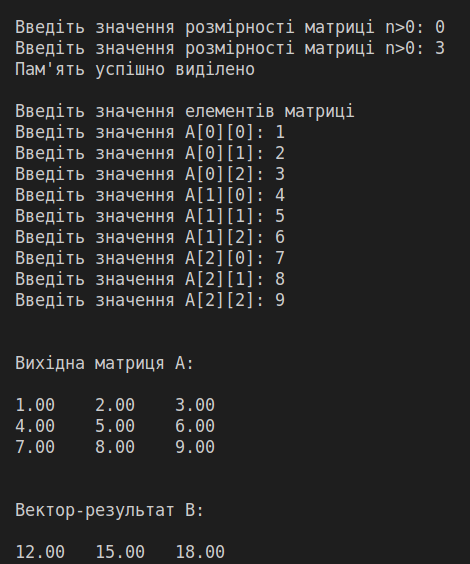

### Завдання

4-2. Є дійсна квадратна матриця $a_{ij}, i, j \in [0, n -1]$. Утворити вектор $B$, елементами якого є суми елементів по стовпчиках матриці $A$.

### 1. Аналіз умов задачі

Виходячи з умови задачі, спочатку запропонуємо користувачеві ввести розмірність матриці. Потім виділемо пам'ять для матриці і результуючого вектору.
Потім занулемо усі елементи результуючого вектору, щоб далі накопичувати в них суми елементів по стовпчикам. Далі у двох вкладених циклах запропонуємо користувачеві вводити чергове значення матриці у поточному рядку та поточному стовпчику, і одразу будемо накопичувати суми елементів по стовпцях у результуючому векторі.

Вхідні змінні:
- `n` - розмірність матриці, тип даних – ціле число,
- `a` - вхідна матриця, тип даних – показчик на показчик на дійсне число,
  
Проміжні змінні:

- `i, j` - лічильник циклів для рядків та стовпчиків відповідно, тип даних – ціле число.

Вихідна змінна:
- `b` - результуючий вектор, тип даних – показчик на показчик на дійсне число.

### 2. Блок-схема алгоритму.

Блок-схема алгоритму представлена на рисунку 1.

### 3. Код програми.

Результат роботи програми наведено на рисунку 2.

Рисунок 2 – Результат роботи програми.

### 4. Висновки

В ході виконання лабораторної роботи №4 було розроблено алгоритм утворення вектору, елементами якого є суми елементів по стовпчиках вхідної матриці та реалізовано мовою програмування С. 
Користувач повинен ввести розмірність матриці, і програма перевіряє чи введене число додатнє, в іншому випадку програма пропонує користувачеві повторити ввод. Алгоритм має два вкладених цикла з лічильником, у яких виконується ввод поточного члена матриці та накопичуються поточні суми по стовпчиках. Лічильники циклу мають тип даних - ціле число, матриця має тип – показчик на показчик на дійсні число, вектор має тип - показчик на дійсне число. Для виведення результату застосовано форматоване виведення.
