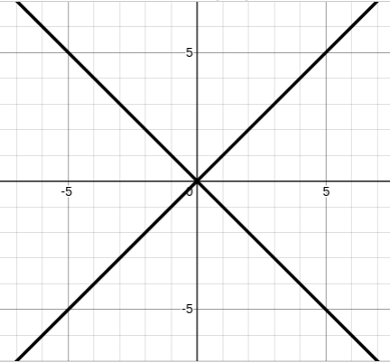
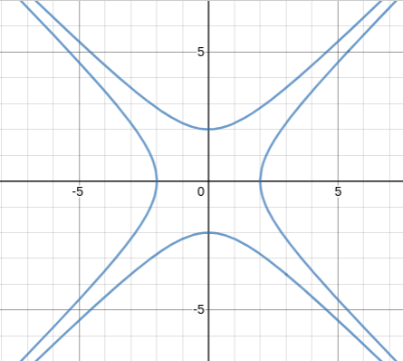

# Розрахункова робота

## Група ІС-02. Бойко Василь Олександрович

### Дискретна математика. Теорія відношень. Задача 3. Варіант 2.

Відношення еквівалентності "$\sim$" задане відображенням  $f:{\rm I\!R}^2 \rightarrow R$:

$$((x_1,x_2) \sim (y_1,y_2)) \Leftrightarrow
(f(x_1,x_2) = f(y_1,y_2))
$$

Необхідно:

1. Описати загальний вигляд фактор-множини $:{\rm I\!R}^2 / _\sim$
2. Зобразити на координатній площині класи еквівалентності, що відповідають заданим значенням $\alpha=f(x_1,x_2)$

$$f(x_1,x_2)=|x_1^2-x_2^2|, \; \alpha = 0;1;4
$$

### Розв'язок

З визначення даного відношення "$\sim$" випливає, що кожний клас еквівалентності містить елементи $(x_1,x_2) \in {\rm I\!R}^2$ з фіксованим значенням $|x_1^2-x_2^2|$:

$$A_r = \{ (x_1,x_2):|x_1^2-x_2^2|= \alpha \}, \; (a \ge 0)
\quad A / _\sim = \{ A_{\alpha}: \alpha\ge 0 \}
$$

Отже, фактор-множина $A / _\sim$ є розбиттям координатної площини ${\rm I\!R}^2$ на множини точок, які складаються з двох симетричних гіпербол $y=\frac{1}{x}$ та $y=-\frac{1}{x}$, які повернуті на $45\degree$ з центром повороту в початку координат, і які притискаються до асимптот $y=x$ та $y=-x$, у випадку коли $\alpha > 0$. Вершинами гіпербол є точки $(0,\sqrt{\alpha}), (\sqrt{\alpha}, 0), (0,-\sqrt{\alpha}), (-\sqrt{\alpha}, 0)$. Випадку, коли $\alpha = 0$ відповідає клас еквіваkентності, який складається з двох прямих $y=x$ та $y=-x$

     

рис.1

На рис.1 зображено клас еквівалентності, що відповідає значенню $\alpha=0$.

     

рис.2

На рис.2 зображено клас еквівалентності, що відповідає значенню $\alpha=1$.

     

рис.3

На рис.3 зображено клас еквівалентності, що відповідає значенню $\alpha=4$.