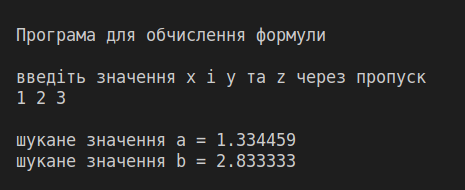

### Завдання

$$ a = \frac{3 + e^{y-1}}{1 + x^2 \left| y - \tg z \right|}; b = 1 + \left| y - x \right| + \frac{(y - x)^2}{2} + \frac{\left| y - x \right|^2}{3} $$

### 1. Аналіз умов задачі.

Виходячи з умови задачі, можна сказати, що задача не вимагає розбиття на підзадачі, всі дії виконуватимуться послідовно, тобто, алгоритм розв’язку буде лінійним. Вхідних змінних – три: x, y та z, тип даних – дійсні числа. Вихідних змінних – дві: a та b, тип даних – дійсні чисао. Формули для розрахунку: 

    a = (3 + exp(y - 1)) / ((1 + pow(x, SQU)) * fabs(y - tan(z)));

    b = 1 + fabs(y - x) + pow(y - x, SQU) / 2 + pow(fabs(y - x), SQU) / 3;

Обидві формули як для змінної a, так і для змінної b визначені при будь яких значеннях x, y та z. Отже немає необхідності у перевірці вхідних значень.

### 2. Блок-схема алгоритму.

Блок-схема алгоритму представлена на рисунку 1.

Рисунок 1 – Блок схема алгоритму обчислення формули

### 3. Код програми.

Результат роботи програми наведено на рисунку 2.

Рисунок 2 – Результат роботи програми у випадку, якщо формула визначена при введених даних.

### 4. Висновки

В ході виконання лабораторної роботи №1 було розроблено алгоритм розв’язку задачі знаходження значень формул та реалізовано мовою програмування С. Алгоритм є лінійним, оскільки всі дії виконуються послідовно. Всі використані змінні мають тип – дійсні числа. Для виведення результату застосовано форматоване виведення.