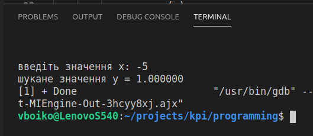
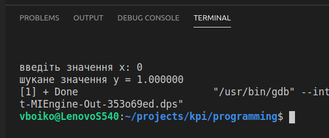
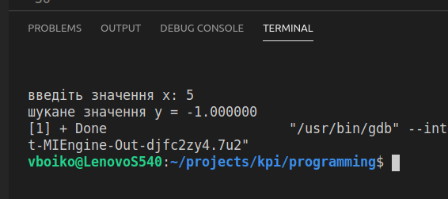
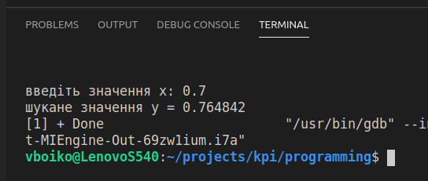

### Завдання

Для довільного $x$ обчислити:

$$
 y = \begin{cases}
   1, \quad \text{при} \quad x < 0\\
   \cos x, \quad \text{при} \quad 0 \le x \le \pi \\
   -1, \quad \text{при} \quad x > \pi\\
 \end{cases}
$$

### 1. Аналіз умов задачі

Вхідна змінна – одна: x, тип даних – дійсне число. Вихідна змінна – одна: y, тип даних – дійсне число.

Обчислення змінної y передбачає розгалуження процесу обчислень на три напрямки в залежності від значення вихідного значення змінної x. Для розгалуження процесу обчислень будемо використовувати вкладені оператори if ... else.

### 2. Блок-схема алгоритму.

Блок-схема алгоритму представлена на рисунку 1.

Рисунок 1 – Блок схема алгоритму обчислення формули

### 3. Код програми.

Результат роботи програми наведено на рисунках 2, 3, 4 та 5.

Рисунок 2 – Результат роботи програми у випадку, якщо x=-5.

Рисунок 3 – Результат роботи програми у випадку, якщо x=0.

Рисунок 4 – Результат роботи програми у випадку, якщо x=5.

Рисунок 5 – Результат роботи програми у випадку, якщо x=0,7.

### 4. Висновки

В ході виконання лабораторної роботи №2 було розроблено алгоритм розв’язку задачі обчислення функції та реалізовано мовою програмування С. Алгоритм має розгалуження, оскільки функція обчислюється згідно різних формул в залежності від значення вхідної змінної x. Всі використані змінні мають тип – дійсні числа. Для виведення результату застосовано форматоване виведення.
