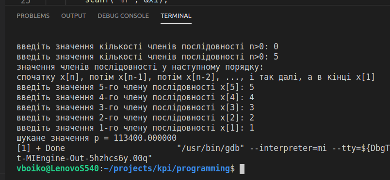

### Завдання

3-2. Обчислити добуток:

$$
p = x_n(x_n + x_{n-1})(x_n + x_{n-1} + x_{n-2})...(x_n + x_{n-1} + ... + x_1)
$$

значення $x_i$ послідовно вводити з клавіатури, масив не утворювати.

### 1. Аналіз умов задачі

Розпишемо формулу для декількох перших $x$:

з умови задачі не вбачається значення $p$, якщо $n =1$, але можемо припустити, що $p = x_1$, якщо $n =1$,

$$
p_1 = x_1
$$

$$
p_2 = x_2 (x_2 + x_1)
$$

$$
p_3 = x_3 (x_3 + x_2) (x_3 + x_2 + x_1)
$$

$$
p_4 = x_4 (x_4 + x_3) (x_4 + x_3 + x_2) (x_4 + x_3 + x_2 + x_1)
$$

Для того, щоб виконати умову завдання про неутворення масиву, потрібно, щоб користувач вводив значення членів послідовності у наступному порядку: спочатку $x_n$, потім $x_{n-1}$, потім $x_{n-2}$ .... і так далі, а в кінці $x_1$.

Також, з умов задачі, ми можемо припусти, що кількість членів послідовності $n$ заздалегідь відома. Тому ми можемо на початку виконання програми запросити у користувача значення змінної $n$ та використовувати у алгоритмі різновид циклу з передумовою з використанням оператора `for`.

Вхідні змінні:
- `n` - кількість елементів послідовності, тип даних – ціле число.
  
Проміжні змінні:
- `i` - лічильник для циклу `for`, тип даних – ціле число,
- `xi` - і-й елемент послідовності, тип даних – дійсне число,
- `s` - поточне значення доданку, поточна сума введених членів послідовності, тип даних – дійсне число.

Вихідна змінна:
- `p` - поточне та кінцеве значення добутку доданків, тип даних – дійсне число.

### 2. Блок-схема алгоритму.

Блок-схема алгоритму представлена на рисунку 1.

### 3. Код програми.

Результат роботи програми наведено на рисунку 2.

Рисунок 2 – Результат роботи програми.

### 4. Висновки

В ході виконання лабораторної роботи №3 було розроблено алгоритм пошуку додатку членів послідовності за допомогою циклу та реалізовано мовою програмування С. Користувач повинен ввести кількість членів послідовності, і програма перевіряє чи введене число додатнє, в іншому випадку програма пропонує користувачеві повторити ввод. Алгоритм має цикл з лічильником, у якому виконується ввод поточного члена послідовності, накопичується поточне значення доданку та безпосередньо сам шуканий додаток. Лічильник циклу має тип даних - ціле число, всі інші використані змінні мають тип – дійсні числа. Для виведення результату застосовано форматоване виведення.
