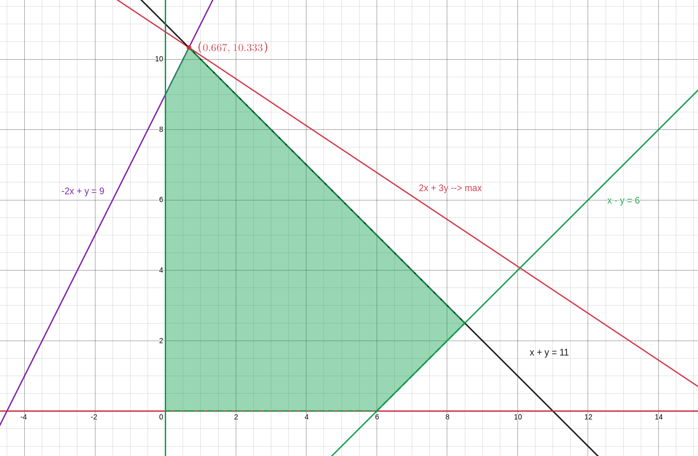

# Лінійне програмування

Для нижченаведених варіантів задач лінійного програмування виконати такі дії:

1. розв’язати задачу графічним методом;
2. розв’язати задачу симплекс-методом;
3. провести аналіз розв’язку задачі на чутливість до зміни значень обмежень і до зміни значень коефіцієнтів цільової
   функції;
4. побудувати двоїсту задачу до заданої задачі, розв'язати її, порівняти результат з розв’язком прямої задачі;
5. знайти цілочислове рішення задачі методом Гоморі.

## Варіант 2.

$$ 2 x_1 + 3 x_2 \to max $$

$$ x_1 - x_2 \leq 6 $$

$$ -2 x_1 + x_2 \leq 9 $$

$$ x_1 + x_2 \leq 11 $$

$$ x_i \geq 0, i= 1,2 $$

## Розв'язок

### Графічний метод

     

Побудуємо графіки наступних прямих: $x_1 - x_2 =6, -2 x_1 + x_2  = 9, x_1 + x_2 = 11, x_1=0, x_2=0 $. Заштрихуємо многокутник, утворений ціми прямим, який є простіром рішень задачі. Проводячи прямі через вершини прямокутника, парарельні прямій $2x_1+3x_2=0$, отримаємо точку $x_1 \approx 0.667, x_2 \approx 10.333,$ у якій значення цільової функціїї максимальне.

### Сімплекс метод

Приведемо задачу до канонічної форми:

$$ 2 x_1 + 3 x_2 + 0 x_3 + 0 x_4 + 0 x_5 \to max $$

$$ x_1 - x_2 + x_3 = 6 $$

$$ -2 x_1 + x_2 + x_4 =9 $$

$$ x_1 + x_2 + x_5 = 11 $$

$$ x_i \geq 0, i= 1,2,3,4,5 $$

Запишемо система обмежень у векторній формі:

$$
\overline{A_1}x_1 +  \overline{A_2}x_2 +  \overline{A_3}x_3 +  \overline{A_4}x_4 +  \overline{A_5}x_5 =  \overline{B},
$$

$$
\text{де}
\overline{A_1} = \begin{pmatrix} 1 \\ -2 \\ 1\end{pmatrix},
\overline{A_2} = \begin{pmatrix} -1 \\ 1 \\ 1\end{pmatrix},
\overline{A_3} = \begin{pmatrix} 1 \\ 0 \\ 0\end{pmatrix},
\overline{A_4} = \begin{pmatrix} 0 \\ 1 \\ 0\end{pmatrix},
\overline{A_5} = \begin{pmatrix} 0 \\ 0 \\ 1\end{pmatrix},
\overline{B} = \begin{pmatrix} 6 \\ 9 \\ 11\end{pmatrix}
$$

Базис: $ \overline{A_3}, \overline{A_4}, \overline{A_5} $
Початковий опорний план: $ X = (0,0,6,9,11)$

Заповнимо сімплекс-таблицю:

$$
\begin{array}{ | c | c | c | c | c | c | c | c | c | } \hline
    & & & 2 & 3 & 0 & 0 &0
    \\ \hline
    \text{Базис} & С_\text {баз} & \text{План}  & \overline{A_1}  & \overline{A_2}  & \overline{A_3}  & \overline{A_4}  & \overline{A_5} & \theta
    \\ \hline
    \overline{A_3} & 0 & 6 & 1 & -1 & 1 & 0 & 0 & -
    \\ \hline
    \overline{A_4} & 0 & 9 & -2 & \colorbox{aqua}{1} & 0 & 1 & 0 & 9
    \\ \hline
    \overline{A_5} & 0 & 11 & 1 & 1 & 0 & 0 & 1 & 11
    \\ \hline
     & \Delta_j & 0 & -2 & -3 & 0 & 0 & 0 &
    \\ \hline
  \end{array}
$$

Вводимо до базису змінну $x_2$, виводимо змінну $x_4$ та перераховуємо симплекс-таблицю:

$$
\begin{array}{ | c | c | c | c | c | c | c | c | c | } \hline
    & & & 2 & 3 & 0 & 0 &0
    \\ \hline
    \text{Базис} & С_\text {баз} & \text{План}  & \overline{A_1}  & \overline{A_2}  & \overline{A_3}  & \overline{A_4}  & \overline{A_5} & \theta
    \\ \hline
    \overline{A_3} & 0 & 15 & -1 & 0 & 1 & 1 & 0 & -
    \\ \hline
    \overline{A_2} & 3 & 9 & -2 & 1 & 0 & 1 & 9 & -
    \\ \hline
    \overline{A_5} & 0 & 2 & \colorbox{aqua}{3} & 0 & 0 & -1 & 1 & \frac{2}{3}
    \\ \hline
        & \Delta_j     & 27 & -8 & 0 & 0 & 3 & 27 &
    \\ \hline
  \end{array}
$$

Отримуємо опорний план: $ X = (0,9,15,0,2)$

Вводимо до базису змінну $x_1$, виводимо змінну $x_5$ та перераховуємо симплекс-таблицю:

$$
\begin{array}{ | c | c | c | c | c | c | c | c | c | } \hline
    & & & 2 & 3 & 0 & 0 &0
    \\ \hline
    \text{Базис} & С_\text {баз} & \text{План}  & \overline{A_1}  & \overline{A_2}  & \overline{A_3}  & \overline{A_4}  & \overline{A_5} & \theta
    \\ \hline
    \overline{A_3} & 0 & 15\frac{2}{3} & 0 & 0 & 1 & \frac{2}{3} & \frac{1}{3} &
    \\ \hline
    \overline{A_2} & 3 & 10\frac{1}{3} & 0 & 1 & 0 & \frac{1}{3} & 9\frac{2}{3} &
    \\ \hline
    \overline{A_1} & 2 & \frac{2}{3} & 1 & 0 & 0 & -\frac{1}{3} & \frac{1}{3} &
    \\ \hline
     & \Delta_j    & 32\frac{1}{3} & 0 & 0 & 0 & \frac{1}{3} & 29\frac{2}{3} &
    \\ \hline
  \end{array}
$$

Отримуємо опорний план: $ X = (\frac{2}{3},10\frac{1}{3},15\frac{2}{3} ,0,0)$
Всі $\Delta_j$ є невід'ємними, отже план є оптимальним.
Рішення: $x_1=\frac{2}{3}, x_2=10\frac{1}{3}$

### Аналіз розв’язку задачі на чутливість до зміни значень обмежень і до зміни значень коефіцієнтів цільової функції

Нехай коефіцієнти при змінних у ЦФ стали іншими:

$$ (2 + \delta_1) x_1 + (3 + \delta_2) x_2 \to max 
$$

Виконаємо дослідження для змінної $x_1$:

