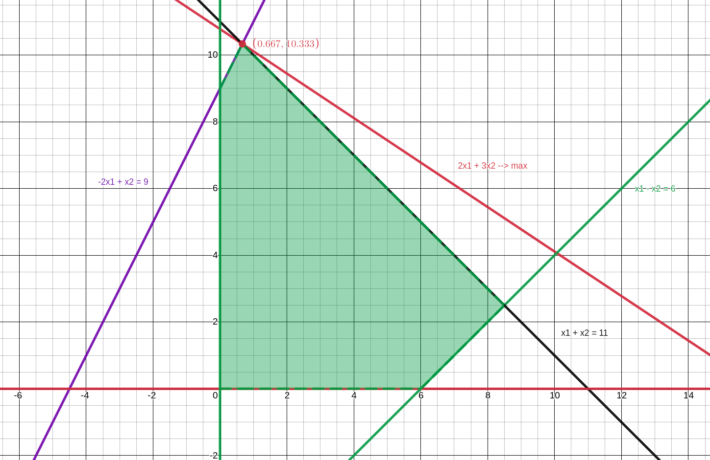

# Лінійне програмування

Для нижченаведених варіантів задач лінійного програмування виконати такі дії:
1. розв’язати задачу графічним методом;
2. розв’язати задачу симплекс-методом;
3. провести аналіз розв’язку задачі на чутливість до зміни значень обмежень і до зміни значень коефіцієнтів цільової
функції;
4. побудувати двоїсту задачу до заданої задачі, розв'язати її, порівняти результат з розв’язком прямої задачі;
5. знайти цілочислове рішення задачі методом Гоморі.

## Варіант 2.

$$ 2 x_1 + 3 x_2 \to max $$

$$ x_1 - x_2 \leq 6 $$

$$ -2 x_1 + x_2 \leq 9 $$

$$ x_1 + x_2 \leq 11 $$

$$ x_i \geq 0, i= 1,2 $$

## Розв'язок

### Графічний метод

     

Побудуємо графіки наступних прямих: $x_1 - x_2 =6, -2 x_1 + x_2  = 9, x_1 + x_2 = 11, x_1=0, x_2=0 $. Заштрихуємо многокутник, утворений ціми прямим, який є простіром рішень задачі. Проводячи прямі через вершини прямокутника, парарельні прямій $2x_1+3x_2=0$, отримаємо точку $x_1 \approx 0.667, x_2 \approx 10.333,$ у якій значення цільової функціїї максимальне.

