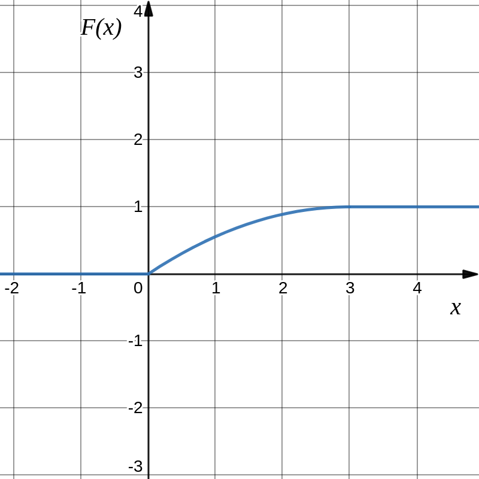
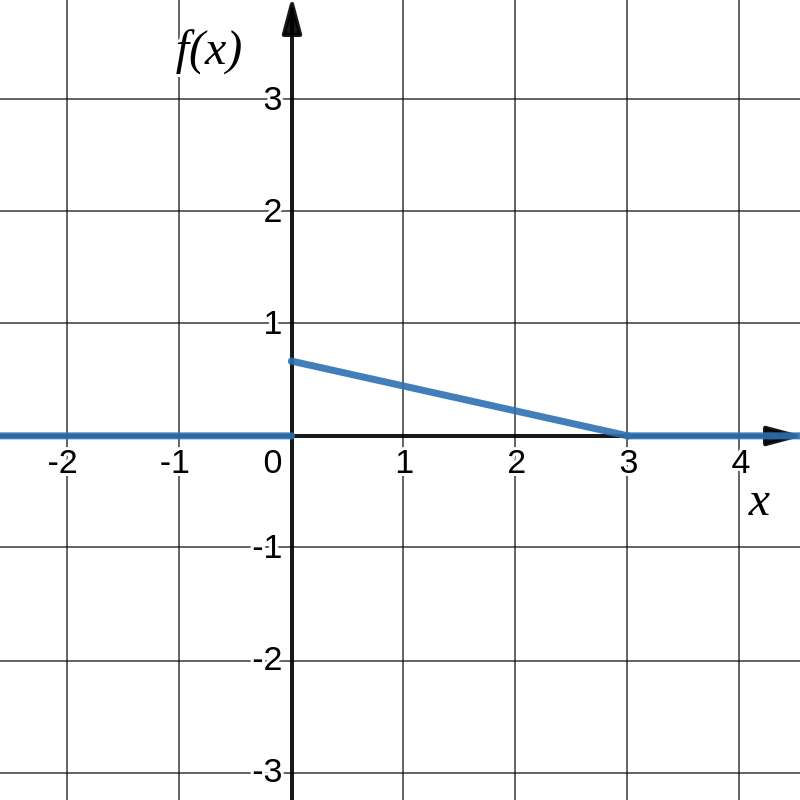

# Розрахункова робота

## Група ІС-02. Бойко Василь Олександрович

### Задача 2.2. Неперервні випадкові величини. Варіант 2.

Задана функція розподілу неперервної випадкової величини $\xi$. 
* Знайти коефіцієнт $A$; 
* записати щільність розподілу $f_\xi (x)$; 
* обчислити числові характеристики випадкової величини: $M_\xi, D_\xi$
* знайти ймовірність події $\alpha \leq \xi < \beta$;
* Намалювати графіки функцій $f_\xi(x)$ та $F_\xi(x)$

$$ \text{2.2.1. } F_\xi (x) = \begin{cases}
   0, & x \leq 0 \\
   A \left(2x - \frac{x^2}{3} \right), & 0 < x \leq 3 \\
   1, & x>3 \\
\end{cases}, \alpha=1, \beta = 2
$$

### Розв'язок

Обчислимо значення функції у точці $x=3$

$$ A \left(2x - \frac{x^2}{3} \right) = A \left(2 \cdot 3 - \frac{3^2}{3} \right) = A \cdot 3
$$

Виходячи з неперервності функції розподілу у точці $x=3$ знаходимо значення коефіцієнту $A = \frac{1}{3}$. Отже, можемо переписати функцію розподілу з підставленим коефіцієнтом

$$ F_\xi (x) = \begin{cases}
   0, & x \leq 0 \\
   \frac{2}{3}x - \frac{x^2}{9}, & 0 < x \leq 3 \\
   1, & x>3 \\
\end{cases}
$$

Знайдемо диференціальну функцію розподілу, тобто щільність розподілу ймовірності за формулою $f ( x ) = F' ( x )$:

$$ f_\xi (x) = \begin{cases}
   \frac{2}{3} - \frac{2}{9}x, & 0 < x \leq 3 \\
   0, & x \notin (0,3]\\
\end{cases}
$$

Знайдемо математичне сподівання:

$$ M(X) = \intop_a^b x f(x)dx = 
\intop_0^3 x \cdot \left(\frac{2}{3} - \frac{2}{9}x \right)dx =
$$

$$ = \intop_0^3 \left( \frac{2}{3}x dx - \frac{2}{9}x^2 dx \right)  =
$$

$$ = \left( \frac{1}{3}x^2 - \frac{2}{27}x^3 \right) \bigg| _0^3  = \frac{1}{3} \cdot 9 - \frac{2}{27} \cdot 27 = 1
$$

Знайдемо дисперсію:

$$ D(X) = \intop_a^b x^2 f(x)dx - (M(x))^2 = 
\intop_0^3 x^2 \cdot \left(\frac{2}{3} - \frac{2}{9}x \right)dx - 1=
$$

$$ = \intop_0^3 \left(\frac{2}{3}x^2 - \frac{2}{9}x^3 \right)dx - 1=
$$

$$ = \left( \frac{2}{9}x^3 - \frac{1}{18}x^4 \right) \bigg| _0^3  = \frac{2}{9} \cdot 27 - \frac{1}{18} \cdot 81 = 6 - 4.5 = 1.5
$$

Знайдемо ймовірність події $1 \leq \xi < 2 $

$$ P(\alpha \leq x < \beta) = \intop_\alpha^\beta f(x)dx
$$

$$ P(1 \leq x < 2) = 
\intop_1^2 \left( \frac{2}{3} - \frac{2}{9}x \right) dx =
\left( \frac{2}{3}x - \frac{1}{9}x^2 \right) \bigg| _1^2=
$$

$$ = \intop_1^2 \left( \frac{2}{3} - \frac{2}{9}x \right) dx =
\left( \frac{2}{3}x - \frac{1}{9}x^2 \right) \bigg| _1^2=
$$

$$ 
\left( \frac{2}{3} \cdot 2 - \frac{1}{9} \cdot 2^2 \right) - 
\left( \frac{2}{3} \cdot 1 - \frac{1}{9} \cdot 1^2 \right)=
$$

$$  \frac{4}{3}  - \frac{4}{9} - \frac{2}{3} + \frac{1}{9} = \frac{1}{3}
$$

Графік функції $F_\xi(x)$

     

Графік функції $f_\xi(x)$

     

