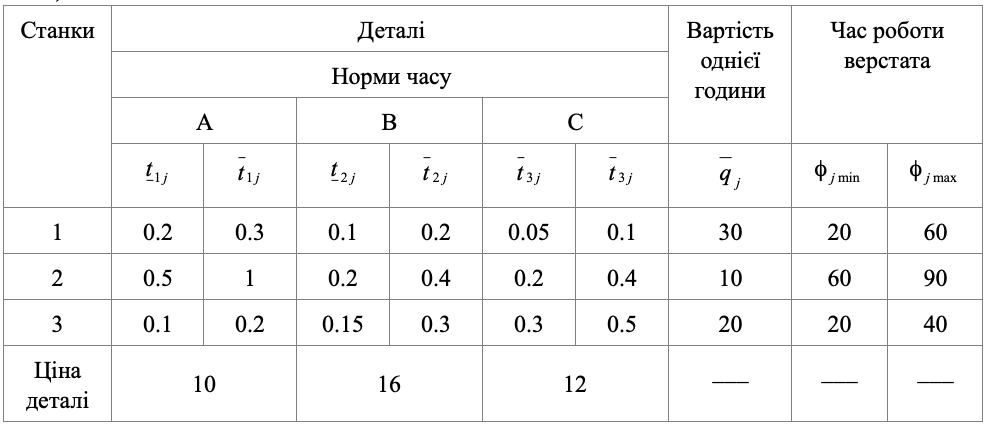

### Задача 1.1

Нехай деталі $A, B, C$ можуть виготовлятися на трьох верстатах $1, 2, 3$. Витрати часу на виготовлення деталі $i$ на верстаті $j$ є випадковими величинами, рівномірно розподіленими в інтервалі $(\overline{t}_{ij}, \underline{t}_{ij})$ і приводяться в таблиці 1.1, де також зазначена середня продажна ціна одиниці деталі $C_i$ та собівартість однієї години роботи кожного верстата. Нехай сумарний плановий фонд часу роботи верстата – $\varPhi_j$ рівномірно розподілена випадкова величина в інтервалі $(\phi_{j\,max}, \phi_{j\,min})$.
Потрібно знайти оптимальну виробничу програму випуску деталей, яка б була реалізована з імовірністю не менше 0.90 та забезпечувала б екстремум одного з таких критеріїв витрат.

А) максимум товарної продукції Т;

Б) максимум сумарного прибутку П;

Таблиця 1.1

### Розв’язок

Критерій А.
Складемо математичну модель даної задачі для максимуму товарної продукції.
Позначимо через $x_i$ - кількість деталей $i$-го типу.

$$  \sum_{i=1}^{3} C_i x_j  \rightarrow max $$
 
При обмеженнях

$$  \sum_{i=1}^{3} x_i \mu_{ij} + \Phi^{-1}(\alpha_0) \left( \sum_{i=1}^{3} x_i^2 \sigma^2_{ij} \right)^{\frac{1}{2}} \le \varPhi_j ,\quad j=1..3
$$

$$  \mu_{ij} = \frac{{\overline{t}_{ij} + \underline{t}_{ij}}}{2},
\sigma^2_{ij} = \frac{({\overline{t}_{ij} + \underline{t}_{ij})^2}}{12},
\varPhi_j = \frac{\phi_{j\,max} + \phi_{j\,min}}{2}
$$

Підставляючи дані з таблиці отримаємо модель даної задачі

$$  max(10 x_1 + 16 x_2 + 12 x_3) $$

$$  \frac{0.2 + 0.3}{2} x_1 + \frac{0.1 + 0.2}{2} x_2 + \frac{0.05 + 0.1}{2} x_3 + \\
+\Phi^{-1}(0.9) \left( 
\frac{(0.2 + 0.3)^2}{12} x_1^2 + \frac{(0.1 + 0.2)^2}{12} x_2^2 + \frac{(0.05 + 0.1)^2}{12} x_3^2 \right)^{\frac{1}{2}} \le\\
\le \frac{60+20}{2}
$$

$$  \frac{0.5+1}{2} x_1 + \frac{0.2+0.4}{2} x_2 + \frac{0.2+0.4}{2} x_3 + \\
+\Phi^{-1}(0.9) \left( 
\frac{(0.5+1)^2}{12} x_1^2 + \frac{(0.2+0.4)^2}{12} x_2^2 + \frac{(0.2+0.4)^2}{12} x_3^2 \right)^{\frac{1}{2}}  \le\\
\le \frac{60+90}{2}
$$

$$  \frac{0.1+0.2}{2} x_1 + \frac{0.15+0.3}{2} x_2 + \frac{0.3+0.5}{2} x_3 + \\
+\Phi^{-1}(0.9) \left( 
\frac{(0.1+0.2)^2}{12} x_1^2 + \frac{(0.15+0.3)^2}{12} x_2^2 + \frac{(0.3+0.5)^2}{12} x_3^2 \right)^{\frac{1}{2}} \le\\
\le \frac{20+40}{2}
$$

Отже після виконання підрахунків отримуємо математичну модель для критерію максимуму товарної продукції:

$$  max(10 x_1 + 16 x_2 + 12 x_3) $$

$$  \frac{1}{4} x_1 + \frac{3}{20} x_2 + \frac{3}{40} x_3 
+\Phi^{-1}(0.9) \left( 
\frac{1}{48} x_1^2 + \frac{3}{400} x_2^2 + \frac{3}{600} x_3^2 \right)^{\frac{1}{2}}
\le 40
$$

$$  \frac{3}{4} x_1 + \frac{3}{10} x_2 + \frac{3}{10} x_3
+\Phi^{-1}(0.9) \left( 
\frac{3}{16} x_1^2 + \frac{3}{100} x_2^2 + \frac{3}{100} x_3^2 \right)^{\frac{1}{2}}
\le 75
$$

$$  \frac{3}{20} x_1 + \frac{9}{40} x_2 + \frac{2}{5} x_3
+\Phi^{-1}(0.9) \left( 
\frac{3}{400} x_1^2 + \frac{27}{1600} x_2^2 + \frac{4}{75} x_3^2 \right)^{\frac{1}{2}}
\le 30
$$

Критерій Б.
Складемо математичну модель даної задачі для максимуму сумарного прибутку.
Позначимо через $x_{ij}$ - кількість деталей $i$-го типу, виготовлених на верстаті $j$.

$$ \sum_{i=1}^{3} \sum_{j=1}^{3} C_i x_{ij}
-\sum_{j=1}^{3} \sum_{i=1}^{3} q_{j} \mu_{ij} x_{ij}
 \rightarrow max $$

При обмеженнях

$$  \sum_{i=1}^{3} x_{ij} \mu_{ij} + \Phi^{-1}(\alpha_0) \left( \sum_{i=1}^{3} x_{ij}^2 \sigma^2_{ij} \right)^{\frac{1}{2}} \le \varPhi_j ,\quad j=1..3
$$

$$  \mu_{ij} = \frac{{\overline{t}_{ij} + \underline{t}_{ij}}}{2},
\sigma^2_{ij} = \frac{({\overline{t}_{ij} + \underline{t}_{ij})^2}}{12},
\varPhi_j = \frac{\phi_{j\,max} + \phi_{j\,min}}{2}
$$

Підставляючи дані з таблиці отримаємо модель даної задачі.

$$  max(10 (x_{11} + x_{12} + x_{13}) + 16 (x_{21} + x_{22} + x_{23}) + 12 (x_{31} + x_{32} + x_{33}) - \\
30(\frac{1}{4} x_{11} + \frac{3}{20} x_{21} + \frac{3}{40} x_{31}) - 
10(\frac{3}{4} x_{12} + \frac{3}{10} x_{22} + \frac{3}{10} x_{32}) - \\
-20(\frac{3}{20} x_{13} + \frac{9}{40} x_{23} + \frac{2}{5} x_{33})
)$$

Отже після виконання підрахунків отримуємо математичну модель для критерію максимуму сумарного прибутку:

$$  max(
\frac{5 }{2} x_{11} + \frac{5}{2} x_{12} +          7 x_{13} +
\frac{23}{2} x_{21} +          16 x_{22} + \frac{23}{2} x_{23} +
\frac{39}{4} x_{31} +           9 x_{32} +            4 x_{33}
)$$

$$  \frac{1}{4} x_{11} + \frac{3}{20} x_{21} + \frac{3}{40} x_{31} 
+\Phi^{-1}(0.9) \left( 
\frac{1}{48} x_{11}^2 + \frac{3}{400} x_{21}^2 + \frac{3}{600} x_{31}^2 \right)^{\frac{1}{2}}
\le 40
$$

$$  \frac{3}{4} x_{12} + \frac{3}{10} x_{22} + \frac{3}{10} x_{32}
+\Phi^{-1}(0.9) \left( 
\frac{3}{16} x_{12}^2 + \frac{3}{100} x_{22}^2 + \frac{3}{100} x_{32}^2 \right)^{\frac{1}{2}}
\le 75
$$

$$  \frac{3}{20} x_{13} + \frac{9}{40} x_{23} + \frac{2}{5} x_{33}
+\Phi^{-1}(0.9) \left( 
\frac{3}{400} x_{13}^2 + \frac{27}{1600} x_{23}^2 + \frac{4}{75} x_{33}^2 \right)^{\frac{1}{2}}
\le 30
$$