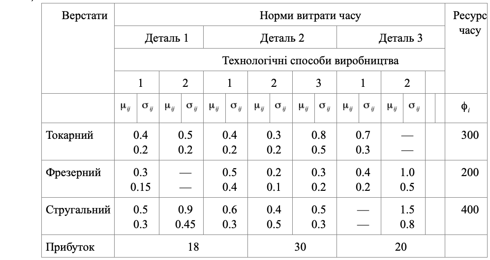

### Задача 1.2

Завод при виготовленні трьох типів деталей використовує токарські, фрезерні і стругальні верстати. При цьому виготовлення кожної деталі можна проводити трьома різними технологічними способами $(1, 2, 3)$. У табл. 1.2 зазначені наявні ресурси по кожній $i$-тій групі верстатів (у верстато-год) $\phi_i, i=1,3$, норми витрати часу при обробці деталей $j (j=1, 2, 3)$ на верстаті і є нормально розподіленими випадковими величинами з параметрами  $\mu_{ij}$ і $\sigma_{ij}$. Нехай прибуток від випуску одиниці деталі кожного виду складає відповідно $12, 18, 30$ грн/шт. 
Скласти оптимальний план навантаження виробничих потужностей, що забезпечує максимальний очікуваний прибуток, за умови фізичної реалізованості плану з ймовірністю 0.90.

Таблиця 1.2

Складемо математичну модель даної задачі для максимуму очікуваного прибутку.
Позначимо через $x_{ij}$ - кількість деталей $i$-го типу, виготовлених на верстаті $j$,
а через $C_i$ прибуток від випуску одиниці деталі кожного виду:

$$  \sum_{i=1}^{3} C_i x_j \rightarrow max $$

При обмеженнях

$$  \sum_{i=1}^{3} x_{ij} \mu_{ij} + \Phi^{-1}(\alpha_0) \left( \sum_{i=1}^{3} x_{ij}^2 \sigma^2_{ij} +\theta^2 \right)^{\frac{1}{2}} \le \phi_j ,\quad j=1..3, \quad \theta^2 = 0
$$

Підставляючи дані з таблиці отримаємо модель даної задачі:

$$ 18(x_{11}+x_{12}) + 30(x_{21}+x_{22}+x_{23}) + 20(x_{31}+x_{32}) \rightarrow max
$$

При обмеженнях

$$ 0.4x_{11}+0.5x_{x12}+0.4x_{21}+0.3x_{22}+0.8x_{23}+0.7x_{31} +\\
+\Phi^{-1}(0.9) \left(  
0.04 x_{11}^2 + 0.04 x_{12}^2 + 0.04 x_{21}^2 + 0.04 x_{22}^2+ 0.25 x_{23}^2+ 0.09 x_{31}^2
\right)^{\frac{1}{2}} \le 300
$$

$$ 0.3 x_{11} + 0.5 x_{21} + 0.2 x_{22} + 0.3 x_{23} + 0.4 x_{31} + x_{32} +\\
+\Phi^{-1}(0.9) \left(  
0.00225 x_{11}^2 + 0.16 x_{21}^2 + 0.01 x_{22}^2+ 0.04 x_{23}^2+ 0.04 x_{31}^2 + 0.25 x_{32}^2
\right)^{\frac{1}{2}} \le 200
$$

$$ 0.5 x_{11} + 0.9 x_{12} + 0.6 x_{21} + 0.4 x_{22} + 0.5 x_{23} + 1.5 x_{32} +\\
+\Phi^{-1}(0.9) \left(  
0.09 x_{11}^2 + 0.2025 x_{12}^2 + 0.09 x_{21}^2 + 0.25 x_{22}^2 + 0.09 x_{23}^2 + 0.64 x_{32}^2
\right)^{\frac{1}{2}} \le 400
$$