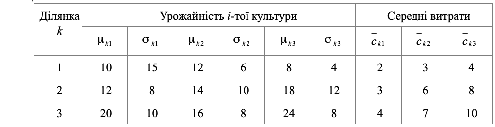

### Задача 1.5

На трьох ділянках колгоспного поля $(k=1, 2, 3)$ можна вирощувати три культури: жито, пшеницю і ячмінь $(i=1, 2, 3)$. Урожайність $\lambda_{ki}$ цих культур нормально розподілені із середнім $\mu_{ki}$ і дисперсією $\sigma_{ki}^2$
(табл. 1.5).
Нехай планове завдання із зібрання урожаю кожної культури складає відповідно 500 ц., 600 ц. і 400 ц., а площі ділянок дорівнюють відповідно 30 га., 50 га., 20 га.

А) Визначити оптимальну структуру посівів, які мінімізують сумарні очікувані витрати при умові виконання плану з ймовірністю не менше 0.90.

Б) Визначити оптимальну структуру посівів, які забезпечують максимальну ймовірність перевиконання плану при збереженні планового асортименту 5:2:4.

Таблиця 1.5

### Розв'язок

A) Складемо математичну модель даної задачі для мінімізації сумарного очікування витрат.
Позначимо через $x_{ki}$ - площу посівів $i$-ї культури на $k$-й ділянці, через $p_i$ - планове завдання із зібрання урожаю кожної культури, а через $s_k$ площу $k$-ї ділянки:

$$  \sum_{i=1}^{3} \sum_{k=1}^{3} c_{ki} x_{ki} \rightarrow min $$

При обмеженнях:

$$ \sum_{k=1}^{3} x_{ki} \mu_{ki} - \Phi^{-1}(\alpha_0) \left( \sum_{k=1}^{3} x_{ki}^2 \sigma^2_{ki} \right)^{\frac{1}{2}} \ge p_i ,\quad i=1..3
$$

$$ \sum_{i=1}^{3} x_{ki} \le s_k, \quad k=1..3
$$

Підставляючи дані з таблиці отримаємо модель даної задачі:

$$ ( 2 x_{11} + 3 x_{12} +  4 x_{13} + 
     3 x_{21} + 6 x_{22} +  8 x_{23} + 
     4 x_{31} + 7 x_{32} + 10 x_{33} ) \rightarrow min
$$

При обмеженнях:

$$ 10 x_{11} + 12 x_{21} + 20 x_{31} - \Phi^{-1}(0.9) 
\left( 15 x_{11}^2 + 8 x_{21}^2 + 10 x_{31}^2 \right)^{\frac{1}{2}} \ge 500
$$

$$ 12 x_{11} + 14 x_{21} + 16 x_{31} - \Phi^{-1}(0.9) 
\left( 6 x_{11}^2 + 10 x_{21}^2 + 8 x_{31}^2 \right)^{\frac{1}{2}} \ge 600
$$

$$ 8 x_{11} + 18 x_{21} + 24 x_{31} - \Phi^{-1}(0.9) 
\left( 4 x_{11}^2 + 12 x_{21}^2 + 8 x_{31}^2 \right)^{\frac{1}{2}} \ge 400
$$

Б) Для збереженні планового асортименту 5:2:4 додаємо умови:

$$ x_{11} + x_{21} + x_{31} = 2.5 x_{12} + 2.5 x_{22} + 2.5 x_{32}
$$

$$ x_{13} + x_{23} + x_{33} = 2 x_{12} + 2 x_{22} + 2 x_{32}
$$