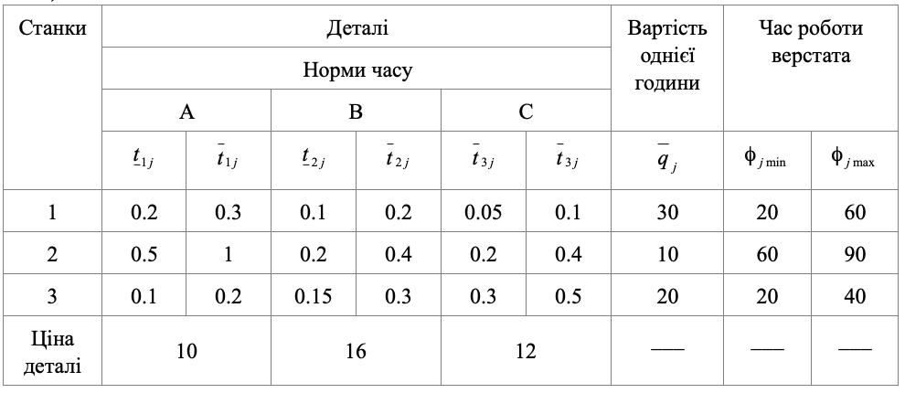

### Задача 1.1

Нехай деталі $A, B, C$ можуть виготовлятися на трьох верстатах $1, 2, 3$. Витрати часу на виготовлення деталі $i$ на верстаті $j$ є випадковими величинами, рівномірно розподіленими в інтервалі $(\overline{t}_{ij}, \underline{t}_{ij})$ і приводяться в таблиці 1.1, де також зазначена середня продажна ціна одиниці деталі $C_i$ та собівартість однієї години роботи кожного верстата. Нехай сумарний плановий фонд часу роботи верстата – $\varPhi_j$ рівномірно розподілена випадкова величина в інтервалі $(\phi_{j\,max}, \phi_{j\,min})$.
Потрібно знайти оптимальну виробничу програму випуску деталей, яка б була реалізована з імовірністю не менше 0.90 та забезпечувала б екстремум одного з таких критеріїв витрат.

А) максимум товарної продукції Т;

Б) максимум сумарного прибутку П;

Таблиця 1.1

### Розв’язок

Критерій А.
Складемо математичну модель даної задачі для максимуму товарної продукції.
Позначимо через $x_{ij}$ - кількість деталей $i$-го типу виготовлених на $j$-му верстаті.

$$  \sum_{i=1}^{3} \sum_{j=1}^{3} C_i x_{ij}  \rightarrow max $$
 
При обмеженнях

$$  \sum_{i=1}^{3} x_{ij} \frac{{\overline{t}_{ij} + \underline{t}_{ij}}}{2} + \Phi^{-1}(\alpha_0) \left( 
    \sum_{i=1}^{3} x_{ij}^2 \frac{({\overline{t}_{ij} - \underline{t}_{ij})^2}}{12} + 
    (\phi_{j\,max} - \phi_{j\,min})^2     
    \right)^{\frac{1}{2}} \le \\
    \le \frac{\phi_{j\,max} + \phi_{j\,min}}{2} ,\quad j=1..3
$$

Підставляючи дані з таблиці отримаємо модель даної задачі

$$10 x_{11} + 10 x_{12} + 10 x_{13} + 
  16 x_{21} + 16 x_{22} + 16 x_{23} + 
  12 x_{31} + 12 x_{32} + 12 x_{33} + \rightarrow max $$

$$  \frac{0.2 + 0.3}{2} x_{11} + \frac{0.1 + 0.2}{2} x_{12} + \frac{0.05 + 0.1}{2} x_{13} + \\
+\Phi^{-1}(0.9) \left( 
\frac{(0.3- 0.2)^2}{12} x_{11}^2 + \frac{(0.2- 0.1)^2}{12} x_{12}^2 + \frac{(0.1-0.05)^2}{12} x_{13}^2 +
(60-20)^2 \right)^{\frac{1}{2}} \le\\ \le \frac{60+20}{2}
$$

$$  \frac{0.5+1}{2} x_{21} + \frac{0.2+0.4}{2} x_{22} + \frac{0.2+0.4}{2} x_{23} + \\
+\Phi^{-1}(0.9) \left( 
\frac{(1-0.5)^2}{12} x_{21}^2 + \frac{(0.4-0.2)^2}{12} x_{22}^2 + \frac{(0.4-0.2)^2}{12} x_{23}^2 +
(90-60)^2 \right)^{\frac{1}{2}}  \le\\ \le \frac{60+90}{2}
$$

$$  \frac{0.1+0.2}{2} x_{31} + \frac{0.15+0.3}{2} x_{32} + \frac{0.3+0.5}{2} x_{33} + \\
+\Phi^{-1}(0.9) \left( 
\frac{(0.2-0.1)^2}{12} x_{31}^2 + \frac{(0.3-0.15)^2}{12} x_{32}^2 + \frac{(0.5-0.3)^2}{12} x_{33}^2 +
(40-20)^2  \right)^{\frac{1}{2}} \le\\ \le \frac{20+40}{2}
$$

Отже після виконання підрахунків отримуємо математичну модель для критерію максимуму товарної продукції:

$$ 10 x_{11} + 10 x_{12} + 10 x_{13} + 
   16 x_{21} + 16 x_{22} + 16 x_{23} + 
   12 x_{31} + 12 x_{32} + 12 x_{33} + \rightarrow max $$

$$  \frac{1}{4} x_{11} + \frac{3}{20} x_{12} + \frac{3}{40} x_{13} 
+\Phi^{-1}(0.9) \left( 
\frac{1}{1200} x_{11}^2 + \frac{1}{1200} x_{12}^2 + \frac{1}{240} x_{13}^2  + 1600 \right)^{\frac{1}{2}}
\le 40
$$

$$  \frac{3}{4} x_{21} + \frac{3}{10} x_{22} + \frac{3}{10} x_{23}
+\Phi^{-1}(0.9) \left( 
\frac{1}{48} x_{21}^2 + \frac{1}{300} x_{22}^2 + \frac{1}{300} x_{23}^2 + 900 \right)^{\frac{1}{2}} 
\le 75
$$

$$  \frac{3}{20} x_{31} + \frac{9}{40} x_{32} + \frac{2}{5} x_{33}
+\Phi^{-1}(0.9) \left( 
\frac{1}{1200} x_{31}^2 + \frac{3}{1600} x_{32}^2 + \frac{1}{300} x_{33}^2 + 400 \right)^{\frac{1}{2}} 
\le 30
$$

Критерій Б.
Складемо математичну модель даної задачі для максимуму сумарного прибутку.
В цьому випадку змінюється лише цільова функція, а обмеження залишаються такими ж як і у критерії А:

$$  \sum_{i=1}^{3} \sum_{j=1}^{3} C_i x_{ij} -
\sum_{i=1}^{3} \sum_{j=1}^{3} x_{ij} q_j \frac{({\overline{t}_{ij} + \underline{t}_{ij})^2}}{2}
-\Phi^{-1}(\alpha_0) \left( 
    \sum_{i=1}^{3} \sum_{j=1}^{3} x_{ij}^2 q_j^2 \frac{({\overline{t}_{ij} - \underline{t}_{ij})^2}}{12}   
    \right)^{\frac{1}{2}}
 \rightarrow max $$

Підставляючи дані з таблиці отримаємо цільову функцію:

$$ 10 x_{11} + 10 x_{12} + 10 x_{13} + 
   16 x_{21} + 16 x_{22} + 16 x_{23} + 
   12 x_{31} + 12 x_{32} + 12 x_{33} - \\
\,- 30 \left( \frac{1}{4} x_{11} + \frac{3}{20} x_{12} + \frac{3}{40} x_{13}  \right)
\,- 10 \left( \frac{3}{4} x_{21} + \frac{3}{10} x_{22} + \frac{3}{10} x_{23} \right) - \\
\,- 20 \left( \frac{3}{20} x_{31} + \frac{9}{40} x_{32} + \frac{2}{5} x_{33}  \right) - \\
\,- \Phi^{-1}(0.9) \left( 
\frac{1}{1200} 30^2 x_{11}^2 + \frac{1}{1200} 30^2 x_{12}^2 + \frac{1}{240} 30^2 x_{13}^2 \right)^{\frac{1}{2}} - \\
\,- \Phi^{-1}(0.9) \left( 
\frac{1}{48} 10^2 x_{21}^2 + \frac{1}{300} 10^2 x_{22}^2 + \frac{1}{300} 10^2 x_{23}^2  \right)^{\frac{1}{2}} - \\
\,- \Phi^{-1}(0.9) \left( 
\frac{1}{1200} 20^2 x_{31}^2 + \frac{3}{1600} 20^2 x_{32}^2 + \frac{1}{300} 20^2 x_{33}^2 \right)^{\frac{1}{2}}
\rightarrow max  $$

Отже після виконання підрахунків отримуємо цільову функцію для максимуму сумарного прибутку:

$$ 2\frac{1}{2} x_{11} + 5\frac{1}{2} x_{12} + 7\frac{3}{4} x_{13} + 
   8\frac{1}{2} x_{21} + 13 x_{22} + 13 x_{23} + 
   9 x_{31} + 7\frac{1}{2} x_{32} + 2 x_{33} - \\
   \,- \Phi^{-1}(0.9) \left( 
\frac{3}{4} x_{11}^2 + \frac{3}{4} x_{12}^2 + 3\frac{3}{4} x_{13}^2 \right)^{\frac{1}{2}} - \\
\,- \Phi^{-1}(0.9) \left( 
2\frac{1}{12}x_{21}^2 + \frac{1}{3} x_{22}^2 + \frac{1}{3} x_{23}^2  \right)^{\frac{1}{2}} - \\
\,- \Phi^{-1}(0.9) \left( 
\frac{1}{3} x_{31}^2 + \frac{3}{4} x_{32}^2 + 1\frac{1}{3} x_{33}^2 \right)^{\frac{1}{2}}
\rightarrow max  $$

