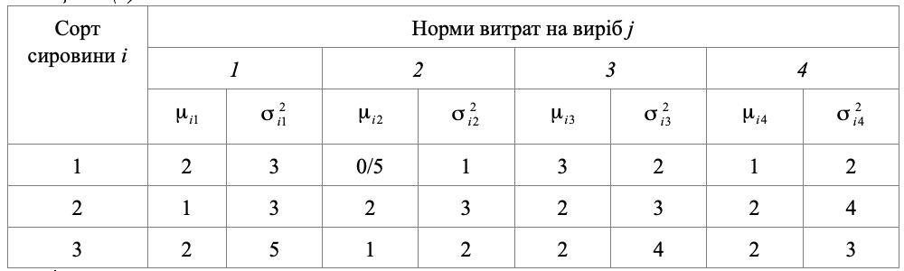
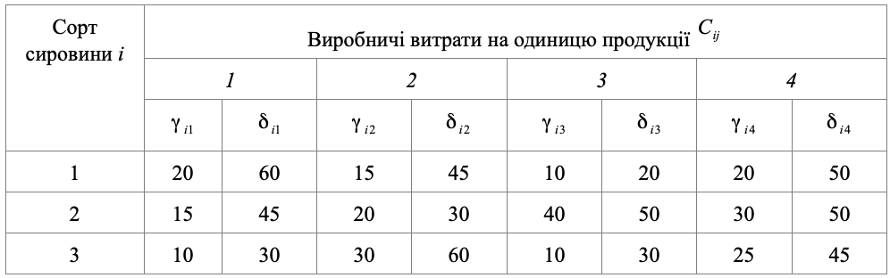

### Задача 1.3

Три сорти взаємозамінної сировини $(i=1, 2, 3)$ в кількості $200, 100$ та $300$ кг використовується для виробництва чотирьох виробів $(j=1, 2, 3, 4)$. Норми витрат $a_{ij}$ сировини $i$ на виробництво виробу $j$ є
нормально розподіленими випадковими величинами з середнім $\mu_{ij}$ та дисперсію $\sigma_{ij}^2$ , а виробничі витрати рівномірно розподілені випадкові величини на інтервалі $[\gamma_{ij}, \delta_{ij}]$. Вихідні дані наведені в таблицях 1.3(а) і 1.3(б).
Скласти такий план виробництва виробів, щоб з ймовірністю $0,9$ випустити $25$ одиниць першого виробу, $45$ одиниць другого виробу, $30$ одиниць третього та $70$ одиниць четвертого при мінімальних очікуваних сумарних виробничих витратах.

Таблиця 1.3(а)

Таблиця 1.3(а)

### Розв'язок

Складемо математичну модель даної задачі для мінімальних очікуваних сумарних виробничих витратах.
Позначимо через $x_j$ - кількість одиниць $j$-го виробу, через $b_i$ кількість сировини, а через $\varPhi_j$ план виробництва.

$$  \sum_{i=1}^{n} \sum_{j=1}^{m} \frac{\delta_{ij}+\gamma_{ij}}{2} x_{j} -
\Phi^{-1}(\alpha_0) \left(\sum_{i=1}^{n} \sum_{j=1}^{m} \frac{(\delta_{ij}-\gamma_{ij})^2}{12} x_{j}^2 \right) \rightarrow min, \quad \alpha_0=0.9 $$
 
При обмеженнях

$$ x_j \ge \varPhi_j, j=1..4 
$$

$$  \sum_{j=1}^{4} x_j \mu_{ij} + \Phi^{-1}(\alpha_0) \left( \sum_{j=1}^{4} x_j^2 \sigma^2_{ij} \right)^{\frac{1}{2}} \le b_j ,\quad i=1..3
$$

Підставляючи дані з таблиці, запишемо цільову функцію:

$$ 40x_1+30x_2+15x_3+35x_4+30x_1+25x_2+45x_3+40x_4+20x_1+45x_2+20x_3+$$

$$+35x_4-\Phi^{-1}(0.9) ( 133\frac{1}{3}x_1^2+75x_2^2+8\frac{1}{3}x_3^2+ 75x_4^2+75x_1^2+8\frac{1}{3}x_2^2+8\frac{1}{3}x_3^2+33\frac{1}{3}x_4^2+ $$

$$+33\frac{1}{3}x_1^2+75x_2^2+33\frac{1}{3}x_3^2+33\frac{1}{3}x_4^2 )^{\frac{1}{2}} \rightarrow min$$

Підставляючи дані з таблиці у формули обмежень та спростивши цільову функцію, отримаємо модель даної задачі:

$$ 90 x_1+100x_2+80x_3+110x_4 \\
\, -\Phi^{-1}(0.9) \left(241\frac{2}{3}x_1^2+158\frac{1}{3}x_2^2+40x_3^2+ 141\frac{2}{3}x_4^2 \right)^{\frac{1}{2}} \rightarrow min$$

При обмеженнях

$$x_1 \ge 25, \quad x_2 \ge 45, \quad x_3 \ge 30, \quad x_4 \ge 70 $$

$$ 2 x_1 + 0.5 x_2 + 3 x_3 + x_4 + \Phi^{-1}(0.9) (3 x_1^2 + x_2^2 + 2 x_3^2 + 2 x_4^2)^\frac{1}{2} \le 200
$$

$$ 1 x_1 + 2 x_2 + 2 x_3 + 2 x_4 + \Phi^{-1}(0.9) (3 x_1^2 + 3 x_2^2 + 3 x_3^2 + 4 x_4^2)^\frac{1}{2} \le 100
$$

$$ 2 x_1 + 1 x_2 + 2 x_3 + 2 x_4 + \Phi^{-1}(0.9) (5 x_1^2 + 2 x_2^2 + 4 x_3^2 + 3 x_4^2)^\frac{1}{2} \le 300
$$