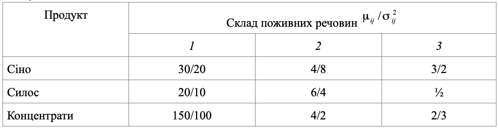

### Задача 1.4

В кормову суміш входять три продукти: сіно, силос і концентрати, які містять поживні речовини: білок, кальцій і вітаміни. Кількість поживних речовин (таблиця 1.4) представляє собою нормально розподілені випадкові величини із середнім $\mu_{ij}$ і дисперсією $\sigma_{ij}$. Мінімально необхідні норми споживання білка –– 2000г., кальцію –– 120г., вітамінів –– 40г.

А) Визначити оптимальний раціон харчування мінімальної вартості, який забезпечується з ймовірністю не менше 0.8 добової норми споживання всіх поживних речовин, якщо ціна 1 кг сіна дорівнює 30 коп., силосу –– 20 коп., концентратів –– 50 коп.

Б) Розв'язати цю ж задачу при умові, що відомі граничні норми споживання добової видачі: сіна – не більше 12 кг., силосу –– не більше 20 кг., концентратів –– 16 кг.

Таблиця 1.4

### Розв'язок

A) Складемо математичну модель даної задачі для мінімальної вартості.
Позначимо через $x_i$ - кількість $i$-го продукту, через $b_j$ - мінімально необхідні норми споживання поживних речовин, а через $с_i$ ціну $i$-го продукту:

$$  \sum_{i=1}^{3} c_i x_i \rightarrow min $$

При обмеженнях:

$$  \sum_{i=1}^{3} x_i \mu_{ij} - \Phi^{-1}(\alpha_0) \left( \sum_{i=1}^{3} x_i^2 \sigma^2_{ij} \right)^{\frac{1}{2}} \ge b_j ,\quad j=1..3
$$

Підставляючи дані з таблиці отримаємо модель даної задачі:

$$ (0.3 x_1 + 0.2 x_2 + 0.5 x_3) \rightarrow min
$$

При обмеженнях:

$$ 30 x_1 + 20 x_2 + 150 x_3 - \Phi^{-1}(0.8) \left( 20 x_1^2 + 10 x_2^2 + 100 x_3^2 \right)^{\frac{1}{2}} \ge 2000
$$

$$ 4 x_1 + 6 x_2 + 4 x_3 - \Phi^{-1}(0.8) \left( 8 x_1^2 + 4 x_2^2 + 2 x_3^2 \right)^{\frac{1}{2}} \ge 120
$$

$$ 3 x_1 + x_2 + 2 x_3 - \Phi^{-1}(0.8) \left( 2 x_1^2 + 2 x_2^2 + 3 x_3^2 \right)^{\frac{1}{2}} \ge 40
$$
 

B) Складемо математичну модель даної задачі для мінімальної вартості при заданих граничних нормах споживання добової видачі продуктів.
Додатково позначимо через $\phi_i$ граничну норму споживання добової видачі $i$-го продукту:

$$  \sum_{i=1}^{3} c_i x_i \rightarrow min $$

При обмеженнях:

$$  \sum_{i=1}^{3} x_i \mu_{ij} - \Phi^{-1}(\alpha_0) \left( \sum_{i=1}^{3} x_i^2 \sigma^2_{ij} \right)^{\frac{1}{2}} \ge b_j ,\quad j=1..3
$$

$$ x_i \le \phi_i, \quad i=1..3
$$

Підставляючи дані з таблиці отримаємо модель даної задачі:

$$ (0.3 x_1 + 0.2 x_2 + 0.5 x_3) \rightarrow min
$$

При обмеженнях:

$$ 30 x_1 + 20 x_2 + 150 x_3 - \Phi^{-1}(0.8) \left( 20 x_1^2 + 10 x_2^2 + 100 x_3^2 \right)^{\frac{1}{2}} \ge 2000
$$

$$ 4 x_1 + 6 x_2 + 4 x_3 - \Phi^{-1}(0.8) \left( 8 x_1^2 + 4 x_2^2 + 2 x_3^2 \right)^{\frac{1}{2}} \ge 120
$$

$$ 3 x_1 + x_2 + 2 x_3 - \Phi^{-1}(0.8) \left( 2 x_1^2 + 2 x_2^2 + 3 x_3^2 \right)^{\frac{1}{2}} \ge 40
$$

$$ x_1 \le 12 , \quad x_2 \le 20 , \quad x_3 \le 16 $$