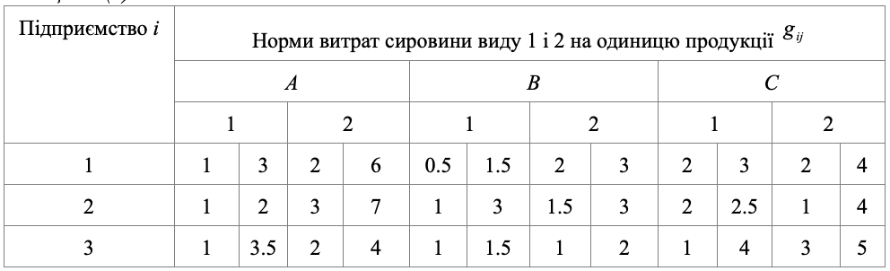
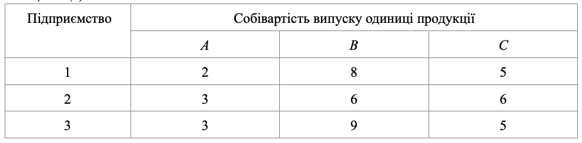

### Задача 1.6

Нехай три підприємства $(i=1, 2, 3)$, використовують для випуску $j$-ї продукції $(j= A, B, C)$ два види ресурсів $(1, 2)$ об'єми яких складають для першого підприємства $250$ і $150$ одиниць, для другого –– $100$ і $200$ і для третього –– $240$ і $300$. Нехай норми витрат кожного ресурсу на $i$-му підприємстві для виробництва $j$-ї одиниці продукції $g$ –– рівномірно розподілені випадкові величина в інтервалі $[a_{ij}^1 ,b_{ij}^1]$, а собі вартість виробництва одиниці $j$-ї продукції на $i$-му підприємстві $c_{ij}$ –– випадкова величина із середнім $\overline{c}_{ij}$ .

Початкові дані наводяться в таблицях 1.6(а) і 1.6(б).
Нехай виробничий план випуску продукції складає відповідно 300, 170 і 250 одиниць.

Необхідно визначити оптимальну спеціалізацію виробництва, при якій мінімізується сумарна очікувана собівартість випуску при умові, що ймовірність виконання плану складає не менше 0.90.

Таблиця 1.6(а)

Таблиця 1.6(б)

### Розв'язок

Складемо математичну модель даної задачі для мінімізації сумарної очікуваної собівартості.
Позначимо:

- через $x_{ij}$ - план виробництва $j$-ї продукції на $i$-му підприємстві, 
- через $p_j$ - план випуску $j$-ї продукції, 
- через $s_{ik}$ об'єм наявного $k$-го ресурсу на $i$-му підприємстві,
- через $a_{ijk}$ та $b_{ijk}$ межі інтервалу розподілення норм витрат $k$-го ресурсу для виробництва $j$-ї продукції на $i$-му підприємстві,

$$  \sum_{i=1}^{3} \sum_{j=1}^{3} c_{ij} x_{ij} \rightarrow min $$

При обмеженнях:

$$  \sum_{i=1}^{3} x_{ij} \ge p_j, \quad j=1..3 $$

$$ \sum_{j=1}^{3} x_{ij} \frac{b_{ijk} + a_{ijk}}{2} + 
\Phi^{-1}(\alpha_0) \left( \sum_{j=1}^{3} x_{ij}^2 \frac{(b_{ijk} - a_{ijk})^2}{12} \right)^{\frac{1}{2}}
\le s_{ik} ,\quad i=1..3, \quad k=1..2
$$

Підставляючи дані з таблиці отримаємо модель даної задачі:

$$ ( 2 x_{11} + 8 x_{12} + 5 x_{13} + 
     3 x_{21} + 6 x_{22} + 6 x_{23} + 
     3 x_{31} + 9 x_{32} + 5 x_{33} ) \rightarrow min
$$

При обмеженнях:

$$ 2 x_{11} + x_{12} + 2\frac{1}{2} x_{13} + \Phi^{-1}(0.9) \left( 
\frac{1}{3} x_{11}^2 + \frac{1}{12} x_{12}^2 + \frac{1}{12} x_{13}^2 
\right)^{\frac{1}{2}} \le 250
$$

$$ 4 x_{11} + 2\frac{1}{2} x_{12} + 3 x_{13} + \Phi^{-1}(0.9) \left( 
1\frac{1}{3} x_{11}^2 + \frac{1}{12} x_{12}^2 + \frac{1}{3} x_{13}^2 
\right)^{\frac{1}{2}} \le 150
$$

$$ 1\frac{1}{2} x_{21} + 2 x_{22} + 2\frac{1}{4} x_{23} + \Phi^{-1}(0.9) \left( 
\frac{1}{12} x_{21}^2 + \frac{1}{3} x_{22}^2 + \frac{1}{48} x_{23}^2 
\right)^{\frac{1}{2}} \le 100
$$

$$ 5 x_{21} + 2\frac{1}{4} x_{22} + 2\frac{1}{2} x_{23} + \Phi^{-1}(0.9) \left( 
1\frac{1}{3} x_{21}^2 + \frac{3}{16} x_{22}^2 + \frac{3}{4} x_{23}^2 
\right)^{\frac{1}{2}} \le 200
$$

$$ 2\frac{1}{4} x_{31} + 1\frac{1}{4} x_{32} + 2\frac{1}{2} x_{33} + \Phi^{-1}(0.9) \left( 
\frac{25}{48} x_{31}^2 + \frac{1}{48} x_{32}^2 + 1\frac{1}{3} x_{33}^2 
\right)^{\frac{1}{2}} \le 240
$$

$$ 3 x_{31} + 1\frac{1}{2} x_{32} + 4 x_{33} + \Phi^{-1}(0.9) \left( 
\frac{1}{3} x_{31}^2 + \frac{1}{12} x_{32}^2 + 1\frac{1}{3} x_{33}^2 
\right)^{\frac{1}{2}} \le 300
$$
