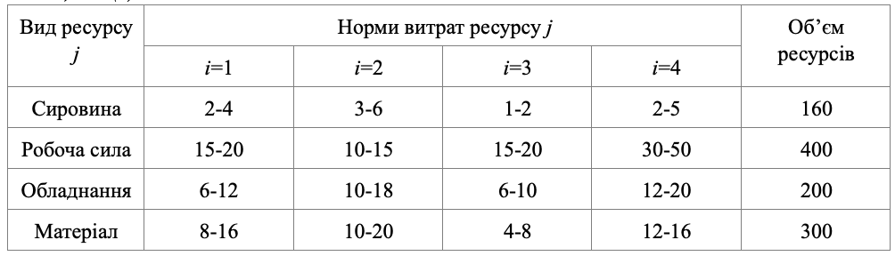
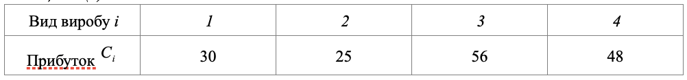

### Задача 1.7

Підприємство володіє ресурсами сировини, робочої сили і обладнання, які необхідні для виробництва чотирьох видів виробів. Нехай питомі витрати ресурсів типу $j$ є випадковими величинами, рівномірно розподіленими у інтервалі $[a_{ij} ,b_{ij}]$, а прибуток на одиницю виробу $i$ складає $C_i$ одиниць. Початкові наведені в таблицях 1.7(а) і 1.7(б).

Визначити оптимальний асортимент виробів, який забезпечує:

А) максимум очікуваного прибутку, при умові реалізованості плану із ймовірністю 0.95;
Б) максимум очікуваного прибутку при асортименті 3:2:1:2;
В) максимум числа компонентів, яке включає один виріб типу 1, два вироби типу 2, три вироби
типу 3 і один виріб типу 4.

Таблиця 1.7(а)

Таблиця 1.7(б)

### Розв'язок

Позначимо:

- через $x_{i}$ - план виробництва $i$-го виробу, 
- через $a_{ij}$ та $b_{ij}$ межі інтервалу розподілення питомих витрат $j$-го ресурсу для виробництва $i$-го виробу,
- через $p_{j}$ - об'єм $j$-го ресурсу, 
  
  
A) Складемо математичну модель даної задачі для максимуму очікуваного прибутку.

$$  \sum_{i=1}^{4} С_{i} x_{i} \rightarrow min $$

При обмеженнях:

$$ \sum_{i=1}^{4} x_{i} \frac{b_{ij} + a_{ij}}{2} + 
\Phi^{-1}(\alpha_0) \left( \sum_{j=1}^{3} x_{ij}^2 \frac{(b_{ij} - a_{ij})^2}{12} \right)^{\frac{1}{2}}
\le p_j ,\quad j=1..4
$$