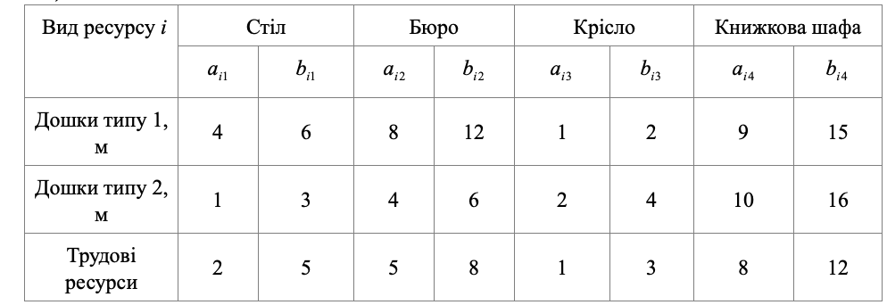

### Задача 1.8

Меблева фабрика випускає столи, крісла, бюро і книжкові шафи, використовуючи два типи дощок. Фабрика має 1000 дощок типу 1 и 500 дощок типу 2. Трудові ресурси фабрики складають 800 чоловік на тиждень. Витрати кожного виду ресурсів на виготовлення одного виробу є рівномірно розподіленими випадковими величинами в інтервалі $[a_{ij}, b_{ij}]$ (табл.1.8). Прибуток від реалізації одного стола––12гр., одного крісла –– 5 гр., одного бюро –– 15 гр., одної книжкової шафи –– 20 гр.

Визначити оптимальний асортимент випуску, який забезпечується при умові реалізованості плану з ймовірністю не менше 0.9:

А) максимум очікуваного прибутку;
Б) максимум очікувано прибутку при умові комплектності (кількість столів відноситься до кількості крісел як 1:6);
В) максимум очікуваного прибутку при додаткових умовах: столів не менше 400 шт., бюро не менше 130 шт., книжкових шаф не більше 10 шт.;
Г) максимум очікуваної вартості товарної продукції при умові комплектності і наступних цінах на продукцію: стіл –– 40 гр., крісло –– 15 гр., бюро –– 30 гр., шафа –– 80 гр.

Таблиця 1.8

### Розв'язок

Позначимо:

- через $x_{j}$ - план виробництва $j$-го виробу, 
- через $a_{ij}$ та $b_{ij}$ межі інтервалу розподілення витрат $i$-го ресурсу для виробництва $j$-го виробу,
- через $p_{i}$ - об'єм $i$-го ресурсу, 
- через $C_{i}$ - прибуток від реалізації $j$-го виробу, 
  
  
A) Складемо математичну модель даної задачі для максимуму очікуваного прибутку.

$$  \sum_{j=1}^{4} С_{j} x_{j} \rightarrow min $$

При обмеженнях:

$$ \sum_{j=1}^{4} x_{j} \frac{b_{ij} + a_{ij}}{2} + 
\Phi^{-1}(\alpha_0) \left( \sum_{j=1}^{4} x_{j}^2 \frac{(b_{ij} - a_{ij})^2}{12} \right)^{\frac{1}{2}}
\le p_j ,\quad i=1..3
$$

Підставляючи дані з таблиці отримаємо модель даної задачі:

$$ 12 x_1 + 15 x_2 + 5 x_3 + 20 x_4 \rightarrow \max
$$

При обмеженнях:

$$ 5 x_1 + 10 x_2 + 1\frac{1}{2} x_3 + 13 x_4 + \Phi^{-1}(0.9) \left(
\frac{1}{3} x_1^2 + 1\frac{1}{3} x_2^2 + \frac{1}{12} x_3^2 + 3 x_4^2  \right)^{\frac{1}{2}}
\le 1000
$$

$$ 2 x_1 + 5 x_2 + 3 x_3 + 13 x_4 + \Phi^{-1}(0.9) \left(
\frac{1}{3} x_1^2 + \frac{1}{3} x_2^2 + \frac{1}{3} x_3^2 + 3 x_4^2  \right)^{\frac{1}{2}}
\le 500
$$

$$ 3\frac{1}{2} x_1 + 6\frac{1}{2} x_2 + 2 x_3 + 10 x_4 + \Phi^{-1}(0.9) \left(
\frac{3}{4} x_1^2 + \frac{3}{4} x_2^2 + \frac{1}{3} x_3^2 + 1\frac{1}{3} x_4^2  \right)^{\frac{1}{2}}
\le 800
$$

Б) Для максимуму очікуваного прибутку при умові комплектності (кількість столів відноситься до кількості крісел як 1:6) треба ввести заміну:

$$ x_3 = 6 x_1 $$

В) Для максимуму очікуваного прибутку при додаткових умовах: столів не менше 400 шт., бюро не менше 130 шт., книжкових шаф не більше 10 шт. треба додати наступні обмеження:

$$ x_1 \ge 400, \quad x_2 \ge 130, \quad x_4 \le 10 $$

Г) Для максимуму очікуваної вартості товарної продукції при умові комплектності і наступних цінах на продукцію: стіл –– 40 гр., крісло –– 15 гр., бюро –– 30 гр., шафа –– 80 гр. треба зробити заміну змінних та замінити коефіцієнти у цільовій функції:

$$ 40 x_1 + 30 x_2 + 15 x_3 + 80 x_4 \rightarrow \max
$$

$$ x_3 = 6 x_1 $$

