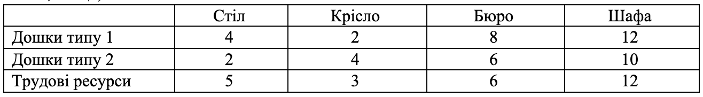
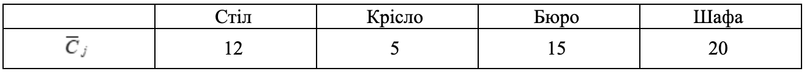

### Задача 3.1 

Меблева фабрика випускає столи, крісла, бюро і книжкові шафи, використовуючи два типи дощок. Фабрика має 1000 дощок типу 1 и 500 дощок типу 2. Трудові ресурси фабрики складають 800 чоловік на тиждень. Витрати кожного виду ресурсів на виготовлення одного виробу є нечіткими параметрами із функцією приналежності $\mu_{ij}(a_{ij})$ і наведені в таблиці 3.1(а). Прибуток від реалізації виробів $C_j$ є нечіткою величиною із функцією приналежності $\gamma_j(C_j)$ (табл. 3.1(б)), де 

$$ \mu_{ij}(a_{ij}) = \frac{2}{2 + (a_{ij} - \overline{a}_{ij})^2}, \quad
   \gamma_j(C_j) = \exp \left( -\frac{(C_{j} - \overline{C}_{j})^2}{2} \right)
$$

Визначити оптимальний асортимент випуску виробів, який забезпечується при умові реалізованості плану максимум очікуваного прибутку. Знайти множину не домінуючих альтернатив зі степенем $\alpha=0.75$

Таблиця 3.1(а)

Таблиця 3.1(б) 

### Розв'язок

Позначимо через $x_{j}$ - кількість виробів $j$-го типу, а через $b_i$ наявні ресурси  $i$-го типу. Тоді математична модель матиме такий вигляд:

$$ \max \sum_{j=1}^{4} C_j x_j $$

При обмеженнях

$$ \sum_{j=1}^{4} a_{ij} x_j \le b_i, \quad i=1..3 $$

$$ x_j \ge 0, \quad j=1..4 $$

$$ \mu(a_{ij})  \ge 0.75 , \quad \gamma(C_j) \ge 0.75$$

Вирішуємо нерівність та знайдемо кінці інтервалу нечіткої множини $a_{ij}$ рівня $\alpha=0.75$

$$ \mu_{ij}(a_{ij}) = \frac{2}{2 + (a_{ij} - \overline{a}_{ij})^2} \ge 0.75 $$

$$ 2 \ge 0.75 \cdot (2 + (a_{ij} - \overline{a}_{ij})^2) $$

$$ 1.5 + 0.75 \cdot (a_{ij} - \overline{a}_{ij})^2 \le 2 $$

$$ (a_{ij} - \overline{a}_{ij})^2 \le \frac{2}{3} $$

$$ |a_{ij} - \overline{a}_{ij}| \le \sqrt{\frac{2}{3}} $$

$$ \overline{a}_{ij} - \sqrt{\frac{2}{3}} \le a_{ij} \le \overline{a}_{ij} + \sqrt{\frac{2}{3}} $$

Вирішуємо нерівність та знайдемо кінці інтервалу нечіткої множини $C_j$ рівня $\alpha=0.75$

$$ \gamma_j(C_j) = \exp \left( -\frac{(C_{j} - \overline{C}_{j})^2}{2} \right) \ge 0.75 $$

$$ -\frac{(C_{j} - \overline{C}_{j})^2}{2} \ge \ln 0.75 $$

$$ (C_{j} - \overline{C}_{j})^2 \le -2 \ln 0.75 $$

$$ (C_{j} - \overline{C}_{j})^2 \le 2 \ln \frac{4}{3} $$

$$ |C_{j} - \overline{C}_{j}| \le \sqrt{ 2 \ln \frac{4}{3} } $$

$$ \overline{C}_{j} - \sqrt{ 2 \ln \frac{4}{3} } \le C_{j} \le \overline{C}_{j} + \sqrt{ 2 \ln \frac{4}{3} } $$

Задача песиміста:

$$ 12 x_1 + 5 x_2 + 15 x_3 + 20 x_4 + \sqrt{ 2 \ln \frac{4}{3} } (x_1+x_2+x_3+x_4) \rightarrow \max $$

$$ 4 x_1 + 2 x_2 + 8 x_3 + 12 x_4 + \sqrt{\frac{2}{3}} (x_1+x_2+x_3+x_4) \le 1000 $$

$$ 2 x_1 + 4 x_2 + 6 x_3 + 10 x_4 + \sqrt{\frac{2}{3}} (x_1+x_2+x_3+x_4) \le 500 $$

$$ 5 x_1 + 3 x_2 + 6 x_3 + 12 x_4 + \sqrt{\frac{2}{3}} (x_1+x_2+x_3+x_4) \le 800 $$

Задача оптиміста:

$$ 12 x_1 + 5 x_2 + 15 x_3 + 20 x_4 - \sqrt{ 2 \ln \frac{4}{3} } (x_1+x_2+x_3+x_4) \rightarrow \max $$

$$ 4 x_1 + 2 x_2 + 8 x_3 + 12 x_4 - \sqrt{\frac{2}{3}} (x_1+x_2+x_3+x_4) \le 1000 $$

$$ 2 x_1 + 4 x_2 + 6 x_3 + 10 x_4 - \sqrt{\frac{2}{3}} (x_1+x_2+x_3+x_4) \le 500 $$

$$ 5 x_1 + 3 x_2 + 6 x_3 + 12 x_4 - \sqrt{\frac{2}{3}} (x_1+x_2+x_3+x_4) \le 800 $$