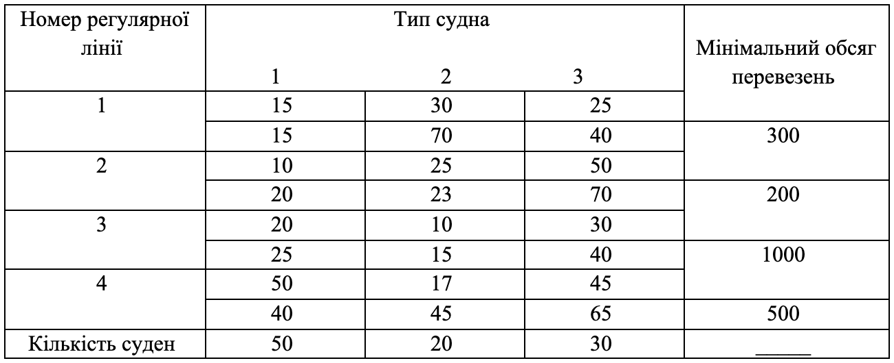

### Задача 3.10. 

**Дослідження задачі оптимального розподілу судів за регулярними лініями.**

Є $n$ різних типів суден, які можуть здійснювати перевезення народногосподарських вантажів регулярними лініями. Судна різних типів під час експлуатації тієї чи іншої лінії мають різні характеристики. Зокрема, вони мають різну кількість заходів у проміжні порти для поповнення запасів палива та прісної води, на деяких лініях не використовується повністю комерційна вантажопідйомність суден, а судна деяких типів взагалі не можуть бути використані на окремих лініях тощо. Тому експлуатаційні витрати на кожен тип судна, що використовується на даній лінії, – різні.

Виходячи з даних про собівартість вантажо-кілометра та комерційного завантаження кожного типу судна на кожній лінії встановлюють:

а) величину $a_{ij}$ - місячний обсяг перевезень вантажів одним судном - $j$-го типу $i$-ої регулярної лінії;

б) величину $c_{ij}$ - місячна експлуатаційна витрата коштів на одне судно $j$-го типу, що використовується на $i$-ій лінії.

Передбачається також відомий необхідний мінімальний обсяг перевезень $b_i (i=1,2,...,m)$ по кожній лінії, а також кількість $N_j(j=1,2,...,)$ судів $j$-го типу. $\sum_{j=1}^n N_j = N$, де $N$ - загальна кількість судів, що підлягає розподілу по лініями. Потрібно скласти такий план розподілу парку суден за регулярними лініями, який би забезпечував мінімум сумарних експлуатаційних витрат при виконанні заданого обсягу перевезень.

Конкретні числові умови задачі за варіантами 1-4 зведені у табл. 5-8 відповідно [1; 4; 6].

Примітки: 
1. У верхніх відділеннях клітин таблиць 5 - зазначені числа $a_{ij}$ у тисячах тонн, а в нижніх – $c_{ij}$ у тисячах гривень, у правому стовпці обсяг перевезень $A_j$ у тисячах тонн.

2. Відсутність чисел $a_{ij}$ та $c_{ij}$ в $i$-му рядку і $j$-му стовпці означає неможливість використання судна $i$-го типу на $i$-ій регулярної лінії.

Припустимо, що місячний обсяг перевезень вантажів є нечіткою множиною з ф.п. $\mu_{ij}(a_{ij})$, а місячні експлуатаційні витрати $C_{ij}$ - нечітка множина з ф.п. $\gamma_{ij}(C_{ij})$, де

$$ \mu_{ij}(a_{ij}) = \exp \left( -\frac{(a_{ij} - \overline{a}_{ij})^2}{2} \right), \quad
   \gamma_j(C_j) = \frac{1}{1 + (C_{j} - \overline{C}_{j})^2}
$$

Відповідні дані наведено у табл. 5, де у верхніх відділеннях клітин зазначені величини $a_{ij}$, а в нижніх - $c_{ij}$.

Знайти такий план розподілу судів по лініях, при якому місячний план перевезень би виконувався і сумарні очікувані експлуатаційні витрати були б мінімальними. Побудувати відповідну модель задачі НМП. Знайти підмножини максимізуючих альтернатив, що не домінуються зі ступенем $\alpha=0.8$, зокрема для стратегій оптиміста та песиміста, та порівняти отримані рішення.

Таблиця 5

### Розв'язок

Позначимо через $x_{ij}$ - кількість суден $j$-го типу, розподілених на $i$-еу регулярну лінію. Тоді математична модель матиме такий вигляд:

$$ \min \sum_{i=1}^{4} \sum_{j=1}^{3} C_{ij} x_{ij} $$

При обмеженнях

$$ \sum_{j=1}^{3} a_{ij} x_{ij} \ge b_{i}, \quad i=1..4$$

$$ \sum_{i=1}^{4} x_{ij} \le N_{j}, \quad j=1..4 $$

$$ x_{ij} \ge 0, \quad i=1..3, \quad j=1..3 $$

$$ \mu(a_{ij})  \ge 0.8 , \quad \gamma(C_{ij}) \ge 0.8$$

Вирішуємо нерівність та знайдемо кінці інтервалу нечіткої множини $a_{ij}$ рівня $\alpha=0.8$

$$ \mu_{ij}(a_{ij}) = \exp \left( -\frac{(a_{ij} - \overline{a}_{ij})^2}{2} \right) \ge 0.8 $$

$$  -\frac{(a_{ij} - \overline{a}_{ij})^2}{2} \ge \ln 0.8 $$

$$  (a_{ij} - \overline{a}_{ij})^2 \le -2 \ln 0.8 $$

$$  |a_{ij} - \overline{a}_{ij}| \le \sqrt{2 \ln 1.25} $$

$$ \overline{a}_{ij} - \sqrt{2 \ln 1.25} \le a_{ij} \le \overline{a}_{ij} + \sqrt{2 \ln 1.25} $$

Вирішуємо нерівність та знайдемо кінці інтервалу нечіткої множини $C_{ij}$ рівня $\alpha=0.8$

$$ \gamma_j(C_j) = \frac{1}{1 + (C_{j} - \overline{C}_{j})^2} \ge 0.8 $$

$$ 1 \ge 0.8 (1 + (C_{j} - \overline{C}_{j})^2) $$

$$ 1 \ge 0.8 + 0.8 (C_{j} - \overline{C}_{j})^2 $$

$$ 0.8 (C_{j} - \overline{C}_{j})^2 \le 0.2$$

$$ (C_{j} - \overline{C}_{j})^2 \le 0.25$$

$$ |C_{j} - \overline{C}_{j}| \le 0.5$$

$$ \overline{C}_{j} - 0.5 \le C_{j} \le  \overline{C}_{j} + 0.5$$

Задача песиміста:

$$ 15 x_{11} + 70 x_{12} + 40 x_{13} +
   20 x_{21} + 23 x_{22} + 70 x_{23} + \\ +
   25 x_{31} + 15 x_{32} + 40 x_{33} +
   40 x_{41} + 45 x_{42} + 65 x_{43} + \\ + 0.5(
      x_{11} + x_{12} + x_{13} +
      x_{21} + x_{22} + x_{23} +
      x_{31} + x_{32} + x_{33} +
      x_{41} + x_{42} + x_{43}
   ) \rightarrow \min
$$

$$ 15 x_{11} + 30 x_{12} + 25 x_{13} - \sqrt{2 \ln 1.25} ( x_{11} + x_{12} + x_{13} ) \ge 300 $$

$$ 10 x_{21} + 25 x_{22} + 50 x_{23} - \sqrt{2 \ln 1.25} ( x_{21} + x_{22} + x_{23} ) \ge 200 $$

$$ 20 x_{31} + 10 x_{32} + 30 x_{33} - \sqrt{2 \ln 1.25} ( x_{31} + x_{32} + x_{33} ) \ge 1000 $$

$$ 50 x_{41} + 17 x_{42} + 45 x_{43} - \sqrt{2 \ln 1.25} ( x_{41} + x_{42} + x_{43} ) \ge 500 $$

$$ x_{11} + x_{21} + x_{31} + x_{41} \le 50 $$

$$ x_{12} + x_{22} + x_{32} + x_{42} \le 20 $$

$$ x_{13} + x_{23} + x_{33} + x_{43} \le 30 $$

Задача оптиміста:

$$ 15 x_{11} + 70 x_{12} + 40 x_{13} +
   20 x_{21} + 23 x_{22} + 70 x_{23} + \\ +
   25 x_{31} + 15 x_{32} + 40 x_{33} +
   40 x_{41} + 45 x_{42} + 65 x_{43} - \\ - 0.5(
      x_{11} + x_{12} + x_{13} +
      x_{21} + x_{22} + x_{23} +
      x_{31} + x_{32} + x_{33} +
      x_{41} + x_{42} + x_{43}
   ) \rightarrow \min
$$

$$ 15 x_{11} + 30 x_{12} + 25 x_{13} + \sqrt{2 \ln 1.25} ( x_{11} + x_{12} + x_{13} ) \ge 300 $$

$$ 10 x_{21} + 25 x_{22} + 50 x_{23} + \sqrt{2 \ln 1.25} ( x_{21} + x_{22} + x_{23} ) \ge 200 $$

$$ 20 x_{31} + 10 x_{32} + 30 x_{33} + \sqrt{2 \ln 1.25} ( x_{31} + x_{32} + x_{33} ) \ge 1000 $$

$$ 50 x_{41} + 17 x_{42} + 45 x_{43} + \sqrt{2 \ln 1.25} ( x_{41} + x_{42} + x_{43} ) \ge 500 $$

$$ x_{11} + x_{21} + x_{31} + x_{41} \le 50 $$

$$ x_{12} + x_{22} + x_{32} + x_{42} \le 20 $$

$$ x_{13} + x_{23} + x_{33} + x_{43} \le 30 $$