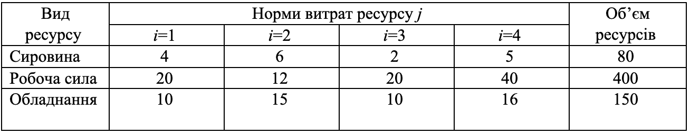
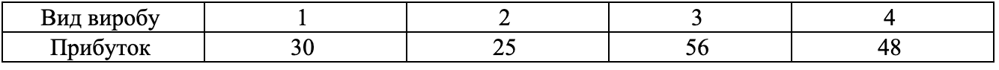

### Задача 3.2 

Підприємство володіє ресурсами сировини, робочої сили і обладнання, які необхідні для виробництва чотирьох видів виробів. Нехай питомі витрати ресурсів типу $i$ при виробництві виробів типу $j$ $a_{ij}$  є нечіткими змінними на інтервалі $[\eta_{ij}, \delta_{ij}]$ з ф.п. $\mu_{ij}(a_{ij})$ , а прибуток одиниці виробу $C_j$ - нечітка величина з ф.п. $\gamma_j(C_j)$, де 

$$ \mu_{ij}(a_{ij}) = \exp \left( -\frac{(a_{ij} - \overline{a}_{ij})^2}{2} \right), \quad
   \gamma_j(C_j) = \frac{1}{1 + (C_{j} - \overline{C}_{j})^2}
$$

Початкові дані наводяться у табл. 3.2(а) и табл. 3.2(б). Визначити оптимальний асортимент випуску виробів, який забезпечує максимум очікуваного прибутку при умові реалізованості плану. Знайти підмножину не домінуючих альтернатив зі степенем $\alpha=0.8$. 

Таблиця 3.2(а) 

Таблиця 3. 2(б) 

### Розв'язок

Позначимо через $x_{j}$ - кількість виробів $j$-го типу, а через $b_i$ наявні ресурси  $i$-го типу. Тоді математична модель матиме такий вигляд:

$$ \max \sum_{j=1}^{4} C_j x_j $$

При обмеженнях

$$ \sum_{j=1}^{4} a_{ij} x_j \le b_i, \quad i=1..3 $$

$$ x_j \ge 0, \quad j=1..4 $$

$$ \mu(a_{ij})  \ge 0.8 , \quad \gamma(C_j) \ge 0.8$$

Вирішуємо нерівність та знайдемо кінці інтервалу нечіткої множини $a_{ij}$ рівня $\alpha=0.8$

$$ \mu_{ij}(a_{ij}) = \exp \left( -\frac{(a_{ij} - \overline{a}_{ij})^2}{2} \right) \ge 0.8 $$

$$ -\frac{(a_{ij} - \overline{a}_{ij})^2}{2} \ge \ln 0.8 $$

$$ (a_{ij} - \overline{a}_{ij})^2 \le -2 \ln 0.8 $$

$$ |a_{ij} - \overline{a}_{ij}| \le \sqrt{2 \ln 1.25} $$

$$ \overline{a}_{ij} - \sqrt{2 \ln 1.25} \le a_{ij} \le \overline{a}_{ij} + \sqrt{2 \ln 1.25} $$

Вирішуємо нерівність та знайдемо кінці інтервалу нечіткої множини $C_j$ рівня $\alpha=0.8$

$$ \gamma_j(C_j) = \frac{1}{1 + (C_{j} - \overline{C}_{j})^2} \ge 0.8 $$

$$ 1 \ge 0.8 \cdot (1 + (C_{j} - \overline{C}_{j})^2) $$

$$  0.8 + 0.8(C_{j} - \overline{C}_{j})^2) \le 1 $$

$$  (C_{j} - \overline{C}_{j})^2 \le 0.25 $$

$$  |C_{j} - \overline{C}_{j}| \le 0.5 $$

$$ \overline{C}_{j} - 0.5  + C_{j} \le \overline{C}_{j} + 0.5 $$

Задача песиміста:

$$ 30 x_1 + 25 x_2 + 56 x_3 + 48 x_4 - 0.5 (x_1+x_2+x_3+x_4) \rightarrow \max $$

$$ 4 x_1 + 6 x_2 + 2 x_3 + 5 x_4 + \sqrt{2 \ln 1.25} (x_1+x_2+x_3+x_4) \le 80 $$

$$ 20 x_1 + 12 x_2 + 20 x_3 + 40 x_4 + \sqrt{2 \ln 1.25} (x_1+x_2+x_3+x_4) \le 400 $$

$$ 10 x_1 + 15 x_2 + 10 x_3 + 16 x_4 + \sqrt{2 \ln 1.25} (x_1+x_2+x_3+x_4) \le 150 $$

Задача оптиміста:

$$ 30 x_1 + 25 x_2 + 56 x_3 + 48 x_4 + 0.5 (x_1+x_2+x_3+x_4) \rightarrow \max $$

$$ 4 x_1 + 6 x_2 + 2 x_3 + 5 x_4 - \sqrt{2 \ln 1.25} (x_1+x_2+x_3+x_4) \le 80 $$

$$ 20 x_1 + 12 x_2 + 20 x_3 + 40 x_4 - \sqrt{2 \ln 1.25} (x_1+x_2+x_3+x_4) \le 400 $$

$$ 10 x_1 + 15 x_2 + 10 x_3 + 16 x_4 - \sqrt{2 \ln 1.25} (x_1+x_2+x_3+x_4) \le 150 $$
