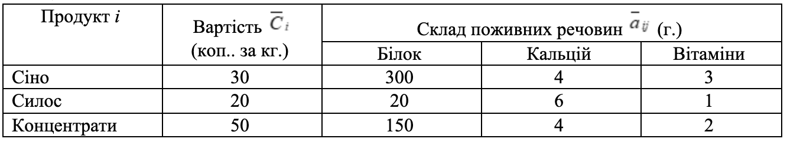

### Задача 3.3 

В кормову суміш входять три продукти: сіно, силос і концентрати, які містять поживні речовини: білок, кальцій і вітаміни. Кількість поживних речовин (таблиця 3.3) є нечіткими величинами у інтервалі $[\delta_{ij}, \sigma_{ij}]$ з ф.п. $\mu_{ij}(a_{ij})$. Мінімально необхідні норми споживання білка –– 2000 г., кальцію –– 120 г., вітамінів –– 40 г. 

Визначити оптимальний раціон харчування мінімальної вартості, який забезпечує добової норми споживання всіх поживних речовин, якщо ціна 1 кг $j$-го продукту нечітка величина з ф.п. $\gamma_j(C_j)$. Знайти підмножину не домінуючих альтернатив зі степенем $\alpha=0.75$. 

$$ \mu_{ij}(a_{ij}) = \exp \left( -\frac{(a_{ij} - \overline{a}_{ij})^2}{2} \right), \quad
   \gamma_j(C_j) = \frac{2}{2 + (C_{j} - \overline{C}_{j})^2}
$$

Початкові дані наведені у таблиці. 

Таблиця 3.3 

### Розв'язок

Позначимо через $x_{j}$ - кількість продуктів $j$-го типу, а через $b_i$ Мінімально необхідні норми споживання поживної речовини $i$-го типу. Тоді математична модель матиме такий вигляд:

$$ \min \sum_{j=1}^{3} C_j x_j $$

При обмеженнях

$$ \sum_{j=1}^{3} a_{ij} x_j \ge b_i, \quad i=1..3 $$

$$ x_j \ge 0, \quad j=1..3 $$

$$ \mu(a_{ij})  \ge 0.75 , \quad \gamma(C_j) \ge 0.75$$

Вирішуємо нерівність та знайдемо кінці інтервалу нечіткої множини $a_{ij}$ рівня $\alpha=0.75$

$$ \mu_{ij}(a_{ij}) = \exp \left( -\frac{(a_{ij} - \overline{a}_{ij})^2}{2} \right) \ge 0.75 $$

$$  -\frac{(a_{ij} - \overline{a}_{ij})^2}{2} \ge \ln 0.75 $$

$$  (a_{ij} - \overline{a}_{ij})^2 \le -2 \ln 0.75 $$

$$  |a_{ij} - \overline{a}_{ij}| \le \sqrt{2 \ln \frac{4}{3}} $$

Вирішуємо нерівність та знайдемо кінці інтервалу нечіткої множини $C_j$ рівня $\alpha=0.75$

$$ \gamma_j(C_j) = \frac{2}{2 + (C_{j} - \overline{C}_{j})^2} \ge 0.75 $$

$$ 2 \ge 0.75 (2 + (C_{j} - \overline{C}_{j})^2 $$

$$ 1.5 + 0.75 (C_{j} - \overline{C}_{j})^2 \le 2 $$

$$ (C_{j} - \overline{C}_{j})^2 \le \frac{2}{3} $$

$$ |C_{j} - \overline{C}_{j}| \le \sqrt{\frac{2}{3}} $$

$$ \overline{C}_{j} - \sqrt{\frac{2}{3}} \le C_{j} \le \overline{C}_{j} + \sqrt{\frac{2}{3}} $$

Задача песиміста:

$$ 30 x_1 + 20 x_2 + 50 x_3  + 0.5 (x_1+x_2+x_3) \rightarrow \min $$

$$ 300 x_1 + 20 x_2 + 150 x_3     +  \sqrt{2 \ln \frac{4}{3}} (x_1+x_2+x_3) \ge 2000 $$

$$ 4 x_1 + 6 x_2 + 4 x_3  + \sqrt{2 \ln \frac{4}{3}} (x_1+x_2+x_3) \ge 120 $$

$$ 3 x_1 + 1 x_2 + 2 x_3  + \sqrt{2 \ln \frac{4}{3}} (x_1+x_2+x_3) \ge 40 $$

Задача оптиміста:

$$ 30 x_1 + 20 x_2 + 50 x_3  - 0.5 (x_1+x_2+x_3) \rightarrow \min $$

$$ 300 x_1 + 20 x_2 + 150 x_3     -  \sqrt{2 \ln \frac{4}{3}} (x_1+x_2+x_3) \ge 2000 $$

$$ 4 x_1 + 6 x_2 + 4 x_3  - \sqrt{2 \ln \frac{4}{3}} (x_1+x_2+x_3) \ge 120 $$

$$ 3 x_1 + 1 x_2 + 2 x_3  - \sqrt{2 \ln \frac{4}{3}} (x_1+x_2+x_3) \ge 40 $$
