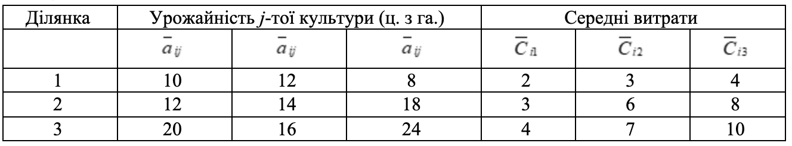

### Задача 3.4 

На трьох ділянках колгоспного поля можна вирощувати три культури: жито, пшеницю і ячмінь. Урожайність цих культур нечітка величина з ф.п. $\mu_{ij}(a_{ij})$. Очікувані затрати –– нечітка величина з ф.п. $\gamma_{ij}(C_{ij})$. 

Нехай планове завдання із зібрання урожаю кожної культури складає відповідно 500 ц., 600 ц. і 400 ц., а площі ділянок дорівнюють відповідно 30 га., 50 га., 20 га. 

Визначити оптимальну структуру посівів, яка мінімізує сумарні очікувані витрати при умові виконання плану. Знайти підмножину не домінуючих альтернатив зі степенем $\alpha=0.8$. 

$$ \mu_{ij}(a_{ij}) = \frac{1}{1 + (a_{ij} - \overline{a}_{ij})^2}, \quad
   \gamma_j(C_j) = \exp \left( -\frac{(C_{ij} - \overline{C}_{ij})^2}{4} \right)
$$

Початкові дані наведені в таблиці 3.4: 

Таблиця 3.4
