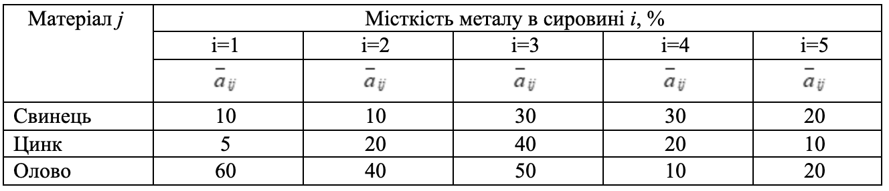
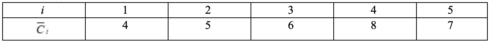

### Задача 3.5 

Для виготовлення визначеного сплаву із свинцю, цинку і олова використовується сировина у вигляді наступних п’яти сплавів із тих же металів, які відрізняються складом і вартістю 1 кг. Допустимо, що процентний склад металу j у кожній сировині і  є нечіткою величиною в інтервалі $[a_{ij}, b_{ij}]$ з ф.п. $\mu_{ij}(a_{ij})$, а вартість сплаву $C_j$ –– нечітка величина з ф.п. $\gamma_j(C_j)$, де 

 
$$ \mu_{ij}(a_{ij}) = \exp \left( -\frac{(a_{ij} - \overline{a}_{ij})^2}{4} \right), \quad
   \gamma_j(C_j) = \frac{5}{5 + (C_{j} - \overline{C}_{j})^2}
$$
 

Початкові дані наведені в таблицях 3.5(а) і 3.5(б). 

Необхідно визначити скільки сировини кожного типу потрібно взяти, щоб виготовити з мінімальною собівартістю сплав, який міститиме не менше 20% свинцю, 30% цинку і 50% олова. Знайти підмножину не домінуючих альтернатив зі степенем $\alpha=0.7$. 

Таблиця 3.5(а) 

Таблиця 3.5(б) 

### Розв'язок

Позначимо через $x_{i}$ - кількість сировини $i$-го типу, через $b_j$ - мінімальний вміст металу $j$-го типу. Тоді математична модель матиме такий вигляд:

$$ \min \sum_{i=1}^{5} C_{i} x_{i} $$

При обмеженнях

$$ \sum_{i=1}^{5} a_{ij} x_{ij} \ge b_j, \quad j=1..3 $$

$$ x_{i} \ge 0, \quad i=1..5  $$

$$ \mu(a_{ij})  \ge 0.7 , \quad \gamma(C_j) \ge 0.7$$

Вирішуємо нерівність та знайдемо кінці інтервалу нечіткої множини $a_{ij}$ рівня $\alpha=0.7$

$$ \mu_{ij}(a_{ij}) = \exp \left( -\frac{(a_{ij} - \overline{a}_{ij})^2}{4} \right) \ge 0.7 $$

$$  -\frac{(a_{ij} - \overline{a}_{ij})^2}{4}  \ge \ln 0.7 $$

$$  (a_{ij} - \overline{a}_{ij})^2  \le - 4\ln 0.7 $$

$$  |a_{ij} - \overline{a}_{ij}|  \le 2\sqrt{\ln \frac{10}{7}} $$

$$  \overline{a}_{ij} - 2\sqrt{\ln \frac{10}{7}} \le a_{ij} \le \overline{a}_{ij} + 2\sqrt{\ln \frac{10}{7}} $$

Вирішуємо нерівність та знайдемо кінці інтервалу нечіткої множини $C_{ij}$ рівня $\alpha=0.7$

$$ \gamma_j(C_j) = \frac{5}{5 + (C_{j} - \overline{C}_{j})^2} \ge 0.7 $$

$$ 5 \ge 0.7 (5 + (C_{j} - \overline{C}_{j})^2) $$

$$ 5 \ge 3.5 + 0.7(C_{j} - \overline{C}_{j})^2 $$

$$ 0.7(C_{j} - \overline{C}_{j})^2 \le 1.5 $$

$$ |C_{j} - \overline{C}_{j}| \le \sqrt{\frac{15}{7}} $$

$$ \overline{C}_{j} - \sqrt{\frac{15}{7}} \le C_{j}\le \overline{C}_{j} + \sqrt{\frac{15}{7}} $$

Задача песиміста:

$$ 4 x_1 + 5 x_2 + 6 x_3 + 8 x_4 + 7 x_5 + \sqrt{\frac{15}{7}} (x_1+x_2+x_3+x_4+x_5) \rightarrow min $$

$$ 10 x_1 + 10 x_2 + 30 x_3 + 30 x_4 + 20 x_5 + 2\sqrt{\ln \frac{10}{7}} (x_1+x_2+x_3+x_4+x_5) \ge 20 $$

$$ 5 x_1 + 20 x_2 + 40 x_3 + 20 x_4 + 10 x_5 + 2\sqrt{\ln \frac{10}{7}} (x_1+x_2+x_3+x_4+x_5) \ge 30 $$

$$ 60 x_1 + 40 x_2 + 50 x_3 + 10 x_4 + 20 x_5 + 2\sqrt{\ln \frac{10}{7}} (x_1+x_2+x_3+x_4+x_5) \ge 50 $$

Задача оптиміста:

$$ 4 x_1 + 5 x_2 + 6 x_3 + 8 x_4 + 7 x_5 - \sqrt{\frac{15}{7}} (x_1+x_2+x_3+x_4+x_5) \rightarrow min $$

$$ 10 x_1 + 10 x_2 + 30 x_3 + 30 x_4 + 20 x_5 - 2\sqrt{\ln \frac{10}{7}} (x_1+x_2+x_3+x_4+x_5) \ge 20 $$

$$ 5 x_1 + 20 x_2 + 40 x_3 + 20 x_4 + 10 x_5 - 2\sqrt{\ln \frac{10}{7}} (x_1+x_2+x_3+x_4+x_5) \ge 30 $$

$$ 60 x_1 + 40 x_2 + 50 x_3 + 10 x_4 + 20 x_5 - 2\sqrt{\ln \frac{10}{7}} (x_1+x_2+x_3+x_4+x_5) \ge 50 $$
