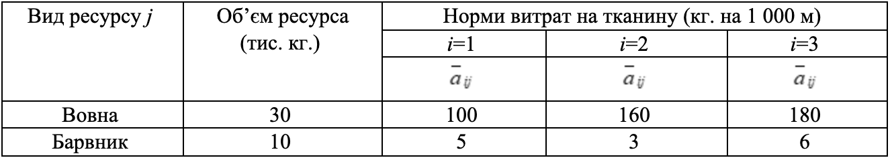
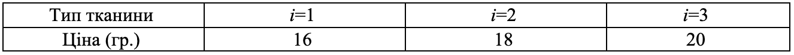

Задача 3.6 

На виробництво тканини трьох артикулів витрачаються ресурси двох типів: вовна і барвник. Витрати вовни і фарби (кг на 1 000 м) –– нечіткі величини розподілені в інтервалі $[c_{ij}, d_{ij}]$ з ф.п. $\mu_{ij}(a_{ij})$. 

Ціна 1 м тканини –– нечітка величина з ф.п. $\gamma_j(C_j)$. 

Визначити оптимальний асортимент, який максимізує прибуток при умові реалізованості плану, якщо середня собівартість 1 м тканини дорівнює відповідно 8, 5 і 15 гр. Знайти підмножину не домінуючих альтернатив зі степенем $\alpha=0.6$. 

$$ \mu_{ij}(a_{ij}) = \frac{3}{3 + (a_{ij} - \overline{a}_{ij})^2}, \quad
   \gamma_j(C_j) = \frac{1}{1 + (C_{j} - \overline{C}_{j})^2}
$$

Початкові дані наведені в таблицях 3.6(а) і 3.6(б) 

Таблиця 3.6(а) 

Таблиця 3.6(б) 
