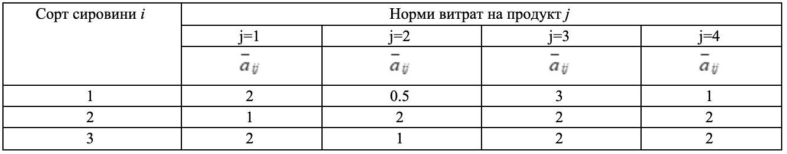
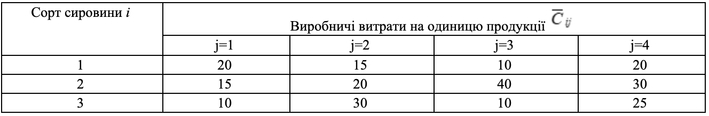

### Задача 3.7 

Три сорти взаємозамінної сировини $(i=1, 2, 3)$ у кількості 200, 100 і 300 кг використовується при виробництві чотирьох продуктів $(j=1, 2, 3, 4)$. Норми витрат $[a_{ij}, b_{ij}]$ сировини $i$ на виробництво продукту $j$ - нечіткі величини з ф.п. $\mu_{ij}(a_{ij})$, а виробничі витрати нечіткі величини в інтервалі $[\gamma_{ij}, \delta_{ij}]$ з ф.п. $\gamma_{ij}(C_{ij})$. 

Скласти план виробництва виробів, який мінімізує очікувані сумарні витрати при умові реалізованості плану. Знайти підмножину не домінуючих альтернатив зі степенем $\alpha=0.85$. 

$$ \mu_{ij}(a_{ij}) = \exp \left( -\frac{(a_{ij} - \overline{a}_{ij})^2}{2} \right), \quad
   \gamma_j(C_j) = \frac{1}{1 + (C_{j} - \overline{C}_{j})^2}
$$

Початкові дані наведені в таблицях 3.7(а) і 3.7(б). 

Таблиця 3.7(а)

Таблиця 3.7(б)
