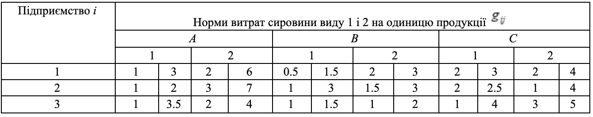
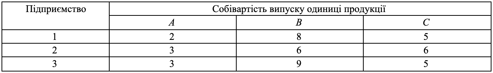

### Задача 3.8 

Нехай три підприємства $(i=1, 2, 3)$, використовують для випуску $j$-ї продукції $(j= A, B, C)$ два види ресурсів $(1, 2)$ об'єми яких складають для першого підприємства 250 і 150 одиниць, для другого –– 100 і 200 і для третього –– 240 і 300. Нехай питомі витрати ресурсів типу $j$ при виробництві виробів типу $i$ $a_{ij}$ є нечіткими змінними на інтервалі $[\eta_{ij}, \delta_{ij}]$ з ф.п. $\mu_{ij}(a_{ij})$, а собівартість одиниці виробу $C_i$  –– нечітка величина з ф.п. $\gamma_j(C_j)$, де 

$$ \mu_{ij}(a_{ij}) = \exp \left( -\frac{(a_{ij} - \overline{a}_{ij})^2}{2} \right), \quad
   \gamma_j(C_j) = \frac{1}{1 + (C_{j} - \overline{C}_{j})^2}
$$

Початкові дані наводяться в таблицях 3.8(а) і 3.8.(б). 

Нехай виробничий план випуску продукції складає відповідно 300, 170 і 250 одиниць. 

Необхідно визначити оптимальну спеціалізацію виробництва, при якій мінімізується сумарна очікувана собівартість випуску. Знайти підмножину не домінуючих альтернатив зі степенем $\alpha=0.8$.

Таблиця 3.8(а) 

Таблиця 3.8(б) 

