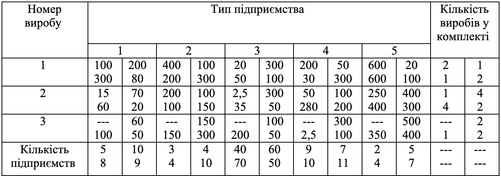

### Задача 3.9

Один із видів кінцевої продукції, що випускається галуззю, комплектується із видів виробів, які можна виготовляти на різних підприємствах. Кількість виробів кожного виду, що входить до комплекту готової продукції, встановлено. Крім того, відома місячна продуктивність кожного підприємства з випуску виробів кожного виду. Потрібно оптимально розподілити випуск виробів на підприємствах, тобто визначити спеціалізацію підприємств таким чином, щоб забезпечити максимальний випуск комплектної продукції [1;3;5].

У табл.1. представлені вихідні дані всім варіантів. Продуктивність підприємства задана у тисячах тонн.

Числа за варіантами розташовано відповідно до наступної схеми:

варіант 1 - варіант 2;
варіант 3 – варіант 4.

Таблиця 1.

Припустимо, що місячна продуктивність кожного підприємства є нечіткою величиною з функцією власності

$$ \mu_{ij}(a_{ij}) = \frac{1}{1 + \frac{1}{ (a_{ij} - \overline{a}_{ij})^2}}
$$

, де $a_{ij}$ - це дані, наведені в таблиці 1, $i$ - номер виробу; $j$ - тип підприємства, $j=\overline{1,4}$. Побудувати відповідну модель задачі НМП. Знайти підмножини максимізуючих альтернатив, недомінованих, зі ступенем $\alpha=0.8$, зокрема для стратегій оптиміста та песиміста, та порівняти отримані рішення.

Розв'язати задачу для варіанта 1.
