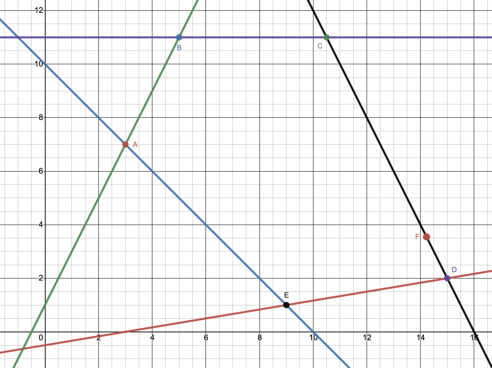

### Задача 4.1 

1. Знайти найкращий компромісний розв'язок наступної задачі багатокритеріальної оптимізації 

$$ F_1(x) = 3 x_1 + 2 x_2 \rightarrow \max $$

$$ F_2(x) =   x_1 -   x_2 \rightarrow \max $$

при умовах 

$$ x_1 - 6 x_2 \le 3 $$

$$ x_1 + x_2 \ge 10 $$

$$ -2 x_1 + x_2 \le 1 $$

$$ x_2 \le 11 $$

$$ 2 x_1 + x_2 \le 32 $$

$$ x_1, x_2 \ge 0 $$

$$ \rho_1 = \rho_2 = 0.5 $$

2. Вважаючи, що величини $C_{ij}$ є нечіткими числами з функцією приналежності
   
$$ \mu(C_{ij}) = \frac{1}{1 + (C_{ij} - \overline{C}_{ij})^2},\quad 
\overline{C}_{11}=3, 
\overline{C}_{12}=2, 
\overline{C}_{21}=1, 
\overline{C}_{22}=-1
$$

знайти найкращий компромісний розв'язок даної задачі, оптимальний по Парето, рівня $\alpha=0.8$. 

### Розв'язок

Розв'яжемо задачу графоаналітично. Побудуємо область допустимих рішень, яка визначається за наведених вище умов.

Знаходимо крайні точки ОДР та їх координати:

$$ A(3,7); \quad B(5,11); \quad C(10.5, 11); \quad D(15,2); \quad E(9,1); $$

$$ F_{1 \max} = F_1(C) = 53.5 $$

$$ F_{1 \min} = F_1(A) = 23 $$

$$ F_{2 \max} = F_2(D) = 13 $$

$$ F_{2 \min} = F_2(B) = -6 $$

$$ F_1(x) = \frac{3 x_1 + 2 x_2 - 23}{30.5} $$

$$ F_2(x) = \frac{x_1 - x_2 + 6}{19} $$

$$\begin{cases}
   \frac{3 x_1 + 2 x_2 - 23}{30.5} = \frac{x_1 - x_2 + 6}{19} \\
   2 x_1 + x_2 = 32 
\end{cases}
$$

$$\begin{cases}
    57 x_1 + 38 x_2 - 437 = 30.5 x_1 - 30.5 x_2 + 183 \\
    x_2 = 32 - 2 x_1
\end{cases}
$$

$$\begin{cases}
    26.5 x_1 + 68.5 x_2= 620 \\
    x_2 = 32 - 2 x_1
\end{cases}
$$

$$    26.5 x_1 + 2192 - 137 x_1 = 620 $$

$$    -110.5 x_1 = -1572 $$

$$  x_1 \approx 14.226, \quad  x_2 \approx 3.548 $$

Розв'язуємо нерівності і знаходимо інтервал приналежності рівня $\alpha=0.8$ для нечітких коефіцієнтів $C_{ij}$

$$ \mu(C_{ij}) = \frac{1}{1 + (C_{ij} - \overline{C}_{ij})^2} \ge 0.8 $$

$$ 1 \ge 0.8 (1 + (C_{ij} - \overline{C}_{ij})^2) $$

$$ 1 \ge 0.8 + 0.8(C_{ij} - \overline{C}_{ij})^2 $$

$$ 0.8(C_{ij} - \overline{C}_{ij})^2 \le 0.2 $$

$$ (C_{ij} - \overline{C}_{ij})^2 \le 0.25 $$

$$ |C_{ij} - \overline{C}_{ij}| \le 0.5 $$

$$ \overline{C}_{ij} - 0.5 \le C_{ij} \le \overline{C}_{ij} + 0.5 $$

Таким чином знаходимо інтервали для $C_{ij}$:

$$ \begin{array}{cc}
    2.5 \le C_{11} \le 3.5 \quad \quad & 1.5 \le C_{12} \le 2.5 \\
    0.5 \le C_{21} \le 1.5 \quad \quad & -1.5 \le C_{22} \le -0.5
\end{array}
$$

Виписуємо критерії песиміста та оптиміста:

$$ F_{1L} = 2.5 x_1 + 1.5 x_2 $$

$$ F_{1U} = 3.5 x_1 + 2.5 x_2 $$

$$ F_{2L} = 0.5 x_1 -1.5 x_2 $$

$$ F_{2U} = 1.5 x_1 -0.5 x_2 $$

Розв'язуємо графічно ці задачі

$$ \max F_{1L}(C) = 2.5 \times 10.5 + 1.5 \times 11 = 42.75 $$

$$ \max F_{1U}(C) = 3.5 \times 10.5 + 2.5 \times 11 = 64.25 $$

$$ \max F_{2L}(D) = 0.5 \times 15  -1.5 \times 2 = 4.5 $$

$$ \max F_{2U}(D) = 1.5 \times 15  -0.5 \times 2 = 21.5 $$

$$ \min F_{1L}(A) = 2.5 \times 3 + 1.5 \times 7 = 18 $$

$$ \min F_{1U}(A) = 3.5 \times 3 + 2.5 \times 7 = 28 $$

$$ \min F_{2L}(B) = 0.5 \times 5 -1.5 \times 11 = -14 $$

$$ \min F_{2U}(B) = 1.5 \times 5 -0.5 \times 11 = 2 $$

Тепер запишемо задачу знаходження компромісного рішення:

$$ \max \lambda $$

$$ \begin{cases}
    (42.75 - 18) \lambda - (2.5 x_1 + 1.5 x_2) \le -18 \\
    (64.25 - 28) \lambda - (3.5 x_1 + 2.5 x_2) \le -28 \\
    (4.5 + 14) \lambda - (0.5 x_1 -1.5 x_2) \le 14 \\
    (21.5 - 2) \lambda - (1.5 x_1 -0.5 x_2) \le -2 \\
\end{cases}
$$

$$ \begin{cases}
    24.75 \lambda - 2.5 x_1 - 1.5 x_2 \le -18 \\
    36.25 \lambda - 3.5 x_1 - 2.5 x_2 \le -28 \\
    18.5 \lambda - 0.5 x_1 + 1.5 x_2 \le 14 \\
    19.5 \lambda - 1.5 x_1 + 0.5 x_2 \le -2 \\
\end{cases}
$$

Оскільки максимальні значення критеріїв досягаються в точках $C$ і $D$, то компромісне рішення належить відрізку $CD$, тобто лежить на прямій $ 2 x_1 + x_2 = 32$. Зробимо заміну $ x_2 = 32 - 2 x_1$

$$ \begin{cases}
    24.75 \lambda - 2.5 x_1 - 1.5 (32 - 2 x_1) \le -18 \\
    36.25 \lambda - 3.5 x_1 - 2.5 (32 - 2 x_1) \le -28 \\
    18.5 \lambda - 0.5 x_1 + 1.5 (32 - 2 x_1) \le 14 \\
    19.5 \lambda - 1.5 x_1 + 0.5 (32 - 2 x_1) \le -2 \\
\end{cases}
$$

$$ \begin{cases}
    24.75 \lambda - 0.5 x_1  \le 30 \\
    36.25 \lambda + 1.5 x_1  \le 52 \\
    18.5 \lambda - 3.5 x_1  \le -34 \\
    19.5 \lambda - 2.5 x_1 \le -18 \\
\end{cases}
$$

Розв'язуємо дану задачу симплекс методом і знаходимо найкраще компромісне рішення, яке максимізує $\lambda$.

$$ \lambda \approx 0.8472,\quad x_1 \approx 14.192,\quad x_2 \approx 3.616 $$