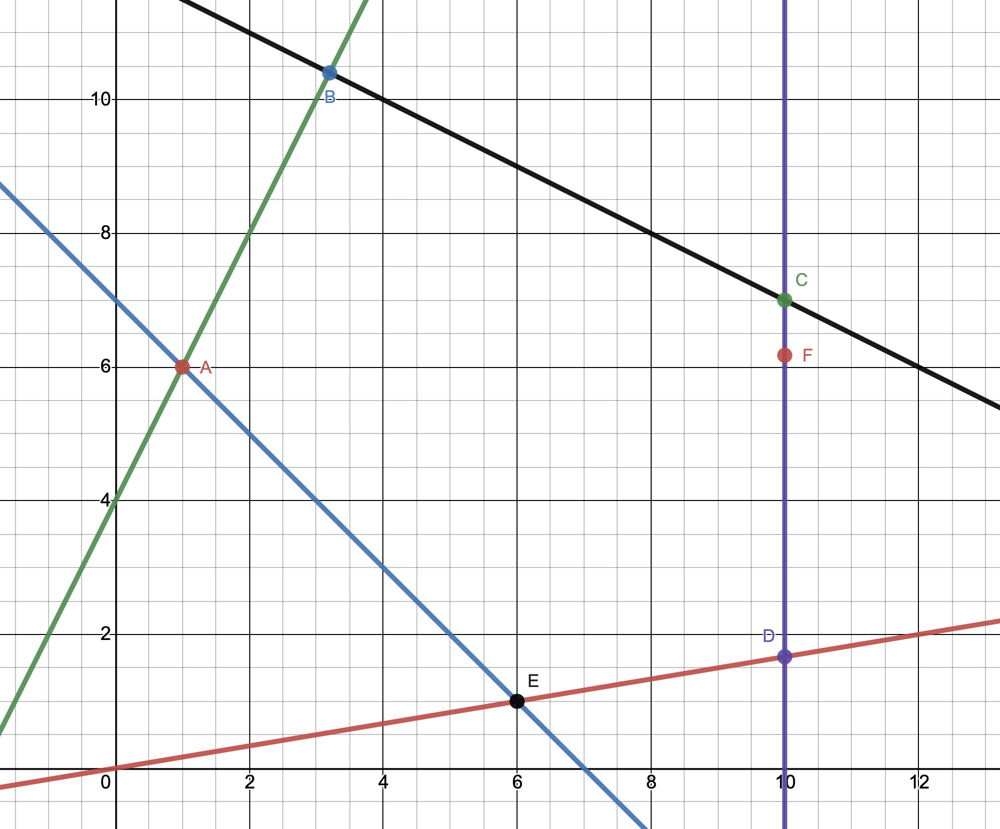

### Задача 4.2

1. Знайти найкращий компромісний розв'язок наступної задачі багатокритеріальної оптимізації 

$$ F_1(x) = x_1+4x_2 \rightarrow \max$$

$$ F_2(x) = 2x_1-2x_2 \rightarrow \max$$

при умовах 

$$ x_2 \ge \frac{1}{6} x_1 $$

$$ x_1 + x_2 \ge 7 $$

$$ -2 x_1 + x_2 \le 4 $$

$$ x_1 \le 10 $$

$$ x_1 + 2 x_2 \le 24 $$

$$ x_1, x_2 \ge 0 $$

$$ \rho_1 = \rho_2 = 0.5 $$

2. Вважаючи, що величини $C_{ij}$ є нечіткими числами з функцією приналежності
   
$$ \mu(C_{ij}) = \frac{2}{2 + (C_{ij} - \overline{C}_{ij})^2},\quad 
\overline{C}_{11}= 1 , 
\overline{C}_{12}= 4, 
\overline{C}_{21}= 2, 
\overline{C}_{22}= -2
$$

знайти найкращий компромісний розв'язок даної задачі, оптимальний по Парето, рівня $\alpha=0.8$. 

### Розв'язок

Розв'яжемо задачу графоаналітично. Побудуємо область допустимих рішень, яка визначається за наведених вище умов.

Знаходимо крайні точки ОДР та їх координати:

$$ A(1, 6), \quad
B(3.2, 10.4), \quad
C(10, 7), \quad
D(10, 1\frac{2}{3}), \quad
E(6, 1), \quad $$

$$ F_{1 \max} = F_1(B) = 44.8 $$

$$ F_{1 \min} = F_1(E) = 10 $$

$$ F_{2 \max} = F_2(D) = 16\frac{2}{3} $$

$$ F_{2 \min} = F_2(B) = -14.4 $$

$$ F_1(x) = \frac{x_1+4x_2-10}{34.8} $$

$$ F_2(x) = \frac{2x_1-2x_2+14.4}{31 \frac{1}{15}} $$

Отже, найкращий компромісний розв'язок лежить на відрізку $CD$.

$$\begin{cases}
\frac{x_1+4x_2-10}{34.8} = \frac{2x_1-2x_2+14.4}{31\frac{1}{15}} \\
x_1=10
\end{cases}
$$

$$ \frac{x_2}{8.7} = \frac{-2x_2+34.4}{31\frac{1}{15}} $$

$$ \frac{10 x_2}{87} = \frac{15(-2x_2+34.4)}{466} $$

$$ 4660 x_2 = 1305(-2x_2+34.4) $$

$$ 4660 x_2 = -2610 2x_2 + 44892 $$

$$ 7270 x_2 = 44892 $$

$$ x_2 = \frac{44892}{7270} $$

$$ x_1=10, \quad x_2 \approx 6.175 $$

Розв'язуємо нерівності і знаходимо інтервал приналежності рівня $\alpha=0.8$ для нечітких коефіцієнтів $C_{ij}$

$$ \mu(C_{ij}) = \frac{2}{2 + (C_{ij} - \overline{C}_{ij})^2} \ge 0.8 $$

$$ 2 \ge 0.8 (2 + (C_{ij} - \overline{C}_{ij})^2) $$

$$ 2 \ge 1.6 + 0.8(C_{ij} - \overline{C}_{ij})^2 $$

$$ 0.8(C_{ij} - \overline{C}_{ij})^2 \le 0.4 $$

$$ (C_{ij} - \overline{C}_{ij})^2 \le 0.5 $$

$$ |C_{ij} - \overline{C}_{ij}| \le \sqrt{0.5} $$

$$ \overline{C}_{ij} + \sqrt{0.5} \le C_{ij} \le \overline{C}_{ij} + \sqrt{0.5} $$

Таким чином знаходимо інтервали для $C_{ij}$:

$$ 1 - \sqrt{0.5} \le C_{11} \le 1 + \sqrt{0.5} $$

$$ 4 - \sqrt{0.5} \le C_{12} \le 4 + \sqrt{0.5} $$

$$ 2 - \sqrt{0.5} \le C_{21} \le 2 + \sqrt{0.5} $$

$$ -2 - \sqrt{0.5} \le C_{22} \le -2 + \sqrt{0.5} $$

Виписуємо критерії песиміста та оптиміста:

$$ F_{1L} = (1 - \sqrt{0.5}) x_1 + (4 - \sqrt{0.5}) x_2 $$

$$ F_{1U} = (1 + \sqrt{0.5}) x_1 + (4 + \sqrt{0.5}) x_2 $$

$$ F_{2L} = (2 - \sqrt{0.5}) x_1 + (-2 - \sqrt{0.5}) x_2 $$

$$ F_{2L} = (2 + \sqrt{0.5}) x_1 + (-2 + \sqrt{0.5}) x_2 $$

Розв'язуємо графічно ці задачі

$$\max F_{1L} = (1 - \sqrt{0.5}) \times 3.2 + (4 - \sqrt{0.5}) \times 10.4 = 35.183$$

$$\max F_{1U} = (1 + \sqrt{0.5}) \times 3.2 + (4 + \sqrt{0.5}) \times 10.4 = 54.417 $$

$$\max F_{2L} = (2 - \sqrt{0.5}) \times 10 + (-2 - \sqrt{0.5}) \times 1.66666666666667 = 8.4171 $$

$$\max F_{2U} = (2 + \sqrt{0.5}) \times 10 + (-2 + \sqrt{0.5}) \times 1.66666666666667 = 24.916 $$

$$\min F_{1L} = (1 - \sqrt{0.5}) \times 6 + (4 - \sqrt{0.5}) \times 1 = 5.05 $$

$$\min F_{1U} = (1 + \sqrt{0.5}) \times 6 + (4 + \sqrt{0.5}) \times 1 = 14.95 $$

$$\min F_{2L} = (2 - \sqrt{0.5}) \times 3.2 + (-2 - \sqrt{0.5}) \times 10.4 = -24.017 $$

$$\min F_{2U} = (2 + \sqrt{0.5}) \times 3.2 + (-2 + \sqrt{0.5}) \times 10.4 = -4.783 $$

Тепер запишемо задачу знаходження компромісного рішення:

$$ \max \lambda $$

$$ \begin{cases}
(35.183-5.05) \lambda - (0.293 x_1 +3.293 x_2) \le -5.05 \\
(54.417-14.95) \lambda - (1.707 x_1 +4.707 x_2) \le -14.95 \\
(8.4171+24.017) \lambda - (1.293 x_1 -2.707 x_2) \le 24.017 \\
(24.916+4.783) \lambda - (2.707 x_1 -1.293 x_2) \le 4.783 \\
\end{cases}$$

$$ \begin{cases}
30.133 \lambda -0.293 x_1 -3.293 x_2 \le -5.05 \\
39.467 \lambda -1.707 x_1 -4.707 x_2 \le -14.95 \\
32.4341 \lambda -1.293 x_1 +2.707 x_2 \le 24.017 \\
29.699 \lambda -2.707 x_1 +1.293 x_2 \le 4.783 \\
\end{cases}$$

Оскільки компромісне рішення належить відрізку $CD$, тобто лежить на прямій $ x_1=10$. Підставимо це значення.

$$ \begin{cases}
30.133 \lambda -2.93 -3.293 x_2 \le -5.05 \\
39.467 \lambda -17.07 -4.707 x_2 \le -14.95 \\
32.4341 \lambda -12.93 +2.707 x_2 \le 24.017 \\
29.699 \lambda -27.07 +1.293 x_2 \le 4.783 \\
\end{cases}$$

$$ \begin{cases}
30.133 \lambda -3.293 x_2 \le -2.12 \\
39.467 \lambda -4.707 x_2 \le 2.12 \\
32.4341 \lambda +2.707 x_2 \le 36.947 \\
29.699 \lambda +1.293 x_2 \le 31.853 \\
\end{cases}$$

Розв'язуємо дану задачу симплекс методом і знаходимо найкраще компромісне рішення, яке максимізує $\lambda$.

$$ \lambda \approx 0.615,\quad x_1 = 10,\quad x_2 \approx 6.275 $$