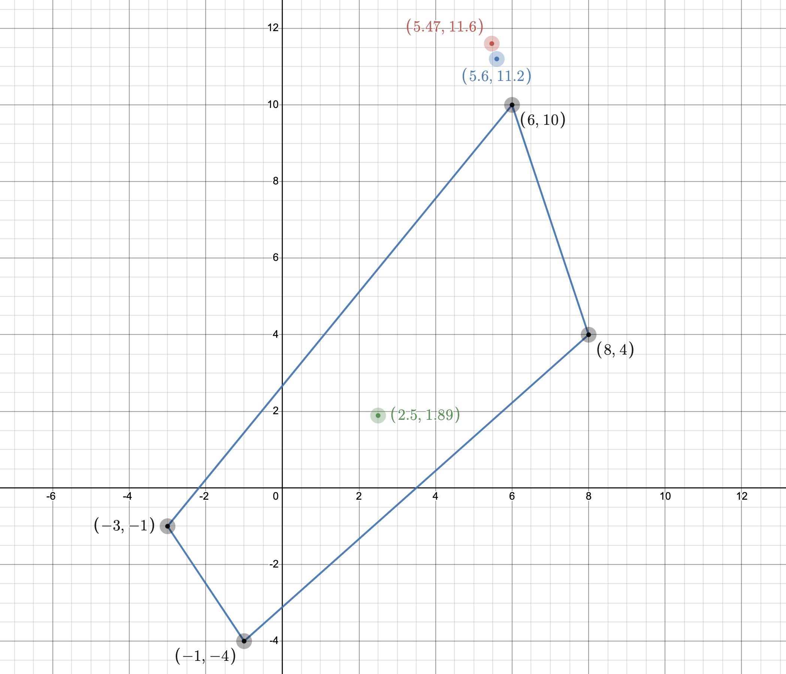
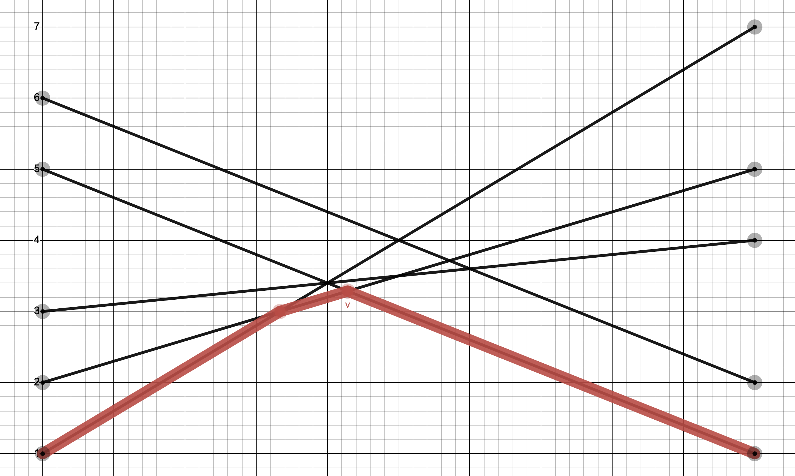

# Задача 7.3

Знайти розв'язок біматричної гри (A, B) для наступних випадків:

1.1. При відсутності коаліції знайти найкращі стратегії обох гравців і відповідні виграші.

1.2. У кооперативній грі двох осіб вияснити доцільність створення коаліції і знайти точку Неша.

1.3. Перевірити вплив дії погроз, визначити арбітражний розв'язок у випадку дії погроз і
порівняти із точкою Неша.

$$ (A,B)= \begin{bmatrix}
   (6;10)   & (-1;-4) \\
   (−3;-1) & (8;4)
\end{bmatrix}
$$

2. Для антагоністичної гри двох осіб із матрицею А записати відповідні ЛП-задачі для визначення оптимальних стратегій гравців і знайти їх.

$$ A = \begin{bmatrix}
    5 & 6 & 3 & 2 & 1 \\
    1 & 2 & 4 & 5 & 7
\end{bmatrix}
$$

## Розв'язок

1.1 Знаходимо гарантовані виграші обох гравців при відсутності коаліцій: 

Для першого гравця маємо:

$$ u^* = \max X^T AY $$

$$ \sum_i x_i = 1; x_i \ge0, i = \overline{1,m} $$

$$ \begin{cases}
    \max u \\
   6x_1 - 3x_2 = u \\
    -x_1 + 8x_2 = u \\
    x_1 + x_2 = 1 \\
    x_1, x_2 \ge 0
\end{cases} ⇒ \begin{cases}
   x_1 = \frac{11}{18} \\
   x_2 = \frac{7}{18} \\
   u^* = \frac{5}{2} = 2.5
\end{cases}
$$

Для другого гравця маємо:

$$ v^* = \max X^T BY $$

$$ \begin{cases}
    \max v \\
   10y_1 - 4y_2 = v \\
    -y_1 + 4y_2 = v \\
    y_1 + y_2 = 1 \\
    y_1, y_2 \ge 0
\end{cases} ⇒ \begin{cases}
   y_1 = \frac{8}{19} \\
   y_2 = \frac{11}{19} \\
   v^* = \frac{36}{19} \approx 1.89
\end{cases}
$$

1.2. Вважаємо, що маємо гру з лінійно-трансферабельною корисністю. Оскільки суми виграшів не однакові $(6 + 10)$ ≠ $(8 + 4)$ , то перетворюємо масштаб по осі $v:v'=\alpha$, так щоб корисності гравців ділилися і передавалися у відношенні $1:1$. Отже $ 6 + 10 \alpha = 8 + 4 \alpha$, звідси $ \alpha = \frac{1}{3}$.

В перетворених координатах, матриця $(A, B')$ така:

$$ (A,B')= \begin{bmatrix}
   (4;\frac{10}{3})   & (-1;-\frac{4}{3}) \\
   (−3;-\frac{1}{3}) & (8;\frac{4}{3})
\end{bmatrix}
$$

Знаходимо точку Неша:

$$ R=6 + 10\cdot \frac{1}{3} = \frac{28}{3} $$ 

$$ v^{*'} = \alpha v^* = \frac{1}{3} \cdot \frac{36}{19} = \frac{36}{57} \approx 0.63 $$

$$ \overline{u} = \frac{u^* - v^* + R}{2} = \frac{2.5 - \frac{36}{57} + \frac{28}{3}}{2} = \frac{1277}{228} \approx 5.6 $$

$$ \overline{v}' = R - \overline{u} =  \frac{28}{3} - \frac{1277}{228} = \frac{851}{228} \approx 3.73$$

$$ \overline{v} = \frac{\overline{v}'}{\alpha} = \frac{\frac{851}{228}}{\frac{1}{3}} = \frac{851}{76} \approx 11.2 $$

Отже точка Неша $ N = (\frac{1277}{228}; \frac{851}{76}) \approx (5.6; 11.2) $

Точка виходить за межі області, тому спроектуємо її в точку $(6; 10)$

1.3. Перевіримо вплив дії погроз:

$$ A - B' = \begin{bmatrix}
   6 - \frac{10}{3} & -1 + \frac{4}{3} \\
   -3 + \frac{1}{3} & 8 - \frac{4}{3}
\end{bmatrix} = 
\begin{bmatrix}
   \frac{8}{3} & \frac{1}{3} \\
   -\frac{8}{3} & \frac{20}{3}
\end{bmatrix}
$$

Знайдемо сідлову точку:

$$ \begin{cases}
    \max u \\
   \frac{8}{3}x_1 - \frac{8}{3}x_2 = u \\
    \frac{1}{3}x_1 + \frac{20}{3}x_2 = u \\
    x_1 + x_2 = 1 \\
    x_1, x_2 \ge 0
\end{cases} ⇒ \begin{cases}
   x_1 = \frac{4}{5} \\
   x_2 = \frac{1}{5} \\
   u^* = \frac{8}{5} = 1.6
\end{cases}
$$

Знаходимо точку Неша з урахуванням погроз.

$$ \overline{u}_y = \frac{x_y^T (A-B') y_y + R}{2} = \frac{\frac{8}{5} + \frac{28}{3}}{2} = \frac{82}{15} \approx 5.47 $$

$$ \overline{v}'_y = \frac{x_y^T (B'-A) y_y + R}{2} = \frac{-\frac{8}{5} + \frac{28}{3}}{2} = \frac{58}{15} \approx 3.87 $$

В вихідних координатах:

$$ \overline{v}_y = \frac{\overline{v}'_y}{\alpha} = \frac{\frac{58}{15}}{\frac{1}{3}} = \frac{58}{5} = 11.6 $$

Точка $(\frac{82}{15} ; 11.6)$ виходить за межі області, тому її також спроектуємо в точку $(6; 10)$

В двох останніх випадках знайдені точки спроектувалися в точку точку (6; 10), яку і вважатимемо розв'язком задачі.

2. Розв'язуємо графоаналітичним методом:

$$ A = \begin{bmatrix}
    \color{red} 5 & 6 & 3 & \color{red} 2 & 1 \\
    \color{red} 1 & 2 & 4 & \color{red} 5 & 7
\end{bmatrix}
$$

Для першого гравця:

$$ \begin{cases}
   5x_1 +  x_2 = v_1 \\
   2x_1 + 5x_2 = v_1 \\
    x_1 + x_2 = 1 \\
    x_1, x_2 \ge 0
\end{cases} ⇒ \begin{cases}
   x_1 = \frac{4}{7} \\
   x_2 = \frac{3}{7} \\
   v_1 = \frac{23}{7} 
\end{cases}
$$

Для другого гравця:

$$ \begin{cases}
   5y_1 + 2y_4 = v_2 \\
    y_1 + 5y_4 = v_2 \\
    y_1 + y_4 = 1 \\
    y_1, y_4 \ge 0
\end{cases} ⇒ \begin{cases}
   y_1 = \frac{3}{7} \\
   y_4 = \frac{4}{7} \\
   y_2 = y_3 = y_5 = 0 \\
   v_2 = \frac{23}{7} 
\end{cases}
$$