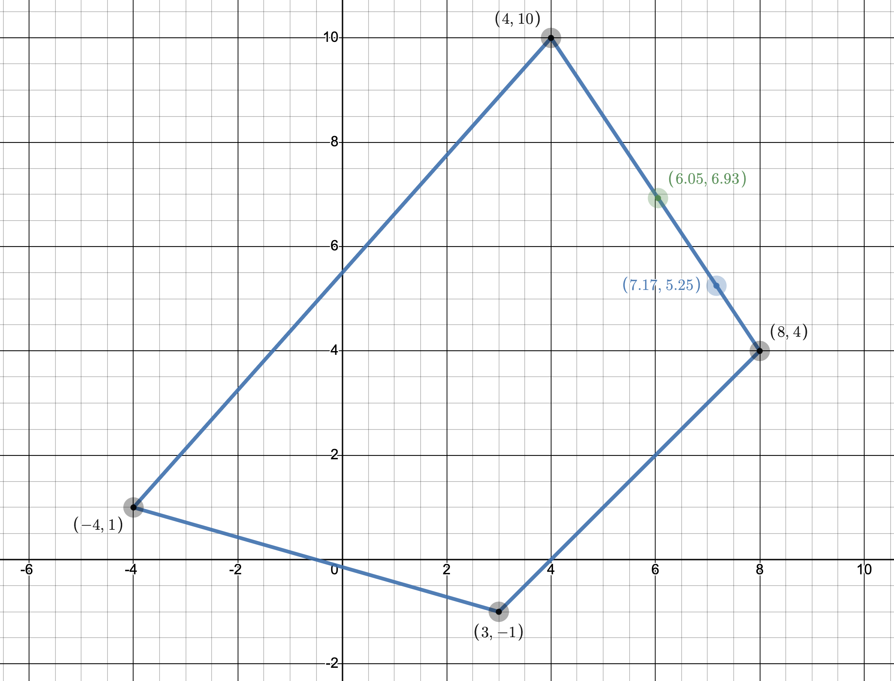
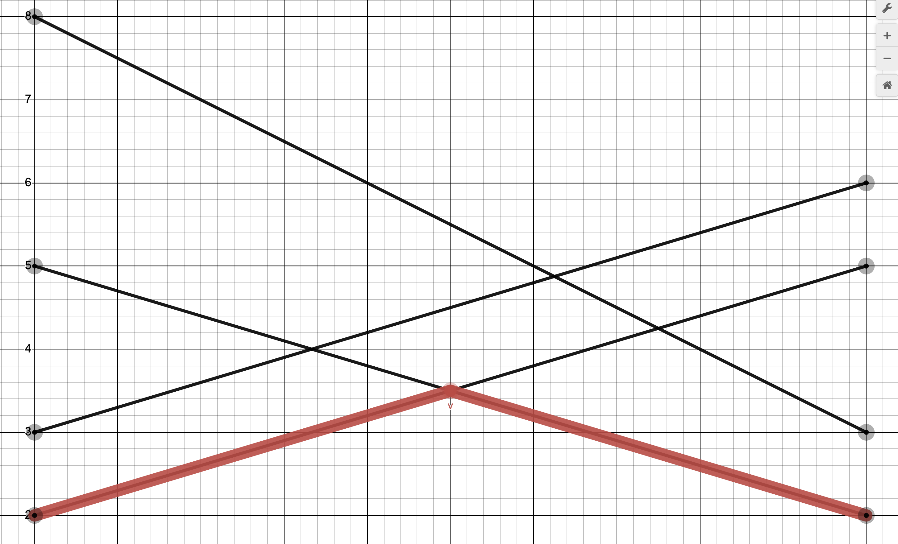

# Задача 7.4

Знайти розв'язок біматричної гри (A, B) для наступних випадків:

1.1. При відсутності коаліції знайти найкращі стратегії обох гравців і відповідні виграші.

1.2. У кооперативній грі двох осіб вияснити доцільність створення коаліції і знайти точку Неша.

1.3. Перевірити вплив дії погроз, визначити арбітражний розв'язок у випадку дії погроз і
порівняти із точкою Неша.

$$ (A,B)= \begin{bmatrix}
   (8;4)   & (3;-1) \\
   (−4;1) & (4;10)
\end{bmatrix}
$$

2. Для антагоністичної гри двох осіб із матрицею А записати відповідні ЛП-задачі для визначення оптимальних стратегій гравців і знайти їх.

$$ A = \begin{bmatrix}
   5 & 8 & 3 & 2 \\
   2 & 3 & 6 & 5
\end{bmatrix}
$$

## Розв'язок

1.1 Знаходимо гарантовані виграші обох гравців при відсутності коаліцій: 

Для першого гравця маємо:

$$ u^* = \max X^T AY $$

$$ \sum_i x_i = 1; x_i \ge0, i = \overline{1,m} $$

$$ \begin{cases}
    \max u \\
   8x_1 - 4x_2 = u \\
   3x_1 + 4x_2 = u \\
    x_1 + x_2 = 1 \\
    x_1, x_2 \ge 0
\end{cases} ⇒ \begin{cases}
   x_1 = \frac{8}{13} \\
   x_2 = \frac{5}{13} \\
   u^* = \frac{44}{13} \approx 3.39
\end{cases}
$$

Для другого гравця маємо:

$$ v^* = \max X^T BY $$

$$ \begin{cases}
    \max v \\
   4y_1 - y_2 = v \\
    y_1 + 10y_2 = v \\
    y_1 + y_2 = 1 \\
    y_1, y_2 \ge 0
\end{cases} ⇒ \begin{cases}
   y_1 = \frac{11}{14} \\
   y_2 = \frac{3}{14} \\
   v^* = \frac{41}{14} \approx 2.93
\end{cases}
$$

1.2. Вважаємо, що маємо гру з лінійно-трансферабельною корисністю. Оскільки суми виграшів не однакові $(4 + 10)$ ≠ $(8 + 4)$ , то перетворюємо масштаб по осі $v:v'=\alpha$, так щоб корисності гравців ділилися і передавалися у відношенні $1:1$. Отже $ 4 + 10 \alpha$ ≠ $ 8 + 4 \alpha$, звідси $ \alpha = \frac{2}{3}$.

В перетворених координатах, матриця $(A, B')$ така:

$$ (A,B')= \begin{bmatrix}
   (8;\frac{8}{3})   & (3;-\frac{2}{3}) \\
   (−4;\frac{2}{3}) & (4;\frac{20}{3})
\end{bmatrix}
$$

Знаходимо точку Неша:

$$ R = 4 + 10 \cdot \frac{2}{3} = \frac{32}{3} $$ 

$$ v^{*'} = \alpha v^* = \frac{2}{3} \cdot \frac{41}{14} = \approx 1.95 $$

$$ \overline{u} = \frac{u^* - v^* + R}{2} = \frac{\frac{44}{13} - \frac{41}{21} + \frac{32}{3}}{2} = \frac{1101}{182} \approx 6.05 $$

$$ \overline{v}' = R - \overline{u} = \frac{32}{3} - \frac{1101}{182} = \frac{2521}{546} = \approx 4.62$$

$$ \overline{v} = \frac{\overline{v}'}{\alpha} = \frac{\frac{2521}{546}}{\frac{2}{3}} = \frac{2521}{546} \cdot \frac{3}{2} = \frac{2521}{364} \approx 6.93 $$

Отже точка Неша $ N = ( \frac{1101}{182}; \frac{2521}{364}) \approx (6.05;6.93) $

Оскільки $u_N > u^*$ та $v_N > v^*$, можемо зробити висновок, що коаліція вигідна обом гравцям.

1.3. Перевіримо вплив дії погроз:

$$ A - B' = \begin{bmatrix}
   8 - \frac{8}{3} & 3 - \frac{2}{3} \\
   -4 - \frac{2}{3} & 4 - \frac{20}{3}
\end{bmatrix} = \begin{bmatrix}
   \frac{16}{3} & \frac{1}{3} \\
   -\frac{14}{3} & - \frac{8}{3}
\end{bmatrix}
$$

Можна легко побачити, що сідлова точка $\frac{11}{3}$.

Знаходимо точку Неша з урахуванням погроз.

$$ \overline{u}_y = \frac{x_y^T (A-B') y_y + R}{2} = \frac{\frac{11}{3} + \frac{32}{3}}{2} = \frac{43}{6} \approx 7.17 $$

$$ \overline{v}'_y = \frac{x_y^T (B'-A) y_y + R}{2} = \frac{- \frac{11}{3} + \frac{32}{3}}{2} = \frac{7}{2} = 3.5 $$

В вихідних координатах:

$$ \overline{v}_y = \frac{\overline{v}'_y}{\alpha} = \frac{\frac{7}{2}}{\frac{2}{3}} = \frac{21}{4} = 5.25 $$

Таким чином точка Неша в умовах погроз буде $(\frac{43}{6}; 5.25)$. Вона лежить на прямій $CD$ на границі допустимої області $S(u,v)$

Отже в даному випадку погрози вигідніші першому гравцю.

2. Розв'язуємо графоаналітичним методом:

$$ A = \begin{bmatrix}
   \color{red} 5 & 8 & 3 & \color{red} 2 \\
   \color{red} 2 & 3 & 6 & \color{red} 5
\end{bmatrix}
$$

Для першого гравця:

$$ \begin{cases}
   5x_1 + 2x_2 = v_1 \\
   2x_1 + 5x_2 = v_1 \\
    x_1 + x_2 = 1 \\
    x_1, x_2 \ge 0
\end{cases} ⇒ \begin{cases}
   x_1 = \frac{1}{2} \\
   x_2 = \frac{1}{2} \\
   v_1 = \frac{7}{2} 
\end{cases}
$$

Для другого гравця:

$$ \begin{cases}
    5y_1 + 2y_4 = v_2 \\
    2y_1 + 5y_4 = v_2 \\
    y_1 + y_4 = 1 \\
    y_1, y_4 \ge 0
\end{cases} ⇒ \begin{cases}
   y_1 = \frac{1}{2} \\
   y_4 = \frac{1}{2} \\
   y_2 = y_3 = 0 \\
   v_2 = \frac{7}{2} 
\end{cases}
$$