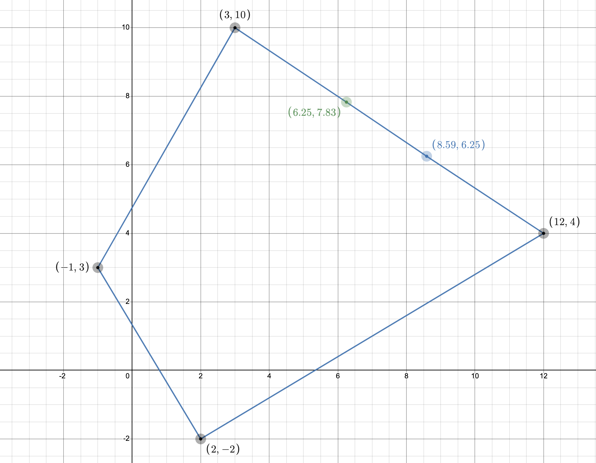
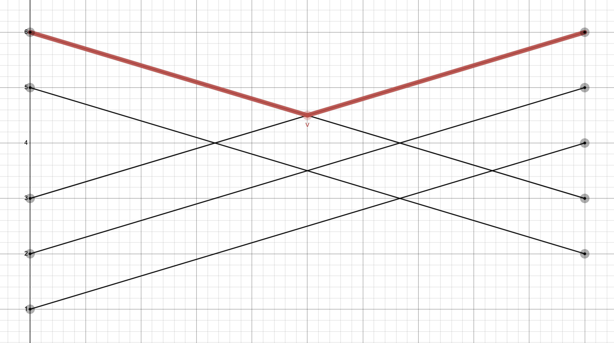

# Задача 7.8

Знайти розв'язок біматричної гри (A, B) для наступних випадків:

1.1. При відсутності коаліції знайти найкращі стратегії обох гравців і відповідні виграші.

1.2. У кооперативній грі двох осіб вияснити доцільність створення коаліції і знайти точку Неша.

1.3. Перевірити вплив дії погроз, визначити арбітражний розв'язок у випадку дії погроз і
порівняти із точкою Неша.

$$ (A,B)= \begin{bmatrix}
   (3;10)   & (2;-2) \\
   (−1;3) & (12;4)
\end{bmatrix}
$$

2. Для антагоністичної гри двох осіб із матрицею А записати відповідні ЛП-задачі для визначення оптимальних стратегій гравців і знайти їх.

$$ A = \begin{bmatrix}
   5 & 6 & 1 & 3 & 2 \\
   2 & 3 & 4 & 6 & 5
\end{bmatrix}
$$

## Розв'язок

1.1 Знаходимо гарантовані виграші обох гравців при відсутності коаліцій: 

Для першого гравця маємо:

$$ u^* = \max X^T AY $$

$$ \sum_i x_i = 1; x_i \ge0, i = \overline{1,m} $$

$$ \begin{cases}
    \max u \\
   3x_1 - x_2 = u \\
   2x_1 + 12x_2 = u \\
    x_1 + x_2 = 1 \\
    x_1, x_2 \ge 0
\end{cases} ⇒ \begin{cases}
   x_1 = \frac{13}{14} \\
   x_2 = \frac{1}{14} \\
   u^* = \frac{19}{7} \approx 2.71
\end{cases}
$$

Для другого гравця маємо:

$$ v^* = \max X^T BY $$

$$ \begin{cases}
    \max v \\
   10y_1 - 2y_2 = v \\
   3y_1 + 4y_2 = v \\
    y_1 + y_2 = 1 \\
    y_1, y_2 \ge 0
\end{cases} ⇒ \begin{cases}
   y_1 = \frac{6}{13} \\
   y_2 = \frac{7}{13} \\
   v^* = \frac{46}{13} \approx 3.54
\end{cases}
$$

1.2. Вважаємо, що маємо гру з лінійно-трансферабельною корисністю. Оскільки суми виграшів не однакові $(12 + 4)$ ≠ $(3 + 10)$ , то перетворюємо масштаб по осі $v:v'=\alpha$, так щоб корисності гравців ділилися і передавалися у відношенні $1:1$. Отже $ 12 + 4 \alpha$ ≠ $ 3 + 10 \alpha$, звідси $ \alpha = 1.5$.

В перетворених координатах, матриця $(A, B')$ така:

$$ (A,B')= \begin{bmatrix}
   (3;15)   & (2;-3) \\
   (−1;4.5) & (12;6)
\end{bmatrix}
$$

Знаходимо точку Неша:

$$ R = 12 + 4 \cdot 1.5 = 18 $$ 

$$ v^{*'} = \alpha v^* = 1.5 \cdot \frac{46}{13} = \frac{69}{13} = \approx 5.3 $$

$$ \overline{u} = \frac{u^* - v^* + R}{2} = \frac{\frac{19}{7} - \frac{46}{13} + 18} = \frac{1563}{182} \approx 8.59 $$

$$ \overline{v}' = R - \overline{u} = 18 - \frac{1563}{182} = \frac{1707}{182} = \approx 9.38$$

$$ \overline{v} = \frac{\overline{v}'}{\alpha} = \frac{\frac{170}{182}}{1.5} = \frac{17707}{273} \approx 6.25 $$

Отже точка Неша $ N = ( \frac{1563}{182}; \frac{1707}{273}) \approx (8.59;6.25) $

Оскільки $u_N > u^*$ та $v_N > v^*$, можемо зробити висновок, що коаліція вигідна обом гравцям.

1.3. Перевіримо вплив дії погроз:

$$ A - B' = \begin{bmatrix}
   -12 & 5 \\
   -5.5 & 6
\end{bmatrix} 
$$

Можна легко побачити, що сідлова точка $-5.5$.

Знаходимо точку Неша з урахуванням погроз.

$$ \overline{u}_y = \frac{x_y^T (A-B') y_y + R}{2} = \frac{-5.5 + 18}{2} = 6.25 $$

$$ \overline{v}'_y = \frac{x_y^T (B'-A) y_y + R}{2} = \frac{5.5 + 18}{2} = 11.75 $$

В вихідних координатах:

$$ \overline{v}_y = \frac{\overline{v}'_y}{\alpha} = \frac{11.75}{1.5} = \frac{47}{6} \approx 7.83 $$

Таким чином точка Неша в умовах погроз буде $(\frac{43}{6}; 5.25)$. Вона лежить на прямій $CD$ на границі допустимої області $S(u,v)$

Отже в даному випадку погрози вигідніші другому гравцю.

2. Розв'язуємо графоаналітичним методом:

$$ A = \begin{bmatrix}
   5 & \color{red} 6 & 1 & \color{red} 3 & 2 \\
   2 & \color{red} 3 & 4 & \color{red} 6 & 5
\end{bmatrix}
$$

Для першого гравця:

$$ \begin{cases}
   6x_4 + 3x_4 = v_1 \\
   3x_4 + 6x_4 = v_1 \\
    x_4 + x_4 = 1 \\
    x_4, x_4 \ge 0
\end{cases} ⇒ \begin{cases}
   x_4 = \frac{1}{2} \\
   x_4 = \frac{1}{2} \\
   v_1 = \frac{9}{2} 
\end{cases}
$$

Для другого гравця:

$$ \begin{cases}
    6y_1 + 3y_2 = v_2 \\
    3y_1 + 6y_2 = v_2 \\
    y_1 + y_2 = 1 \\
    y_1, y_2 \ge 0
\end{cases} ⇒ \begin{cases}
   y_1 = \frac{1}{2} \\
   y_2 = \frac{1}{2} \\
   y_2 = y_3 = 0 \\
   v_2 = \frac{9}{2} 
\end{cases}
$$