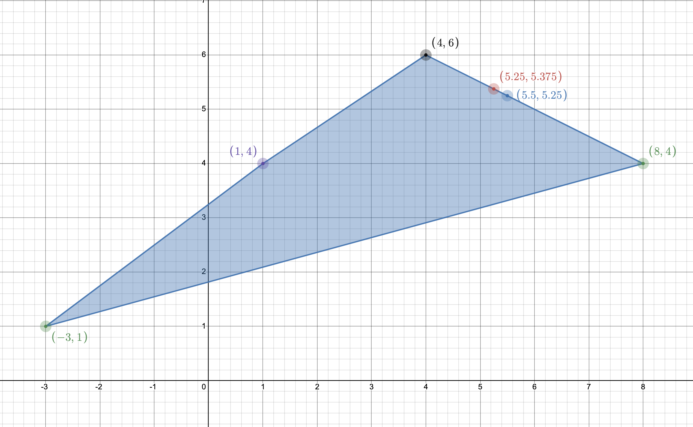
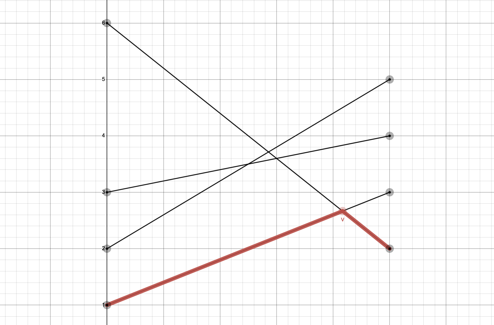

## Задача 7.2

Знайти розв'язок біматричної гри (A, B) для наступних випадків:

1.1. При відсутності коаліції знайти найкращі стратегії обох гравців і відповідні виграші.

1.2. У кооперативній грі двох осіб вияснити доцільність створення коаліції і знайти точку Неша.

1.3. Перевірити вплив дії погроз, визначити арбітражний розв'язок у випадку дії погроз і
порівняти із точкою Неша.

$$ (A,B)= \begin{bmatrix}
   (4;6)   & (1;4) \\
   (−3;1) & (8;4)
\end{bmatrix}
$$

2. Для антагоністичної гри двох осіб із матрицею А записати відповідні ЛП-задачі для визначення оптимальних стратегій гравців і знайти їх.

$$ A = \begin{bmatrix}
   2 & 3 & 1 & 6 \\
    5 & 4 & 3 & 2
\end{bmatrix}
$$

## Розв'язок

1.1 Знаходимо гарантовані виграші обох гравців при відсутності коаліцій: 

Для першого гравця маємо:

$$ u^* = \max X^T AY $$

$$ \sum_i x_i = 1; x_i \ge0, i = \overline{1,m} $$

$$ \begin{cases}
    \max u \\
  4x_1 - 3x_2 = u \\
    x_1 + 8x_2 = u \\
    x_1 + x_2 = 1 \\
    x_1, x_2 \ge 0
\end{cases} ⇒ \begin{cases}
   x_1 = \frac{11}{14} \\
   x_2 = \frac{3}{14} \\
   u^* = \frac{5}{2} = 2 \frac{1}{2}
\end{cases}
$$

Для другого гравця маємо:

$$ v^* = \max X^T BY $$

$$ \begin{cases}
    \max v \\
  6y_1 + 4y_2 = v \\
    y_1 + 4y_2 = v \\
    y_1 + y_2 = 1 \\
    y_1, y_2 \ge 0
\end{cases} ⇒ \begin{cases}
   y_1 = 0 \\
   y_2 = 1 \\
   v^* = 4
\end{cases}
$$

1.2. Вважаємо, що маємо гру з лінійно-трансферабельною корисністю. Оскільки суми виграшів не однакові $(4 + 6 ≠ 8 + 4)$ , то перетворюємо масштаб по осі $v:v'=\alpha$, так щоб корисності гравців ділилися і передавалися у відношенні $1:1$. Отже $ 4 + 6 \alpha \ne 8 + 4 \alpha$, звідси $ \alpha = 2$.

В перетворених координатах, матриця $(A, B')$ така:

$$ (A,B')= \begin{bmatrix}
   (4;12)   & (1;8) \\
   (−3;2) & (8;2)
\end{bmatrix}
$$

Знаходимо точку Неша:

$$ R=4+6\cdot2=16 $$ 

$$ v^{*'} = \alpha v^* = 2 \cdot 4 = 8 $$

$$ \overline{u} = \frac{u^* - v^* + R}{2} = \frac{2.5 - 8 + 16}{2} = 5.25 $$

$$ \overline{v}' = R - \overline{u} =  16 - 5.25 = 10.75$$

$$ \overline{v} = \frac{\overline{v}'}{\alpha} = \frac{10.75}{2} = 5.375 $$

Отже точка Неша $ N = (5.25; 5.375) $

Оскільки $u_N > u^*$ та $v_N > v^*$, можемо зробити висновок, що коаліція вигідна обом гравцям.

1.3. Перевіримо вплив дії погроз:

$$ A - B' = \begin{bmatrix}
   -8 & -7 \\
   -5 & 0
\end{bmatrix}
$$

Сідлова точка $−5$.

Знаходимо точку Неша з урахуванням погроз.

$$ \overline{u}_y = \frac{x_y^T (A-B') y_y + R}{2} = \frac{-5 + 16}{2} = 5.5 $$

$$ \overline{v}'_y = \frac{x_y^T (B'-A) y_y + R}{2} = \frac{5 + 16}{2} = 10.5 $$

В вихідних координатах:

$$ \overline{v}_y = \frac{\overline{v}'_y}{\alpha} = \frac{10.5}{2} = 5.25 $$

Таким чином точка Неша в умовах погроз буде така: N(5.5; 5.25) та лежить на прямій $CD$ на границі допустимої області $S(u,v)$

Отже в даному випадку погрози вигідніші першому гравцю.

2. Розв'язуємо графоаналітичним методом:

$$ A = \begin{bmatrix}
   2 & 3 & 1 & 6 \\
    5 & 4 & 3 & 2
\end{bmatrix}
$$

Для першого гравця:

$$ \begin{cases}
  x_1 + 3x_2 = v_1 \\
    6x_1 + 2x_2 = v_1 \\
    x_1 + x_2 = 1 \\
    x_1, x_2 \ge 0
\end{cases} ⇒ \begin{cases}
   x_1 = \frac{1}{6} \\
   x_2 = \frac{5}{6} \\
   v_1 = \frac{8}{3} 
\end{cases}
$$

Для другого гравця:

$$ \begin{cases}
  y_3 + 6y_4 = v_2 \\
    3y_3 + 2y_4 = v_2 \\
    y_3 + y_4 = 1 \\
    y_3, y_4 \ge 0
\end{cases} ⇒ \begin{cases}
   y_3 = \frac{2}{3} \\
   y_4 = \frac{1}{3} \\
   v_2 = \frac{8}{3} 
\end{cases}
$$