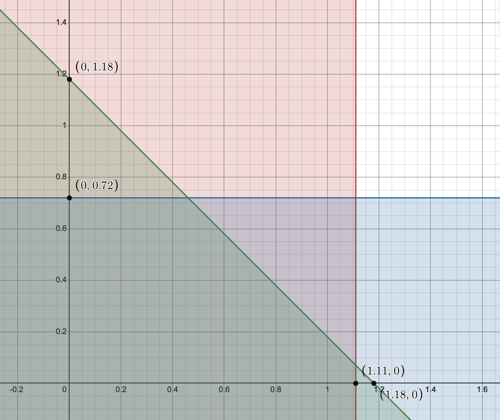

# Задача 9.1

Нехай є економіка виробництва суспільного продукту при наступних початкових даних:

$$ n = 2, b_1(y) = 2 \ln(1 + 2  y), b_2(y) = \sqrt{y} $$

Функція витрат має вигляд $С(y) = \frac{1}{4}y^2 $.

1. Побудувати кооперативну ТП-гру і знайти оптимальний план об'єму випуску $y^*$, а також розподілення витрат, яке належить ядру гри.
2. Знайти розподілення витрат, яке відповідає вектору Шеплі, а також $N$-ядру.
3. Знайти точку часткової рівноваги і відповідне розподілення витрат.
4. Визначити розподілення витрат, яке відповідає егалітарному еквіваленту і перевірити приналежність його ядру гри.

Розв'язок
1. Знаходимо оптимальний план випуску:

$$ \sum_{i=1}^2 b_i'(y) = c(y) $$

$$ b_1'(y) + b_2'(y) = c'(y) $$

$$ \frac{4}{1+2  y} + \frac{2}{2 \sqrt{y}} = \frac{1}{2}y $$

$$ y^* = 2.17 $$

Оптимальні витрати: 

$$ c(y^*) = \frac{1}{4}2.17^2 = 1.18 $$

Знаходимо оптимальний прибуток коаліції:

$$ V(1,2) = b_1(y^*) + b_2(y^*) - c(y^*) = 2 \ln(1 + 2  \cdot  2.17) + \sqrt{2.17} - \frac{1}{4}2.17^2 = 3.65 $$
Знайдемо оптимальний прибуток учасників поза коаліцією: 

Для першого учасника:

$$ V(1) = \underbrace{\max}_y \left \lbrace 2 \ln(1 + 2  y) - \frac{1}{4}y^2 ;0 \right \rbrace  $$

$$ b_1'(y) = c'(y) $$

$$ \frac{4}{1+2  y} = \frac{1}{2}y $$

$$ y = 1.77 $$

$$ V(1) = 2.24 $$

Для другого учасника:

$$ V(2) = \underbrace{\max}_y \left \lbrace 0; \sqrt{y} - \frac{1}{4}y^2 \right \rbrace  $$

$$ b_2'(y) = c'(y) $$

$$ \frac{2}{2 \sqrt{y}} = \frac{1}{2}y $$

$$ y = 1 $$

$$ V(2) = 0.75 $$
Кооперативний прибуток:

$$ \Delta V = V(1,2) - V(1) - V(2) = 3.65 - 2.24 - 0.75 = 0.66$$

Визначаємо умови для ядра гри:

$$ b_1(y^*) - x_1^* \ge V(1) $$

$$ x_1^* \le b_1(y^*) - V(1) $$

$$ x_1^* \le 3.35 - 2.24 $$

$$ x_1^* \le 1.11 $$

$$ b_2(y^*) - x_2^* \ge V(2) $$

$$ x_2^* \le b_2(y^*) - V(2) $$

$$ x_2^* \le 1.47 - 0.75 $$

$$ x_2^* \le 0.72 $$

В коаліції $ x_1^* + x_2^* = 1.18$. Отже:

$$ \begin{cases}
  x_1^* \le 1.11 \\
  x_2^* \le 0.72 \\
  x_1^* + x_2^* \le 1.18
\end{cases}
$$

Побудуємо область допустимих рішень цих нерівностей.

2. Знайдемо розподіл прибутку згідно з вектором Шеплі (маргінальні внески)

$$ \Delta V_1^1 = V(1) - V(0) = V(1) = 2.24 $$

$$ \Delta V_1^2 = V(1,2) - V(2) = 3.65 - 0.75 = 2.9 $$

$$ \Delta V_2^1 = V(2) - V(0) = V(2) = 0.75 $$

$$ \Delta V_2^2 = V(1,2) - V(1) = 3.65 - 2.24 = 1.41 $$

$$ V_1 = \frac{1}{2} V(1) + \frac{1}{2} (V(1,2) - V(2)) = 
\frac{1}{2} \cdot 2.24 + \frac{1}{2} (3.65 - 0.75) =
2.57
$$

$$ V_2 = \frac{1}{2} V(2) + \frac{1}{2} (V(1,2) - V(1)) = 
\frac{1}{2} \cdot 0.75 + \frac{1}{2} (3.65 - 1) =
1.08
$$

Загальний прибуток

$$ \vartheta_1 + \vartheta_2 = V(1,2) = 3.65$$

Знайдемо витрати учасників

$$ b_1(y^*) - x_1^* = V_1 $$

$$ x_1^* = b_1(y^*) - V_1 $$

$$ x_1^* = 3.35 - 2.57 $$

$$ x_1^* = 0.78 $$

$$ b_2(y^*) - x_1^* = V_2 $$

$$ x_2^* = b_2(y^*) - V_2 $$

$$ x_2^* = 1.47 - 1.08 $$

$$ x_2^* = 0.39 $$

$$ x_1^* + x_2^* = 0.78 + 0.39 =
1.17  $$

Знайдемо N-ядро

$$ \frac{1}{2} \left( b_1(y^*) + b_2(y^*) \right) = 
\frac{1}{2} (3.35 + 1.47) = 2.41
$$

$$ \lambda_0 = \frac{C(y^*)}{n} = \frac{1.18}{2} =
0.59  $$

$$ \frac{\min(b_1(y^*), b_2(y^*))}{2} = 
\frac{\min(3.35, 1.47)}{2} =
\frac{1.47}{2} = 
0.74
$$

$$ \lambda_0 < \frac{b_2(y^*)}{2} $$

$$ \lambda^* = \lambda_0 = 0.59 $$

$$ x_1^* = x_2^* = \lambda_0 = 0.59 $$

3. Знайдемо розподіл витрат, що відповідає дольовій рівновазі по Лінделу.

$$ \lbrace b_1(y^*) - r_1 C(y^*) \rbrace = 
\max \lbrace 2 \ln(1 + 2  y) - r_1 \frac{1}{4}y^2 \rbrace
$$

$$ \frac{4}{1+2  y} - r_1 \frac{1}{2}y = 0$$ 

$$ r_1 = \frac{8}{y+2y^2} $$

$$ \lbrace b_2(y^*) - r_2 C(y^*) \rbrace = 
\max \lbrace \sqrt{y} - r_2 \frac{1}{4}y^2 \rbrace
$$

$$ \frac{2}{2 \sqrt{y}} - r_2 \frac{1}{2}y = 0$$ 

$$ r_2 = \frac{1}{y^{\frac{3}{2}}} $$

$$ \frac{8}{y+2y^2} + \frac{1}{y^{\frac{3}{2}}} = 1 $$

$$ 2y^{\frac{5}{2}} + y^{\frac{3}{2}} -2y -8y^{\frac{1}{2}} -1 = 0 $$

$$ y^* \approx 2.174 $$

$$ r_1 \approx 0.688 $$

$$ r_2 \approx 0.312 $$

$$ x_1^* = r_1 C(y^*) = 0.688 \cdot 1.18 =
0.81
$$

$$ x_2^* = r_2 C(y^*) = 0.312 \cdot 1.18 =
0.37
$$

4. Знайдемо егалітарний еквівалент

$$ \sum_{i=1}^n b_i (\overline{y}) = \sum_{i=1}^n b_i (y^*) - c(y^*) $$

$$ 2 \ln(1 + 2  \overline{y}) + \sqrt{\overline{y}} =
2 \ln(1 + 2  y^*) + \sqrt{y^*} - \frac{1}{4}{y^*}^2
$$

$$ 2 \ln(1 + 2  \overline{y}) + \sqrt{\overline{y}} = 3.65$$

$$ \overline{y} = 1.27 $$

$$ x_i^* = b_i(y^*) - b_i(\overline{y}) $$

$$ x_1^* = b_1(y^*) - b_1(\overline{y}) =
3.35 - 2.53 = 
0.82
$$

$$ x_2^* = b_2(y^*) - b_2(\overline{y}) =
1.47 - 1.13 = 
0.35
$$

