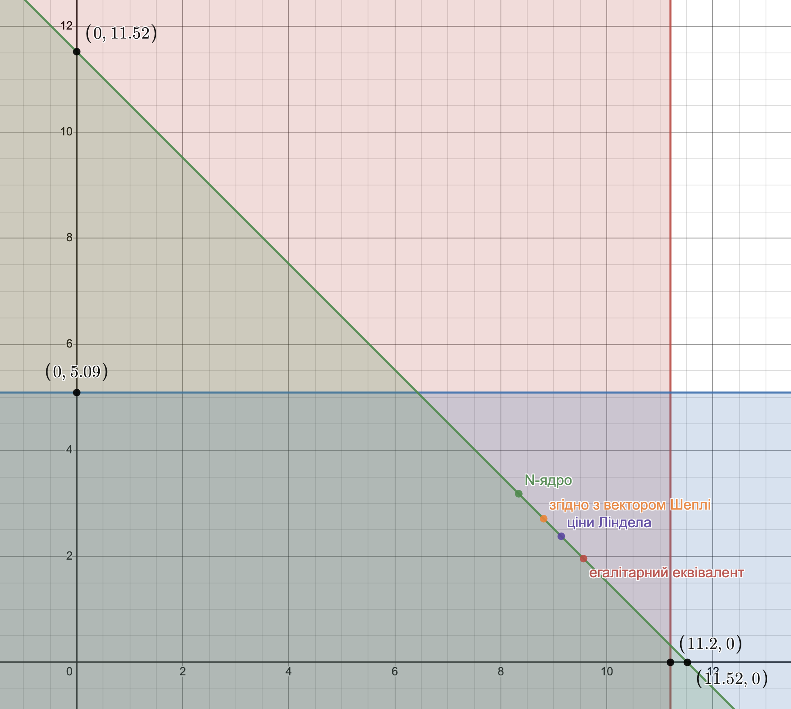

# Задача 9.2

Нехай є економіка виробництва суспільного продукту при наступних початкових даних:

$$ n = 2, b_1(y) = 4 \sqrt{y}, b_2(y) = 2 \ln(1 + y) $$

Функція витрат має вигляд $С(y) = \frac{1}{2}   y $.

1. Побудувати кооперативну ТП-гру і знайти оптимальний план об'єму випуску $y^*$, а також розподілення витрат, яке належить ядру гри.
2. Знайти розподілення витрат, яке відповідає вектору Шеплі, а також $N$-ядру.
3. Знайти точку часткової рівноваги і відповідне розподілення витрат.
4. Визначити розподілення витрат, яке відповідає егалітарному еквіваленту і перевірити приналежність його ядру гри.

Розв'язок
1. Знаходимо оптимальний план випуску:

$$ \sum_{i=1}^2 b_i'(y) = c(y) $$

$$ b_1'(y) + b_2'(y) = c'(y) $$

$$ \frac{2}{ \sqrt{y}} + \frac{2}{1+ y} = \frac{1}{2} $$

$$ y^* = 23.03 $$

Оптимальні витрати: 

$$ c(y^*) = \frac{1}{2}  \cdot   23.03 = 11.52 $$

Знаходимо оптимальний прибуток коаліції:

$$ V(1,2) = b_1(y^*) + b_2(y^*) - c(y^*) = 4 \sqrt{23.03} + 2 \ln(1 + 23.03) - \frac{1}{2}  \cdot   23.03 = 14.04 $$
Знайдемо оптимальний прибуток учасників поза коаліцією: 

Для першого учасника:

$$ V(1) = \underbrace{\max}_y \left \lbrace 4 \sqrt{y} - \frac{1}{2}   y ;0 \right \rbrace  $$

$$ b_1'(y) = c'(y) $$

$$ \frac{2}{ \sqrt{y}} = \frac{1}{2} $$

$$ y = 16 $$

$$ V(1) = 8 $$

Для другого учасника:

$$ V(2) = \underbrace{\max}_y \left \lbrace 0; 2 \ln(1 + y) - \frac{1}{2}   y \right \rbrace  $$

$$ b_2'(y) = c'(y) $$

$$ \frac{2}{1+ y} = \frac{1}{2} $$

$$ y = 3 $$

$$ V(2) = 1.27 $$
Кооперативний прибуток:

$$ \Delta V = V(1,2) - V(1) - V(2) = 14.04 - 8 - 1.27 = 4.77$$

Визначаємо умови для ядра гри:

$$ b_1(y^*) - x_1^* \ge V(1) $$

$$ x_1^* \le b_1(y^*) - V(1) $$

$$ x_1^* \le 19.2 - 8 $$

$$ x_1^* \le 11.2 $$

$$ b_2(y^*) - x_2^* \ge V(2) $$

$$ x_2^* \le b_2(y^*) - V(2) $$

$$ x_2^* \le 6.36 - 1.27 $$

$$ x_2^* \le 5.09 $$

В коаліції $ x_1^* + x_2^* = 11.52$. Отже:

$$ \begin{cases}
  x_1^* \le 11.2 \\
  x_2^* \le 5.09 \\
  x_1^* + x_2^* \le 11.52
\end{cases}
$$

Побудуємо область допустимих рішень цих нерівностей.

2. Знайдемо розподіл прибутку згідно з вектором Шеплі (маргінальні внески)

$$ \Delta V_1^1 = V(1) - V(0) = V(1) = 8 $$

$$ \Delta V_1^2 = V(1,2) - V(2) = 14.04 - 1.27 = 12.77 $$

$$ \Delta V_2^1 = V(2) - V(0) = V(2) = 1.27 $$

$$ \Delta V_2^2 = V(1,2) - V(1) = 14.04 - 8 = 6.04 $$

$$ V_1 = \frac{1}{2} V(1) + \frac{1}{2} (V(1,2) - V(2)) = 
\frac{1}{2} \cdot 8 + \frac{1}{2} (14.04 - 1.27) =
10.39
$$

$$ V_2 = \frac{1}{2} V(2) + \frac{1}{2} (V(1,2) - V(1)) = 
\frac{1}{2} \cdot 1.27 + \frac{1}{2} (14.04 - 1) =
3.65
$$

Загальний прибуток

$$ \vartheta_1 + \vartheta_2 = V(1,2) = 14.04$$

Знайдемо витрати учасників

$$ b_1(y^*) - x_1^* = V_1 $$

$$ x_1^* = b_1(y^*) - V_1 $$

$$ x_1^* = 19.2 - 10.39 $$

$$ x_1^* = 8.81 $$

$$ b_2(y^*) - x_1^* = V_2 $$

$$ x_2^* = b_2(y^*) - V_2 $$

$$ x_2^* = 6.36 - 3.65 $$

$$ x_2^* = 2.71 $$

$$ x_1^* + x_2^* = 8.81 + 2.71 =
11.51  $$

Знайдемо N-ядро

$$ \frac{1}{2} \left( b_1(y^*) + b_2(y^*) \right) = 
\frac{1}{2} (19.2 + 6.36) = 12.78
$$

$$ \lambda_0 = \frac{C(y^*)}{n} = \frac{11.52}{2} =
5.76  $$

$$ \frac{\min(b_1(y^*), b_2(y^*))}{2} = 
\frac{\min(19.2, 6.36)}{2} =
\frac{6.36}{2} = 
3.18
$$

$$ \lambda_0 > \frac{b_2(y^*)}{2} $$

$$ x_2^* = \frac{b_2(y^*)}{2} = 3.18$$

$$ \lambda_1 = \frac{1}{n-1} (c-x_1^*) = 11.52 - 3.18 =
8.34 $$

$$ \frac{b_1 (y^*)}{2} = 9.6 $$

$$ \lambda^* = \lambda_1 = 8.34 $$

$$ x_1^* = \lambda^* = 8.34 $$

3. Знайдемо розподіл витрат, що відповідає дольовій рівновазі по Лінделу.

$$ \lbrace b_1(y^*) - r_1 C(y^*) \rbrace = 
\max \lbrace 4 \sqrt{y} - r_1 \frac{1}{2}   y \rbrace
$$

$$ \frac{2}{ \sqrt{y}} - r_1 \frac{1}{2} = 0$$ 

$$ r_1 = \frac{4}{\sqrt{y}} $$

$$ \lbrace b_2(y^*) - r_2 C(y^*) \rbrace = 
\max \lbrace 2 \ln(1 + y) - r_2 \frac{1}{2}   y \rbrace
$$

$$ \frac{2}{1+ y} - r_2 \frac{1}{2} = 0$$ 

$$ r_2 = \frac{4}{1+y} $$

$$ \frac{4}{\sqrt{y}} + \frac{4}{1+y} = 1 $$

$$ -y^{\frac{3}{2}} +4y +3y^{\frac{1}{2}} +4 = 0 $$

$$ y^* \approx 23.029 $$

$$ r_1 \approx 0.83 $$

$$ r_2 \approx 0.17 $$

$$ x_1^* = r_1 C(y^*) = 0.83 \cdot 11.52 =
9.56
$$

$$ x_2^* = r_2 C(y^*) = 0.17 \cdot 11.52 =
1.96
$$

4. Знайдемо егалітарний еквівалент

$$ \sum_{i=1}^n b_i (\overline{y}) = \sum_{i=1}^n b_i (y^*) - c(y^*) $$

$$ 4 \sqrt{\overline{y}} + 2 \ln(1 + \overline{y}) =
4 \sqrt{y^*} + 2 \ln(1 + y^*) - \frac{1}{2}   {y^*}
$$

$$ 4 \sqrt{\overline{y}} + 2 \ln(1 + \overline{y}) = 14.04$$

$$ \overline{y} = 6.32 $$

$$ x_i^* = b_i(y^*) - b_i(\overline{y}) $$

$$ x_1^* = b_1(y^*) - b_1(\overline{y}) =
19.2 - 10.06 = 
9.14
$$

$$ x_2^* = b_2(y^*) - b_2(\overline{y}) =
6.36 - 3.98 = 
2.38
$$

