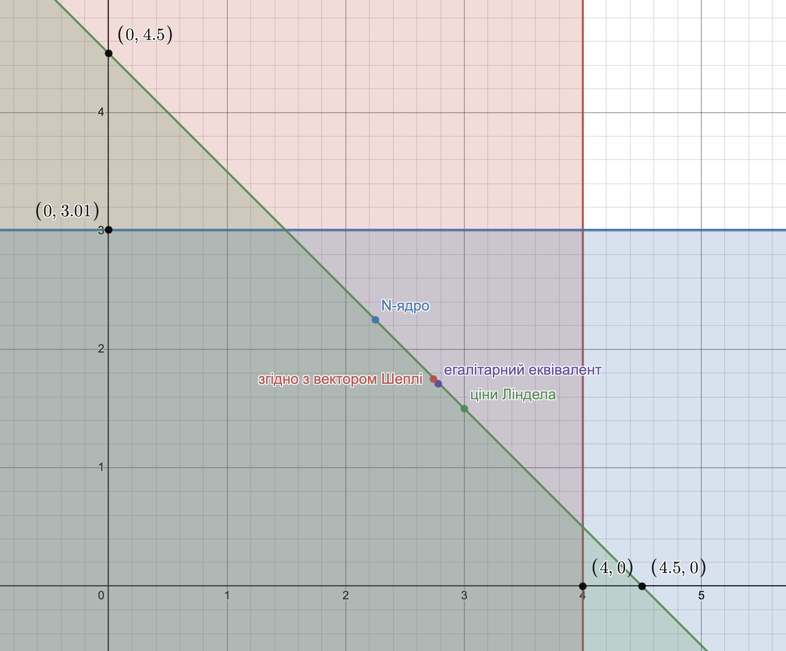

# Задача 9.3

Нехай є економіка виробництва суспільного продукту при наступних початкових даних:

$$ n = 2, b_1(y) = 2  y, b_2(y) = 4 \ln(1 + y) $$

Функція витрат має вигляд $С(y) = \frac{1}{2}   y^2 $.

1. Побудувати кооперативну ТП-гру і знайти оптимальний план об'єму випуску $y^*$, а також розподілення витрат, яке належить ядру гри.
2. Знайти розподілення витрат, яке відповідає вектору Шеплі, а також $N$-ядру.
3. Знайти точку часткової рівноваги і відповідне розподілення витрат.
4. Визначити розподілення витрат, яке відповідає егалітарному еквіваленту і перевірити приналежність його ядру гри.

Розв'язок
1. Знаходимо оптимальний план випуску:

$$ \sum_{i=1}^2 b_i'(y) = c(y) $$

$$ b_1'(y) + b_2'(y) = c'(y) $$

$$ 2 + \frac{4}{1+ y} = y $$

$$ y^* = 3 $$

Оптимальні витрати: 

$$ c(y^*) = \frac{1}{2}  \cdot   3^2 = 4.5 $$

Знаходимо оптимальний прибуток коаліції:

$$ V(1,2) = b_1(y^*) + b_2(y^*) - c(y^*) = 2  \cdot  3 + 4 \ln(1 + 3) - \frac{1}{2}  \cdot   3^2 = 7.05 $$
Знайдемо оптимальний прибуток учасників поза коаліцією: 

Для першого учасника:

$$ V(1) = \underbrace{\max}_y \left \lbrace 2  y - \frac{1}{2}   y^2 ;0 \right \rbrace  $$

$$ b_1'(y) = c'(y) $$

$$ 2 = y $$

$$ y = 2 $$

$$ V(1) = 2 $$

Для другого учасника:

$$ V(2) = \underbrace{\max}_y \left \lbrace 0; 4 \ln(1 + y) - \frac{1}{2}   y^2 \right \rbrace  $$

$$ b_2'(y) = c'(y) $$

$$ \frac{4}{1+ y} = y $$

$$ y = 1.56 $$

$$ V(2) = 2.54 $$
Кооперативний прибуток:

$$ \Delta V = V(1,2) - V(1) - V(2) = 7.05 - 2 - 2.54 = 2.51$$

Визначаємо умови для ядра гри:

$$ b_1(y^*) - x_1^* \ge V(1) $$

$$ x_1^* \le b_1(y^*) - V(1) $$

$$ x_1^* \le 6 - 2 $$

$$ x_1^* \le 4 $$

$$ b_2(y^*) - x_2^* \ge V(2) $$

$$ x_2^* \le b_2(y^*) - V(2) $$

$$ x_2^* \le 5.55 - 2.54 $$

$$ x_2^* \le 3.01 $$

В коаліції $ x_1^* + x_2^* = 4.5$. Отже:

$$ \begin{cases}
  x_1^* \le 4 \\
  x_2^* \le 3.01 \\
  x_1^* + x_2^* \le 4.5
\end{cases}
$$

Побудуємо область допустимих рішень цих нерівностей.

2. Знайдемо розподіл прибутку згідно з вектором Шеплі (маргінальні внески)

$$ \Delta V_1^1 = V(1) - V(0) = V(1) = 2 $$

$$ \Delta V_1^2 = V(1,2) - V(2) = 7.05 - 2.54 = 4.51 $$

$$ \Delta V_2^1 = V(2) - V(0) = V(2) = 2.54 $$

$$ \Delta V_2^2 = V(1,2) - V(1) = 7.05 - 2 = 5.05 $$

$$ V_1 = \frac{1}{2} V(1) + \frac{1}{2} (V(1,2) - V(2)) = 
\frac{1}{2} \cdot 2 + \frac{1}{2} (7.05 - 2.54) =
3.26
$$

$$ V_2 = \frac{1}{2} V(2) + \frac{1}{2} (V(1,2) - V(1)) = 
\frac{1}{2} \cdot 2.54 + \frac{1}{2} (7.05 - 1) =
3.8
$$

Загальний прибуток

$$ \vartheta_1 + \vartheta_2 = V(1,2) = 7.05$$

Знайдемо витрати учасників

$$ b_1(y^*) - x_1^* = V_1 $$

$$ x_1^* = b_1(y^*) - V_1 $$

$$ x_1^* = 6 - 3.26 $$

$$ x_1^* = 2.74 $$

$$ b_2(y^*) - x_1^* = V_2 $$

$$ x_2^* = b_2(y^*) - V_2 $$

$$ x_2^* = 5.55 - 3.8 $$

$$ x_2^* = 1.75 $$

$$ x_1^* + x_2^* = 2.74 + 1.75 =
4.49  $$

Знайдемо N-ядро

$$ \frac{1}{2} \left( b_1(y^*) + b_2(y^*) \right) = 
\frac{1}{2} (6 + 5.55) = 5.77
$$

$$ 4.5 = C(y^*) < \frac{1}{2} \left( b_1(y^*) + b_2(y^*) \right) = 5.77 $$

$$ \lambda_0 = \frac{C(y^*)}{n} = \frac{4.5}{2} =
2.25  $$

$$ \frac{\min(b_1(y^*), b_2(y^*))}{2} = 
\frac{\min(6, 5.55)}{2} =
\frac{5.55}{2} = 
2.77
$$

$$ \lambda_0 < \frac{b_2(y^*)}{2} $$

$$ \lambda^* = \lambda_0 = 2.25 $$

$$ x_1^* = x_2^* = \lambda_0 = 2.25 $$
3. Знайдемо розподіл витрат, що відповідає дольовій рівновазі по Лінделу.

$$ \lbrace b_1(y^*) - r_1 C(y^*) \rbrace = 
\max \lbrace 2  y - r_1 \frac{1}{2}   y^2 \rbrace
$$

$$ 2 - r_1 y = 0$$ 

$$ r_1 = \frac{2}{y} $$

$$ \lbrace b_2(y^*) - r_2 C(y^*) \rbrace = 
\max \lbrace 4 \ln(1 + y) - r_2 \frac{1}{2}   y^2 \rbrace
$$

$$ \frac{4}{1+ y} - r_2 y = 0$$ 

$$ r_2 = \frac{4}{y+y^2} $$

$$ \frac{2}{y} + \frac{4}{y+y^2} = 1 $$

$$ y^{2} -y -6 = 0 $$

$$ y^* = 3 $$

$$ r_1 \approx 0.667 $$

$$ r_2 \approx 0.333 $$

$$ x_1^* = r_1 C(y^*) = 0.667 \cdot 4.5 =
3
$$

$$ x_2^* = r_2 C(y^*) = 0.333 \cdot 4.5 =
1.5
$$

4. Знайдемо егалітарний еквівалент

$$ \sum_{i=1}^n b_i (\overline{y}) = \sum_{i=1}^n b_i (y^*) - c(y^*) $$

$$ 2  \overline{y} + 4 \ln(1 + \overline{y}) =
2  y^* + 4 \ln(1 + y^*) - \frac{1}{2}   {y^*}^2
$$

$$ 2  \overline{y} + 4 \ln(1 + \overline{y}) = 7.05$$

$$ \overline{y} = 1.608 $$

$$ x_i^* = b_i(y^*) - b_i(\overline{y}) $$

$$ x_1^* = b_1(y^*) - b_1(\overline{y}) =
6 - 3.22 = 
2.78
$$

$$ x_2^* = b_2(y^*) - b_2(\overline{y}) =
5.55 - 3.83 = 
1.71
$$

