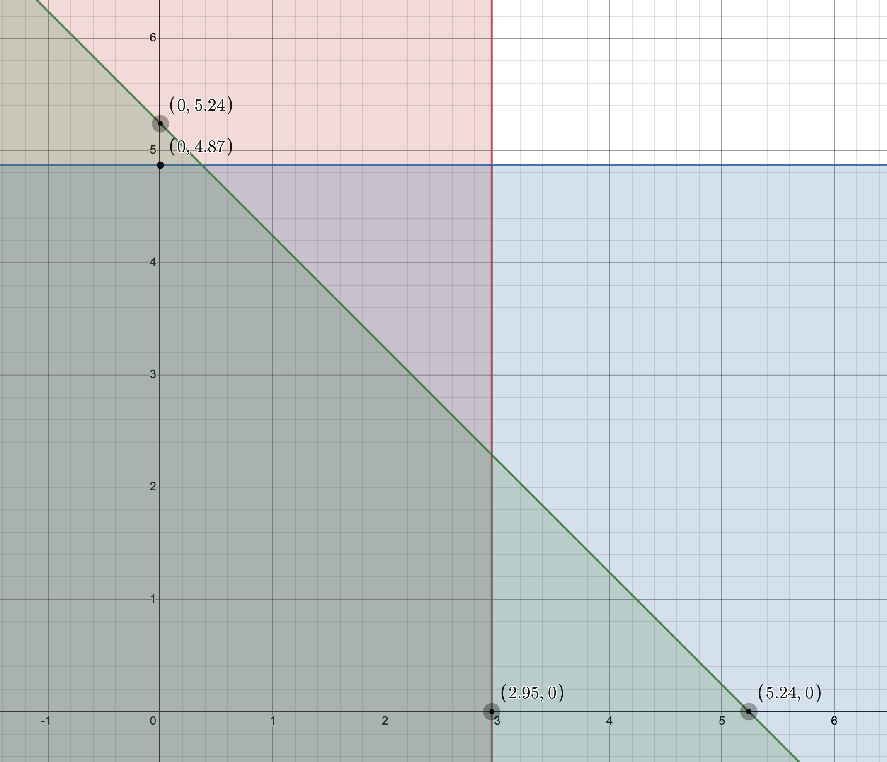

# Задача 9.4

Нехай є економіка виробництва суспільного продукту при наступних початкових даних:

$$ n = 2, b_1(y) = 2 \ln(1 + y), b_2(y) = 4 \sqrt{y} $$

Функція витрат має вигляд $С(y) = \frac{3}{2}   y $.

1. Побудувати кооперативну ТП-гру і знайти оптимальний план об'єму випуску $y^*$, а також розподілення витрат, яке належить ядру гри.
2. Знайти розподілення витрат, яке відповідає вектору Шеплі, а також $N$-ядру.
3. Знайти точку часткової рівноваги і відповідне розподілення витрат.
4. Визначити розподілення витрат, яке відповідає егалітарному еквіваленту і перевірити приналежність його ядру гри.

Розв'язок
1. Знаходимо оптимальний план випуску:

$$ \sum_{i=1}^2 b_i'(y) = c(y) $$

$$ b_1'(y) + b_2'(y) = c'(y) $$

$$ \frac{2}{1+ y} + \frac{2}{\sqrt{y}} = \frac{3}{2} $$

$$ y^* = 3.55 $$

Оптимальні витрати: 

$$ c(y^*) = \frac{3}{2}  \cdot   3.55 = 5.32 $$

Знаходимо оптимальний прибуток коаліції:

$$ V(1,2) = b_1(y^*) + b_2(y^*) - c(y^*) = 2 \ln(1 + 3.55) + 4 \sqrt{3.55} - \frac{3}{2}  \cdot   3.55 = 5.24 $$
Знайдемо оптимальний прибуток учасників поза коаліцією: 

Для першого учасника:

$$ V(1) = \underbrace{\max}_y \left \lbrace 2 \ln(1 + y) - \frac{3}{2}   y ;0 \right \rbrace  $$

$$ b_1'(y) = c'(y) $$

$$ \frac{2}{1+ y} = \frac{3}{2} $$

$$ y = 0.333 $$

$$ V(1) = 0.08 $$

Для другого учасника:

$$ V(2) = \underbrace{\max}_y \left \lbrace 0; 4 \sqrt{y} - \frac{3}{2}   y \right \rbrace  $$

$$ b_2'(y) = c'(y) $$

$$ \frac{2}{\sqrt{y}} = \frac{3}{2} $$

$$ y = 1.777 $$

$$ V(2) = 2.67 $$
Кооперативний прибуток:

$$ \Delta V = V(1,2) - V(1) - V(2) = 5.24 - 0.08 - 2.67 = 2.49$$

Визначаємо умови для ядра гри:

$$ b_1(y^*) - x_1^* \ge V(1) $$

$$ x_1^* \le b_1(y^*) - V(1) $$

$$ x_1^* \le 3.03 - 0.08 $$

$$ x_1^* \le 2.95 $$

$$ b_2(y^*) - x_2^* \ge V(2) $$

$$ x_2^* \le b_2(y^*) - V(2) $$

$$ x_2^* \le 7.54 - 2.67 $$

$$ x_2^* \le 4.87 $$

В коаліції $ x_1^* + x_2^* = 5.24$. Отже:

$$ \begin{cases}
  x_1^* \le 2.95 \\
  x_2^* \le 4.87 \\
  x_1^* + x_2^* \le 5.24
\end{cases}
$$

Побудуємо область допустимих рішень цих нерівностей.

2. Знайдемо розподіл прибутку згідно з вектором Шеплі (маргінальні внески)

$$ \Delta V_1^1 = V(1) - V(0) = V(1) = 0.08 $$

$$ \Delta V_1^2 = V(1,2) - V(2) = 5.24 - 2.67 = 2.57 $$

$$ \Delta V_2^1 = V(2) - V(0) = V(2) = 2.67 $$

$$ \Delta V_2^2 = V(1,2) - V(1) = 5.24 - 0.08 = 5.16 $$

$$ V_1 = \frac{1}{2} V(1) + \frac{1}{2} (V(1,2) - V(2)) = 
\frac{1}{2} \cdot 0.08 + \frac{1}{2} (5.24 - 2.67) =
1.33
$$

$$ V_2 = \frac{1}{2} V(2) + \frac{1}{2} (V(1,2) - V(1)) = 
\frac{1}{2} \cdot 2.67 + \frac{1}{2} (5.24 - 1) =
3.92
$$

Загальний прибуток

$$ \vartheta_1 + \vartheta_2 = V(1,2) = 5.24$$

Знайдемо витрати учасників

$$ b_1(y^*) - x_1^* = V_1 $$

$$ x_1^* = b_1(y^*) - V_1 $$

$$ x_1^* = 3.03 - 1.33 $$

$$ x_1^* = 1.7 $$

$$ b_2(y^*) - x_1^* = V_2 $$

$$ x_2^* = b_2(y^*) - V_2 $$

$$ x_2^* = 7.54 - 3.92 $$

$$ x_2^* = 3.62 $$

$$ x_1^* + x_2^* = 1.7 + 3.62 =
5.32  $$

Знайдемо N-ядро

$$ \frac{1}{2} \left( b_1(y^*) + b_2(y^*) \right) = 
\frac{1}{2} (3.03 + 7.54) = 5.28
$$

$$ \lambda_0 = \frac{C(y^*)}{n} = \frac{5.32}{2} =
2.66  $$

$$ \frac{\min(b_1(y^*), b_2(y^*))}{2} = 
\frac{\min(3.03, 7.54)}{2} =
\frac{3.03}{2} = 
1.52
$$

$$ \lambda_0 > \frac{b_2(y^*)}{2} $$

$$ x_2^* = \frac{b_2(y^*)}{2} = 3.77$$

$$ \lambda_1 = \frac{1}{n-1} (c-x_1^*) = 5.32 - 3.77 =
1.55 $$

$$ \frac{b_1 (y^*)}{2} = 1.515 $$

$$ \lambda^* = \lambda_1 = 1.55 $$

$$ x_1^* = \lambda^* = 1.55 $$

3. Знайдемо розподіл витрат, що відповідає дольовій рівновазі по Лінделу.

$$ \lbrace b_1(y^*) - r_1 C(y^*) \rbrace = 
\max \lbrace 2 \ln(1 + y) - r_1 \frac{3}{2}   y \rbrace
$$

$$ \frac{2}{1+ y} - r_1 \frac{3}{2} = 0$$ 

$$ r_1 = \frac{4}{3+3y} $$

$$ \lbrace b_2(y^*) - r_2 C(y^*) \rbrace = 
\max \lbrace 4 \sqrt{y} - r_2 \frac{3}{2}   y \rbrace
$$

$$ \frac{2}{\sqrt{y}} - r_2 \frac{3}{2} = 0$$ 

$$ r_2 = \frac{4}{3 \sqrt{y}} $$

$$ \frac{4}{3+3y} + \frac{4}{3 \sqrt{y}} = 1 $$

$$ 3y^{\frac{3}{2}} -4y -y^{\frac{1}{2}} +4 = 0 $$

$$ y^* \approx 3.55 $$

$$ r_1 \approx 0.293 $$

$$ r_2 \approx 0.708 $$

$$ x_1^* = r_1 C(y^*) = 0.293 \cdot 5.32 =
1.56
$$

$$ x_2^* = r_2 C(y^*) = 0.708 \cdot 5.32 =
3.77
$$

4. Знайдемо егалітарний еквівалент

$$ \sum_{i=1}^n b_i (\overline{y}) = \sum_{i=1}^n b_i (y^*) - c(y^*) $$

$$ 2 \ln(1 + \overline{y}) + 4 \sqrt{\overline{y}} =
2 \ln(1 + y^*) + 4 \sqrt{y^*} - \frac{3}{2}   {y^*}
$$

$$ 2 \ln(1 + \overline{y}) + 4 \sqrt{\overline{y}} = 5.24$$

$$ \overline{y} = 0.97 $$

$$ x_i^* = b_i(y^*) - b_i(\overline{y}) $$

$$ x_1^* = b_1(y^*) - b_1(\overline{y}) =
3.03 - 1.36 = 
1.67
$$

$$ x_2^* = b_2(y^*) - b_2(\overline{y}) =
7.54 - 3.94 = 
3.6
$$

$$ x_1^* + x_2^* = 
1.67 + 3.6 =
5.27
 $$

