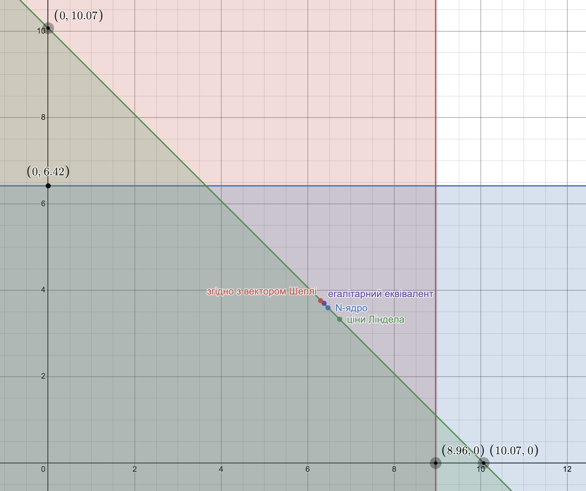

# Задача 9.5

Нехай є економіка виробництва суспільного продукту при наступних початкових даних:

$$ n = 2, b_1(y) = 6 \sqrt{y}, b_2(y) = 4 \ln(1 + y) $$

Функція витрат має вигляд $С(y) = 2   y $.

1. Побудувати кооперативну ТП-гру і знайти оптимальний план об'єму випуску $y^*$, а також розподілення витрат, яке належить ядру гри.
2. Знайти розподілення витрат, яке відповідає вектору Шеплі, а також $N$-ядру.
3. Знайти точку часткової рівноваги і відповідне розподілення витрат.
4. Визначити розподілення витрат, яке відповідає егалітарному еквіваленту і перевірити приналежність його ядру гри.

Розв'язок
1. Знаходимо оптимальний план випуску:

$$ \sum_{i=1}^2 b_i'(y) = c(y) $$

$$ b_1'(y) + b_2'(y) = c'(y) $$

$$ \frac{3}{\sqrt{y}} + \frac{4}{1+ y} = 2 $$

$$ y^* = 5.034 $$

Оптимальні витрати: 

$$ c(y^*) = 2  \cdot   5.034 = 10.07 $$

Знаходимо оптимальний прибуток коаліції:

$$ V(1,2) = b_1(y^*) + b_2(y^*) - c(y^*) = 6 \sqrt{5.034} + 4 \ln(1 + 5.034) - 2  \cdot   5.034 = 10.58 $$
Знайдемо оптимальний прибуток учасників поза коаліцією: 

Для першого учасника:

$$ V(1) = \underbrace{\max}_y \left \lbrace 6 \sqrt{y} - 2   y ;0 \right \rbrace  $$

$$ b_1'(y) = c'(y) $$

$$ \frac{3}{\sqrt{y}} = 2 $$

$$ y = 2.25 $$

$$ V(1) = 4.5 $$

Для другого учасника:

$$ V(2) = \underbrace{\max}_y \left \lbrace 0; 4 \ln(1 + y) - 2   y \right \rbrace  $$

$$ b_2'(y) = c'(y) $$

$$ \frac{4}{1+ y} = 2 $$

$$ y = 1 $$

$$ V(2) = 0.77 $$
Кооперативний прибуток:

$$ \Delta V = V(1,2) - V(1) - V(2) = 10.58 - 4.5 - 0.77 = 5.31$$

Визначаємо умови для ядра гри:

$$ b_1(y^*) - x_1^* \ge V(1) $$

$$ x_1^* \le b_1(y^*) - V(1) $$

$$ x_1^* \le 13.46 - 4.5 $$

$$ x_1^* \le 8.96 $$

$$ b_2(y^*) - x_2^* \ge V(2) $$

$$ x_2^* \le b_2(y^*) - V(2) $$

$$ x_2^* \le 7.19 - 0.77 $$

$$ x_2^* \le 6.42 $$

В коаліції $ x_1^* + x_2^* = 10.07$. Отже:

$$ \begin{cases}
  x_1^* \le 8.96 \\
  x_2^* \le 6.42 \\
  x_1^* + x_2^* \le 10.07
\end{cases}
$$

Побудуємо область допустимих рішень цих нерівностей.

2. Знайдемо розподіл прибутку згідно з вектором Шеплі (маргінальні внески)

$$ \Delta V_1^1 = V(1) - V(0) = V(1) = 4.5 $$

$$ \Delta V_1^2 = V(1,2) - V(2) = 10.58 - 0.77 = 9.81 $$

$$ \Delta V_2^1 = V(2) - V(0) = V(2) = 0.77 $$

$$ \Delta V_2^2 = V(1,2) - V(1) = 10.58 - 4.5 = 6.08 $$

$$ V_1 = \frac{1}{2} V(1) + \frac{1}{2} (V(1,2) - V(2)) = 
\frac{1}{2} \cdot 4.5 + \frac{1}{2} (10.58 - 0.77) =
7.16
$$

$$ V_2 = \frac{1}{2} V(2) + \frac{1}{2} (V(1,2) - V(1)) = 
\frac{1}{2} \cdot 0.77 + \frac{1}{2} (10.58 - 1) =
3.43
$$

Загальний прибуток

$$ \vartheta_1 + \vartheta_2 = V(1,2) = 10.58$$

Знайдемо витрати учасників

$$ b_1(y^*) - x_1^* = V_1 $$

$$ x_1^* = b_1(y^*) - V_1 $$

$$ x_1^* = 13.46 - 7.16 $$

$$ x_1^* = 6.3 $$

$$ b_2(y^*) - x_1^* = V_2 $$

$$ x_2^* = b_2(y^*) - V_2 $$

$$ x_2^* = 7.19 - 3.43 $$

$$ x_2^* = 3.76 $$

$$ x_1^* + x_2^* = 6.3 + 3.76 =
10.06  $$

Знайдемо N-ядро

$$ \frac{1}{2} \left( b_1(y^*) + b_2(y^*) \right) = 
\frac{1}{2} (13.46 + 7.19) = 10.33
$$

$$ \lambda_0 = \frac{C(y^*)}{n} = \frac{10.07}{2} =
5.03  $$

$$ \frac{\min(b_1(y^*), b_2(y^*))}{2} = 
\frac{\min(13.46, 7.19)}{2} =
\frac{7.19}{2} = 
3.59
$$

$$ \lambda_0 > \frac{b_2(y^*)}{2} $$

$$ x_2^* = \frac{b_2(y^*)}{2} = 3.595$$

$$ \lambda_1 = \frac{1}{n-1} (c-x_1^*) = 10.07 - 3.595 =
6.47 $$

$$ \frac{b_1 (y^*)}{2} = 6.73 $$

$$ \lambda^* = \lambda_1 = 6.47 $$

$$ x_1^* = \lambda^* = 6.47 $$

3. Знайдемо розподіл витрат, що відповідає дольовій рівновазі по Лінделу.

$$ \lbrace b_1(y^*) - r_1 C(y^*) \rbrace = 
\max \lbrace 6 \sqrt{y} - r_1 2   y \rbrace
$$

$$ \frac{3}{\sqrt{y}} - r_1 2 = 0$$ 

$$ r_1 = \frac{3}{2 \sqrt{y}} $$

$$ \lbrace b_2(y^*) - r_2 C(y^*) \rbrace = 
\max \lbrace 4 \ln(1 + y) - r_2 2   y \rbrace
$$

$$ \frac{4}{1+ y} - r_2 2 = 0$$ 

$$ r_2 = \frac{2}{1+y} $$

$$ \frac{3}{2 \sqrt{y}} + \frac{2}{1+y} = 1 $$

$$ 2y^{\frac{3}{2}} -3y +2y^{\frac{1}{2}} +3 = 0 $$

$$ y^* \approx 5.034 $$

$$ r_1 \approx 0.669 $$

$$ r_2 \approx 0.331 $$

$$ x_1^* = r_1 C(y^*) = 0.669 \cdot 10.07 =
6.74
$$

$$ x_2^* = r_2 C(y^*) = 0.331 \cdot 10.07 =
3.33
$$

4. Знайдемо егалітарний еквівалент

$$ \sum_{i=1}^n b_i (\overline{y}) = \sum_{i=1}^n b_i (y^*) - c(y^*) $$

$$ 6 \sqrt{\overline{y}} + 4 \ln(1 + \overline{y}) =
6 \sqrt{y^*} + 4 \ln(1 + y^*) - 2   {y^*}
$$

$$ 6 \sqrt{\overline{y}} + 4 \ln(1 + \overline{y}) = 10.58$$

$$ \overline{y} = 1.395 $$

$$ x_i^* = b_i(y^*) - b_i(\overline{y}) $$

$$ x_1^* = b_1(y^*) - b_1(\overline{y}) =
13.46 - 7.09 = 
6.38
$$

$$ x_2^* = b_2(y^*) - b_2(\overline{y}) =
7.19 - 3.49 = 
3.7
$$

$$ x_1^* + x_2^* = 
6.38 + 3.7 =
10.08
 $$

