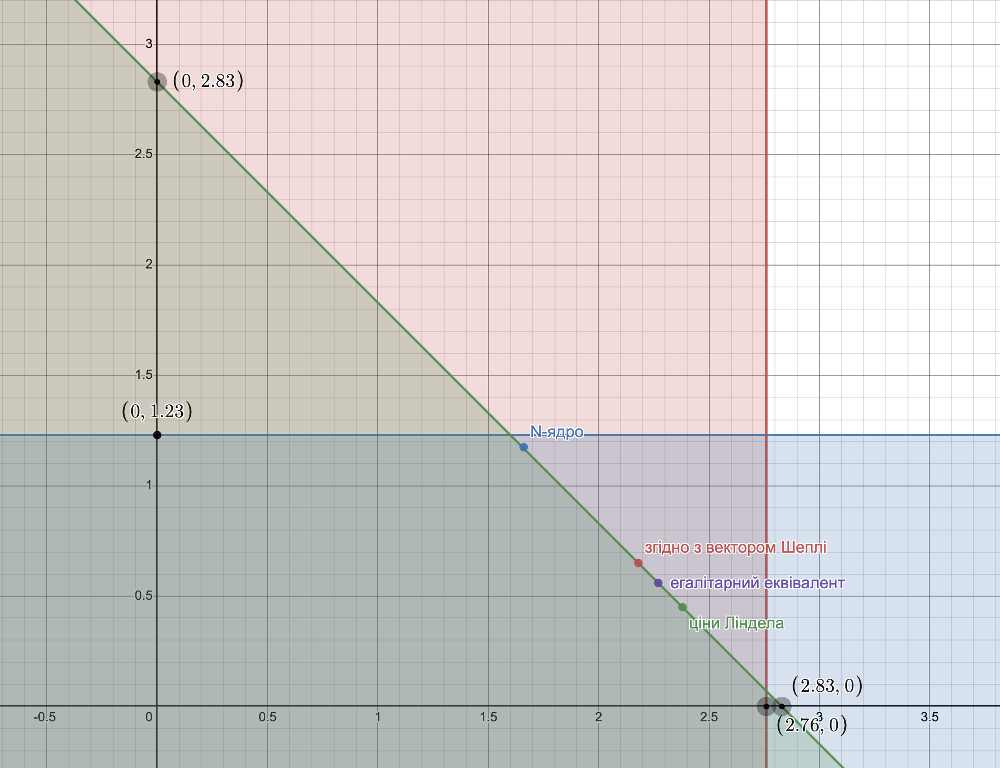

# Задача 9.6

Нехай є економіка виробництва суспільного продукту при наступних початкових даних:

$$ n = 2, b_1(y) = 2  y, b_2(y) = \ln(1 + 4  y) $$

Функція витрат має вигляд $С(y) = \frac{1}{2}   y^2 $.

1. Побудувати кооперативну ТП-гру і знайти оптимальний план об'єму випуску $y^*$, а також розподілення витрат, яке належить ядру гри.
2. Знайти розподілення витрат, яке відповідає вектору Шеплі, а також $N$-ядру.
3. Знайти точку часткової рівноваги і відповідне розподілення витрат.
4. Визначити розподілення витрат, яке відповідає егалітарному еквіваленту і перевірити приналежність його ядру гри.

Розв'язок
1. Знаходимо оптимальний план випуску:

$$ \sum_{i=1}^2 b_i'(y) = c(y) $$

$$ b_1'(y) + b_2'(y) = c'(y) $$

$$ 2 + \frac{4}{1+ 4  y} = y $$

$$ y^* = 2.38 $$

Оптимальні витрати: 

$$ c(y^*) = \frac{1}{2}  \cdot   2.38^2 = 2.83 $$

Знаходимо оптимальний прибуток коаліції:

$$ V(1,2) = b_1(y^*) + b_2(y^*) - c(y^*) = 2  \cdot  2.38 + \ln(1 + 4  \cdot  2.38) - \frac{1}{2}  \cdot   2.38^2 = 4.28 $$
Знайдемо оптимальний прибуток учасників поза коаліцією: 

Для першого учасника:

$$ V(1) = \underbrace{\max}_y \left \lbrace 2  y - \frac{1}{2}   y^2 ;0 \right \rbrace  $$

$$ b_1'(y) = c'(y) $$

$$ 2 = y $$

$$ y = 2 $$

$$ V(1) = 2 $$

Для другого учасника:

$$ V(2) = \underbrace{\max}_y \left \lbrace 0; \ln(1 + 4  y) - \frac{1}{2}   y^2 \right \rbrace  $$

$$ b_2'(y) = c'(y) $$

$$ \frac{4}{1+ 4  y} = y $$

$$ y = 0.88 $$

$$ V(2) = 1.12 $$
Кооперативний прибуток:

$$ \Delta V = V(1,2) - V(1) - V(2) = 4.28 - 2 - 1.12 = 1.16$$

Визначаємо умови для ядра гри:

$$ b_1(y^*) - x_1^* \ge V(1) $$

$$ x_1^* \le b_1(y^*) - V(1) $$

$$ x_1^* \le 4.76 - 2 $$

$$ x_1^* \le 2.76 $$

$$ b_2(y^*) - x_2^* \ge V(2) $$

$$ x_2^* \le b_2(y^*) - V(2) $$

$$ x_2^* \le 2.35 - 1.12 $$

$$ x_2^* \le 1.23 $$

В коаліції $ x_1^* + x_2^* = 2.83$. Отже:

$$ \begin{cases}
  x_1^* \le 2.76 \\
  x_2^* \le 1.23 \\
  x_1^* + x_2^* \le 2.83
\end{cases}
$$

Побудуємо область допустимих рішень цих нерівностей.

2. Знайдемо розподіл прибутку згідно з вектором Шеплі (маргінальні внески)

$$ \Delta V_1^1 = V(1) - V(0) = V(1) = 2 $$

$$ \Delta V_1^2 = V(1,2) - V(2) = 4.28 - 1.12 = 3.16 $$

$$ \Delta V_2^1 = V(2) - V(0) = V(2) = 1.12 $$

$$ \Delta V_2^2 = V(1,2) - V(1) = 4.28 - 2 = 2.28 $$

$$ V_1 = \frac{1}{2} V(1) + \frac{1}{2} (V(1,2) - V(2)) = 
\frac{1}{2} \cdot 2 + \frac{1}{2} (4.28 - 1.12) =
2.58
$$

$$ V_2 = \frac{1}{2} V(2) + \frac{1}{2} (V(1,2) - V(1)) = 
\frac{1}{2} \cdot 1.12 + \frac{1}{2} (4.28 - 1) =
1.7
$$

Загальний прибуток

$$ \vartheta_1 + \vartheta_2 = V(1,2) = 4.28$$

Знайдемо витрати учасників

$$ b_1(y^*) - x_1^* = V_1 $$

$$ x_1^* = b_1(y^*) - V_1 $$

$$ x_1^* = 4.76 - 2.58 $$

$$ x_1^* = 2.18 $$

$$ b_2(y^*) - x_1^* = V_2 $$

$$ x_2^* = b_2(y^*) - V_2 $$

$$ x_2^* = 2.35 - 1.7 $$

$$ x_2^* = 0.65 $$

$$ x_1^* + x_2^* = 2.18 + 0.65 =
2.83  $$

Знайдемо N-ядро

$$ \frac{1}{2} \left( b_1(y^*) + b_2(y^*) \right) = 
\frac{1}{2} (4.76 + 2.35) = 3.56
$$

$$ \lambda_0 = \frac{C(y^*)}{n} = \frac{2.83}{2} =
1.42  $$

$$ \frac{\min(b_1(y^*), b_2(y^*))}{2} = 
\frac{\min(4.76, 2.35)}{2} =
\frac{2.35}{2} = 
1.18
$$

$$ \lambda_0 > \frac{b_2(y^*)}{2} $$

$$ x_2^* = \frac{b_2(y^*)}{2} = 1.175$$

$$ \lambda_1 = \frac{1}{n-1} (c-x_1^*) = 2.83 - 1.175 =
1.66 $$

$$ \frac{b_1 (y^*)}{2} = 2.38 $$

$$ \lambda^* = \lambda_1 = 1.66 $$

$$ x_1^* = \lambda^* = 1.66 $$

3. Знайдемо розподіл витрат, що відповідає дольовій рівновазі по Лінделу.

$$ \lbrace b_1(y^*) - r_1 C(y^*) \rbrace = 
\max \lbrace 2  y - r_1 \frac{1}{2}   y^2 \rbrace
$$

$$ 2 - r_1 y = 0$$ 

$$ r_1 = \frac{2}{y} $$

$$ \lbrace b_2(y^*) - r_2 C(y^*) \rbrace = 
\max \lbrace \ln(1 + 4  y) - r_2 \frac{1}{2}   y^2 \rbrace
$$

$$ \frac{4}{1+ 4  y} - r_2 y = 0$$ 

$$ r_2 = \frac{4}{y+4y^2} $$

$$ \frac{2}{y} + \frac{4}{y+4y^2} = 1 $$

$$ 4y^2-7y-6 = 0 $$

$$ y^* \approx 2.38 $$

$$ r_1 \approx 0.84 $$

$$ r_2 \approx 0.16 $$

$$ x_1^* = r_1 C(y^*) = 0.84 \cdot 2.83 =
2.38
$$

$$ x_2^* = r_2 C(y^*) = 0.16 \cdot 2.83 =
0.45
$$

4. Знайдемо егалітарний еквівалент

$$ \sum_{i=1}^n b_i (\overline{y}) = \sum_{i=1}^n b_i (y^*) - c(y^*) $$

$$ 2  \overline{y} + \ln(1 + 4  \overline{y}) =
2  y^* + \ln(1 + 4  y^*) - \frac{1}{2}   {y^*}^2
$$

$$ 2  \overline{y} + \ln(1 + 4  \overline{y}) = 4.28$$

$$ \overline{y} = 1.246 $$

$$ x_i^* = b_i(y^*) - b_i(\overline{y}) $$

$$ x_1^* = b_1(y^*) - b_1(\overline{y}) =
4.76 - 2.49 = 
2.27
$$

$$ x_2^* = b_2(y^*) - b_2(\overline{y}) =
2.35 - 1.79 = 
0.56
$$

$$ x_1^* + x_2^* = 
2.27 + 0.56 =
2.83
 $$

