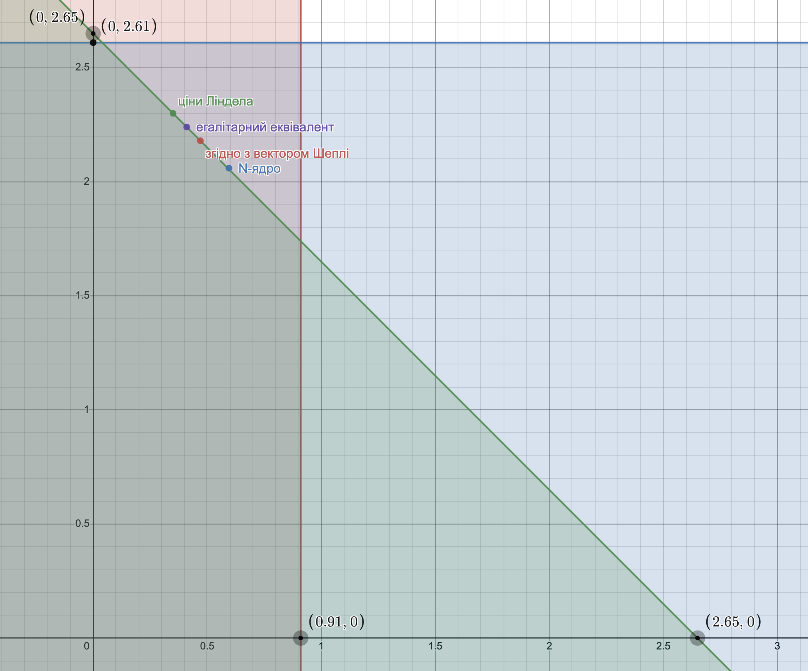

# Задача 9.7

Нехай є економіка виробництва суспільного продукту при наступних початкових даних:

$$ n = 2, b_1(y) = \ln(1 + y), b_2(y) = 2  y $$

Функція витрат має вигляд $С(y) = \frac{1}{2}   y^2 $.

1. Побудувати кооперативну ТП-гру і знайти оптимальний план об'єму випуску $y^*$, а також розподілення витрат, яке належить ядру гри.
2. Знайти розподілення витрат, яке відповідає вектору Шеплі, а також $N$-ядру.
3. Знайти точку часткової рівноваги і відповідне розподілення витрат.
4. Визначити розподілення витрат, яке відповідає егалітарному еквіваленту і перевірити приналежність його ядру гри.

Розв'язок
1. Знаходимо оптимальний план випуску:

$$ \sum_{i=1}^2 b_i'(y) = c(y) $$

$$ b_1'(y) + b_2'(y) = c'(y) $$

$$ \frac{1}{1+ y} + 2 = y $$

$$ y^* = 2.303 $$

Оптимальні витрати: 

$$ c(y^*) = \frac{1}{2}  \cdot   2.303^2 = 2.65 $$

Знаходимо оптимальний прибуток коаліції:

$$ V(1,2) = b_1(y^*) + b_2(y^*) - c(y^*) = \ln(1 + 2.303) + 2  \cdot  2.303 - \frac{1}{2}  \cdot   2.303^2 = 3.15 $$
Знайдемо оптимальний прибуток учасників поза коаліцією: 

Для першого учасника:

$$ V(1) = \underbrace{\max}_y \left \lbrace \ln(1 + y) - \frac{1}{2}   y^2 ;0 \right \rbrace  $$

$$ b_1'(y) = c'(y) $$

$$ \frac{1}{1+ y} = y $$

$$ y = 0.618 $$

$$ V(1) = 0.29 $$

Для другого учасника:

$$ V(2) = \underbrace{\max}_y \left \lbrace 0; 2  y - \frac{1}{2}   y^2 \right \rbrace  $$

$$ b_2'(y) = c'(y) $$

$$ 2 = y $$

$$ y = 2 $$

$$ V(2) = 2 $$
Кооперативний прибуток:

$$ \Delta V = V(1,2) - V(1) - V(2) = 3.15 - 0.29 - 2 = 0.86$$

Визначаємо умови для ядра гри:

$$ b_1(y^*) - x_1^* \ge V(1) $$

$$ x_1^* \le b_1(y^*) - V(1) $$

$$ x_1^* \le 1.19 - 0.29 $$

$$ x_1^* \le 0.9 $$

$$ b_2(y^*) - x_2^* \ge V(2) $$

$$ x_2^* \le b_2(y^*) - V(2) $$

$$ x_2^* \le 4.61 - 2 $$

$$ x_2^* \le 2.61 $$

В коаліції $ x_1^* + x_2^* = 2.65$. Отже:

$$ \begin{cases}
  x_1^* \le 0.9 \\
  x_2^* \le 2.61 \\
  x_1^* + x_2^* \le 2.65
\end{cases}
$$

Побудуємо область допустимих рішень цих нерівностей.

2. Знайдемо розподіл прибутку згідно з вектором Шеплі (маргінальні внески)

$$ \Delta V_1^1 = V(1) - V(0) = V(1) = 0.29 $$

$$ \Delta V_1^2 = V(1,2) - V(2) = 3.15 - 2 = 1.15 $$

$$ \Delta V_2^1 = V(2) - V(0) = V(2) = 2 $$

$$ \Delta V_2^2 = V(1,2) - V(1) = 3.15 - 0.29 = 2.86 $$

$$ V_1 = \frac{1}{2} V(1) + \frac{1}{2} (V(1,2) - V(2)) = 
\frac{1}{2} \cdot 0.29 + \frac{1}{2} (3.15 - 2) =
0.72
$$

$$ V_2 = \frac{1}{2} V(2) + \frac{1}{2} (V(1,2) - V(1)) = 
\frac{1}{2} \cdot 2 + \frac{1}{2} (3.15 - 1) =
2.43
$$

Загальний прибуток

$$ \vartheta_1 + \vartheta_2 = V(1,2) = 3.15$$

Знайдемо витрати учасників

$$ b_1(y^*) - x_1^* = V_1 $$

$$ x_1^* = b_1(y^*) - V_1 $$

$$ x_1^* = 1.19 - 0.72 $$

$$ x_1^* = 0.47 $$

$$ b_2(y^*) - x_1^* = V_2 $$

$$ x_2^* = b_2(y^*) - V_2 $$

$$ x_2^* = 4.61 - 2.43 $$

$$ x_2^* = 2.18 $$

$$ x_1^* + x_2^* = 0.47 + 2.18 =
2.65  $$

Знайдемо N-ядро

$$ \frac{1}{2} \left( b_1(y^*) + b_2(y^*) \right) = 
\frac{1}{2} (1.19 + 4.61) = 2.9
$$

$$ \lambda_0 = \frac{C(y^*)}{n} = \frac{2.65}{2} =
1.33  $$

$$ \frac{\min(b_1(y^*), b_2(y^*))}{2} = 
\frac{\min(1.19, 4.61)}{2} =
\frac{1.19}{2} = 
0.6
$$

$$ \lambda_0 > \frac{b_1(y^*)}{2} $$

$$ x_1^* = \frac{b_1(y^*)}{2} = 0.595$$

$$ \lambda_1 = \frac{1}{n-1} (b_2(y^*)-c+x_1^*) = 4.61 - 2.65 + 0.595 =
2.55 $$

$$ \frac{b_2 (y^*)}{2} = 2.305 $$

$$ \lambda_1 < \frac{b_2 (y^*)}{2} $$

$$ \lambda^* = \lambda_1 = 2.55 $$

$$ x_2^* = \frac{b_2 (y^*)}{2} -\lambda^* = 4.61 - 2.55 =
2.06 $$

3. Знайдемо розподіл витрат, що відповідає дольовій рівновазі по Лінделу.

$$ \lbrace b_1(y^*) - r_1 C(y^*) \rbrace = 
\max \lbrace \ln(1 + y) - r_1 \frac{1}{2}   y^2 \rbrace
$$

$$ \frac{1}{1+ y} - r_1 y = 0$$ 

$$ r_1 = \frac{1}{y+y^2} $$

$$ \lbrace b_2(y^*) - r_2 C(y^*) \rbrace = 
\max \lbrace 2  y - r_2 \frac{1}{2}   y^2 \rbrace
$$

$$ 2 - r_2 y = 0$$ 

$$ r_2 = \frac{2}{y} $$

$$ \frac{1}{y+y^2} + \frac{2}{y} = 1 $$

$$ y^2-y-3 = 0 $$

$$ y^* \approx 2.303 $$

$$ r_1 \approx 0.131 $$

$$ r_2 \approx 0.868 $$

$$ x_1^* = r_1 C(y^*) = 0.131 \cdot 2.65 =
0.35
$$

$$ x_2^* = r_2 C(y^*) = 0.868 \cdot 2.65 =
2.3
$$

$$ x_1^* + x_2^* = 2.65 $$

4. Знайдемо егалітарний еквівалент

$$ \sum_{i=1}^n b_i (\overline{y}) = \sum_{i=1}^n b_i (y^*) - c(y^*) $$

$$ \ln(1 + \overline{y}) + 2  \overline{y} =
\ln(1 + y^*) + 2  y^* - \frac{1}{2}   {y^*}^2
$$

$$ \ln(1 + \overline{y}) + 2  \overline{y} = 3.15$$

$$ \overline{y} = 1.184 $$

$$ x_i^* = b_i(y^*) - b_i(\overline{y}) $$

$$ x_1^* = b_1(y^*) - b_1(\overline{y}) =
1.19 - 0.78 = 
0.41
$$

$$ x_2^* = b_2(y^*) - b_2(\overline{y}) =
4.61 - 2.37 = 
2.24
$$

$$ x_1^* + x_2^* = 
0.41 + 2.24 =
2.65
 $$

