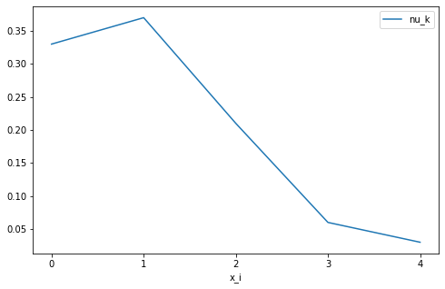
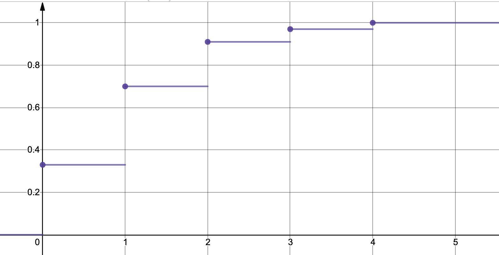

# Розрахункова робота

## Група ІС-02. Бойко Василь Олександрович

### Математична статистика. Варіант 2.

1. Побудувати варіаційний (дискретний або інтервальний) ряд наданої вибірки.
2. Зробити графічне зображення вибірки.
3. Побудувати емпіричну функцію розподілу.
4. Обчислити вибіркові медіану, моду, ексцес, асиметрію.
5. Знайти незміщену оцінку математичного сподівання та дисперсії.
6. Висунути гіпотезу про розподіл, за яким отримано вибірку.
7. Перевірити за допомогою критерію $\chi^2$ Пірсона гіпотезу про розподіл з рівнем значущості $\alpha = 0,05$
8. Знайти довірчий інтервал для параметрів гіпотетичного закону розподілу, взяв рівень надійності $\gamma = 0,95$.

### Вибірка. Варіант 2.

1, 1, 2, 1, 4, 2, 1, 1, 0, 2, 0, 2, 1, 0, 1, 0, 2, 3, 0, 1, 1, 2, 0, 1, 2,
2, 1, 0, 0, 0, 1, 0, 0, 1, 2, 2, 0, 2, 0, 1, 1, 3, 0, 0, 1, 0, 2, 1, 0, 2,
0, 0, 1, 3, 0, 2, 0, 2, 0, 3, 4, 1, 1, 1, 0, 1, 1, 1, 1, 0, 0, 0, 1, 0, 2,
0, 1, 1, 1, 0, 1, 2, 0, 1, 1, 0, 1, 1, 3, 2, 1, 1, 0, 2, 0, 1, 4, 2, 3, 2

### Розв'язок

1. Побудувати варіаційний (дискретний або інтервальний) ряд наданої вибірки.

Виконаємо ранжування для цієї вибірки:

0, 0, 0, 0, 0, 0, 0, 0, 0, 0, 0, 0, 0, 0, 0, 0, 0, 0, 0, 0, 0, 0, 0, 0, 0,
0, 0, 0, 0, 0, 0, 0, 0, 1, 1, 1, 1, 1, 1, 1, 1, 1, 1, 1, 1, 1, 1, 1, 1, 1,
1, 1, 1, 1, 1, 1, 1, 1, 1, 1, 1, 1, 1, 1, 1, 1, 1, 1, 1, 1, 2, 2, 2, 2, 2,
2, 2, 2, 2, 2, 2, 2, 2, 2, 2, 2, 2, 2, 2, 2, 2, 3, 3, 3, 3, 3, 3, 4, 4, 4

Побудуємо дискретний варіаційний ряд:

| $x_{i_k}$ |    0 |    1 |    2 |    3 |    4 |
| --------: | ---: | ---: | ---: | ---: | ---: |
|     $n_k$ |   33 |   37 |   21 |    6 |    3 |
|   $\nu_k$ | 0.33 | 0.37 | 0.21 | 0.06 | 0.03 |

2. Зробити графічне зображення вибірки.

На рисунку наведено полігон частот для нашої вибірки.

3. Побудувати емпіричну функцію розподілу.

4. Обчислити вибіркові медіану, моду, ексцес, асиметрію.
