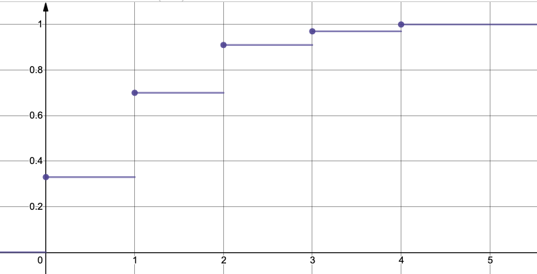

# Розрахункова робота

## Група ІС-02. Бойко Василь Олександрович

### Математична статистика. Варіант 2.

1. Побудувати варіаційний (дискретний або інтервальний) ряд наданої вибірки.
2. Зробити графічне зображення вибірки.
3. Побудувати емпіричну функцію розподілу.
4. Обчислити вибіркові медіану, моду, ексцес, асиметрію.
5. Знайти незміщену оцінку математичного сподівання та дисперсії.
6. Висунути гіпотезу про розподіл, за яким отримано вибірку.
7. Перевірити за допомогою критерію $\chi^2$ Пірсона гіпотезу про розподіл з рівнем значущості $\alpha = 0,05$
8. Знайти довірчий інтервал для параметрів гіпотетичного закону розподілу, взяв рівень надійності $\gamma = 0,95$.

### Вибірка. Варіант 2.

1, 1, 2, 1, 4, 2, 1, 1, 0, 2, 0, 2, 1, 0, 1, 0, 2, 3, 0, 1, 1, 2, 0, 1, 2,
2, 1, 0, 0, 0, 1, 0, 0, 1, 2, 2, 0, 2, 0, 1, 1, 3, 0, 0, 1, 0, 2, 1, 0, 2,
0, 0, 1, 3, 0, 2, 0, 2, 0, 3, 4, 1, 1, 1, 0, 1, 1, 1, 1, 0, 0, 0, 1, 0, 2,
0, 1, 1, 1, 0, 1, 2, 0, 1, 1, 0, 1, 1, 3, 2, 1, 1, 0, 2, 0, 1, 4, 2, 3, 2

### Розв'язок

1. Побудувати варіаційний (дискретний або інтервальний) ряд наданої вибірки.

Виконаємо ранжування для цієї вибірки:

0, 0, 0, 0, 0, 0, 0, 0, 0, 0, 0, 0, 0, 0, 0, 0, 0, 0, 0, 0, 0, 0, 0, 0, 0,
0, 0, 0, 0, 0, 0, 0, 0, 1, 1, 1, 1, 1, 1, 1, 1, 1, 1, 1, 1, 1, 1, 1, 1, 1,
1, 1, 1, 1, 1, 1, 1, 1, 1, 1, 1, 1, 1, 1, 1, 1, 1, 1, 1, 1, 2, 2, 2, 2, 2,
2, 2, 2, 2, 2, 2, 2, 2, 2, 2, 2, 2, 2, 2, 2, 2, 3, 3, 3, 3, 3, 3, 4, 4, 4

Побудуємо дискретний варіаційний ряд:

| $x_{i_k}$ |    0 |    1 |    2 |    3 |    4 |
| --------: | ---: | ---: | ---: | ---: | ---: |
|     $n_k$ |   33 |   37 |   21 |    6 |    3 |
|   $\nu_k$ | 0.33 | 0.37 | 0.21 | 0.06 | 0.03 |

2. Зробити графічне зображення вибірки.

На рисунку наведено полігон частот для нашої вибірки.

<!--  -->

3. Побудувати емпіричну функцію розподілу.

<!--  -->

4. Обчислити вибіркові медіану, моду, ексцес, асиметрію.

Вибіркове середнє:

$$ \overline{\xi} = \frac{1}{100} (33 \cdot 0 + 37 \cdot 1 + 21 \cdot 2 + 6 \cdot 3 + 3 \cdot 4) = 1.09$$

Вибіркова медіана:

$$ \xi_ {\frac{1}{2}} = \frac{1}{2}(\xi*{50} + \xi*{51}) = \frac{1}{2}(1 + 1) = 1 $$

Вибіркова мода:

$$ \xi_{k_m} = 1 $$

Асиметрія:

Знайдемо перший, другий та третій початкові моменти, а потім на їх основі них знайдемо третій центральний момент та коефіцієнт асиметрії.

$$ \gamma_1 = M \xi = 1.09 $$

$$ \gamma_2 = M \xi^2 = \frac{1}{100} (33 \cdot 0^2 + 37 \cdot 1^2 + 21 \cdot 2^2 + 6 \cdot 3^2 + 3 \cdot 4^2) = 2.23 $$

$$ \gamma_3 = M \xi^3 = \frac{1}{100} (33 \cdot 0^3 + 37 \cdot 1^3 + 21 \cdot 2^3 + 6 \cdot 3^3 + 3 \cdot 4^3) = 5.59 $$

$$ \mu_3 = \gamma_3 - 3 \gamma_1 \gamma_2 + 2 \gamma_1^3 = 5.59 - 3 \cdot 1.09 \cdot 2.23 + 2 \cdot 1.09^3 = 0.887958  $$

$$ \sigma^2 \xi = D \xi = \gamma_2 - (\gamma_1)^2 = 2.23 - 1.09^2 = 1.0419 $$

$$ \alpha \xi = \frac{\mu_3}{(\sigma \xi)^3} = \frac{0.887958}{\sqrt{1.0419}^3} \approx 0.834936 $$

Ексцес:

Знайдемо четвертий початковий та центральний моменти, а потім на основі знайдених значень знайдемо ексцес

$$ \gamma_4 = M \xi^4 = \frac{1}{100} (33 \cdot 0^4 + 37 \cdot 1^4 + 21 \cdot 2^4 + 6 \cdot 3^4 + 3 \cdot 4^4) = 16.27 $$

$$ \mu_4 = \gamma_4 - 4 \gamma_3 \gamma_1 + 6 \gamma_1^2 \gamma_2 - 3 \gamma_1^4 = $$

$$ = 16.27 - 4 \cdot 1.09 \cdot 5.59 + 6 \cdot 1.09^2 \cdot 2.23 -3 \cdot 1.09^4 = 3.55963317  $$

$$ C \xi = \frac{\mu_4}{\sigma^4 \xi} - 3 = \frac{3.55963317}{1.0419^2} -3 \approx 0.279089 $$

5. Знайти незміщену оцінку математичного сподівання та дисперсії.

$$ M \xi = \overline{\xi} = 1.09 $$

$$ D \xi = M s_v^2 = \frac{1}{n} \sum_{k=1}^n(\xi_k-\nu)^2 = $$

$$= \frac{1}{100} (33 \cdot (0-1.09)^2 + 37 \cdot (1-1.09)^2 + 21 \cdot (2-1.09)^2 + 6 \cdot (3-1.09)^2 + 3 \cdot (4-1.09)^2) = $$

$$= 1.0419 $$

6. Висунути гіпотезу про розподіл, за яким отримано вибірку.

Висунемо основну (нульову) гіпотезу: випадкова величина $\xi$ розподілена "згідно закону Пуассона з параметром $\lambda$"

$$ P(\xi=k) = \frac{\lambda^k}{k!} e^{-\lambda}, 0 \le k \le 4 $$

Для розподілу Пуассона характерно, що математичне сподівання дорівнює дисперсії.
У якості значення параметру $\lambda$ візьмемо значення виправленої вибіркової дисперсії:

$$ \lambda =  s^2 = \frac{1}{n-1} \sum_{k=1}^n (\xi_k - \overline{\xi})^2 = $$

$$ s^2 = \frac{1}{100-1} \left( 33 \cdot (0-1.09)^2 + 37 \cdot (1-1.09)^2 + 21 \cdot (2-1.09)^2 + 6 \cdot (3-1.09)^2  + 3 \cdot (4-1.09)^2  \right ) $$

$$ \lambda = s^2 = 1.052424 $$

1. Перевірити за допомогою критерію $\chi^2$ Пірсона гіпотезу про розподіл з рівнем значущості $\alpha = 0,05$

Обираємо рівень значущості $\alpha - 0.05$ як межу для помилки першого роду.

Множину $S = {0,1,2,3,4}$ значень $\xi$ розбиваємо природним чином на $r=5$ комірок:

$$ S = \{0\} \cup \{1\} \cup \{2\} \cup \{3\} \cup \{4\}, $$

тобто $ S_i = \{i\} , 0 \le i \le 4 $.

В якості значення параметра розподілу Пуассона $\lambda$ візьмемо виправлену вибіркову дисперсію

Обчислимо значення критерію Пірсона $\chi_{emp}^2$ за двома формулами (для перевірки), для зручності звівши етапи обчислень в таблицю:

$$ P(\xi=0) = \frac{1.052424^0}{0!} e^{-1.052424} = 0.349090 $$

$$ P(\xi=1) = \frac{1.052424^1}{1!} e^{-1.052424} = 0.367391 $$

$$ P(\xi=2) = \frac{1.052424^2}{2!} e^{-1.052424} = 0.193326 $$

$$ P(\xi=3) = \frac{1.052424^3}{3!} e^{-1.052424} = 0.067820 $$

$$ P(\xi=4) = \frac{1.052424^4}{4!} e^{-1.052424} = 0.017844 $$

|  $x_{i}$ | $n_i$ |    $p_i$ |       $np_i$ | $\frac{n_i^2}{np_i}$ | $\frac{(n_i - np_i)^2}{np_i}$ |
| -------: | ----: | -------: | -----------: | -------------------: | ----------------------------: |
|        0 |    33 | 0.349090 |  34.90904426 |         0.1043984467 |                   31.19535418 |
|        1 |    37 | 0.367391 |  36.73912446 |       0.001852413397 |                   37.26272795 |
|        2 |    21 | 0.193326 |  19.33257261 |          0.143815008 |                   22.81124239 |
|        3 |     6 | 0.067820 |  6.782022696 |        0.09017361405 |                   5.308150918 |
|        4 |     3 | 0.017844 |  1.784391274 |         0.8281281099 |                   5.043736835 |
|      >=5 |     0 | 0.004528 | 0.4528446903 |         0.4528446903 |                             0 |
| $\Sigma$ |   100 |      1.0 |        100.0 |          1.621212282 |                 101.621212282 |

Отже, значення критерію за обома формулами у межах похибки обчислень збігаються:

$$\chi_{emp}^2 = 1.621212282$$

За рівнем значущості $\alpha = 0.05$ та кількості ступенів вільності $r-1-s=6-1-1=4$ (розподіл залежить від одного невідомого параметру) із співвідношення:

$$ P\{ \chi_4^2 \ge \chi_{crit}^2 \} = 0.05 $$ 

за таблицями розподілу $\chi^2$ визначаємо критичне значення критерію $ \chi_{crit}^2  = 9.4877$ (з точністю до 0.005).

Оскільки $ \chi_{emp}^2 = 1.621212282 < \chi_{crit}^2 = 9.4877$ (значення критерію лежить поза критичної області), є підстава прийняти основну гіпотезу; ймовірність помилки першого роду (відкинути вірну гіпотезу) у межах похибки обчислення $ \chi_{emp}^2$ та $ \chi_{crit}^2$  становить $\alpha = 0.05$.

7. Знайти довірчий інтервал для параметрів гіпотетичного закону розподілу, взяв рівень надійності $\gamma = 0,95$.

Зафіксувавши значення надійності $\gamma$, із таблиці значень функції Лапласа можна знайти таке $\varepsilon$, що

$$ P\{ |\xi_0| \le \varepsilon \} = P \left\{ \left| \frac{\sqrt{n}(\overline{\xi}-\lambda)}{\sqrt{\lambda}} \right| \le \varepsilon \right\} = \gamma$$

тобто:

$$ P\{ |\xi_0| \le 1.64 \} = 0.95$$

Отже розв'яжемо нерівність та знайдемо значення $\lambda$

$$ \left| \frac{\sqrt{n}(\overline{\xi}-\lambda)}{\sqrt{\lambda}} \right| \le 1.64 $$

$$\left| \frac{\sqrt{100}(1.09-\lambda)}{\sqrt{\lambda}} \right| \le 1.64 $$

$$10\left| \frac{(1.09-\lambda)}{\sqrt{\lambda}} \right| \le 1.64 $$

$$\left| \frac{(1.09-\lambda)}{\sqrt{\lambda}} \right| \le 0.164 $$

Враховуючи, що $\lambda > 0$:

$$ 6.09756 \left| (1.09-\lambda) \right| \le  \sqrt{\lambda}$$

$$ 6.09756^2 (1.09-\lambda)^2  \le  \lambda$$

$$ 37.1802 \lambda^2 - 82.0529 \lambda + 44.1738 \le 0 $$

$$ 0.9317 \le \lambda \le 1.2752$$

Отже довірчий інтервал для параметрів гіпотетичного закону розподілу при рівні надійності $\gamma = 0,95$:

$$  \lambda \in [ 0.9317, 1.2752 ] $$