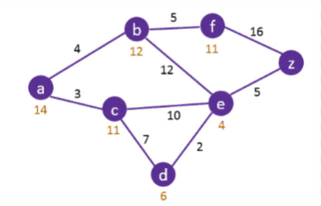

### ДЗ №1. Бойко Василь. ІС-02

1) Початковий стан А, цільовий стан Z. Евристична функція та вага ребра вказані на малюнку.

- Виконати пошук А*. Вказуйте чергу на кожному кроці. Побудуйте дерево пошуку, біля вузла пишіть значення функції оцінки.
- Виконайте жадібний пошук. Вказуйте чергу на кожному кроці. Побудуйте дерево пошуку, біля вузла пишіть значення функції оцінки.
- Виконайте пошук SMA* з обмеженням в 4 вузли.  Вказуйте чергу на кожному кроці. Побудуйте дерево пошуку, біля вузла пишіть значення функції оцінки.

1) Є шахова дошка 4 на 4. Необхідно розмістити 3 ферзя на цій дошці так щоб вони не атакували один одного. Початковий стан - всі ферзі знаходяться в останньому рядку.

- Представити задачу як задачу пошуку (цільовий стан, початковий стан і тп). 
- Побудувати граф пошуку. 
- Та знайти рішення за допомогою декількох неінформованих алгоритмів пошуку

### Розв'язок
### Пошук А*

1. a {c,b}
2. c {b,d,e}
3. b {d,e,f}
4. d {e,f}
5. e {z,f}
6. z

### Жадібний пошук

1. a {c,b}
2. c {d,e}
3. d {e}
4. e {z,b}
5. z

### Пошук SMA*

1. start a {a:14}
2. expand b {a:14, b:16}
3. expand c {a:14, b:16, c:14}
4. expand d {a:14, b:16, c:14, d:16}, out of memory
5. forget d, update c {a:14, b:16, c:16}
6. expand e {a:14, b:16, c:16, e:17}, out of memory
7. forget e {a:14, b:16, c:16}
8. expand f {a:14, b:16, c:16, f:20}, out of memory
9. forget f, update b {a:14, b:20, c:16}
10. expand e {a:14, b:20, c:16, e:20}, out of memory
11. forget e, no update {a:14, b:20, c:16}
12. expand d {a:14, b:20, c:16, d:16}, out of memory
13. forget b, update a {a:20, c:16, d:16}
14. expand e {a:20, c:16, d:16, e:16}, out of memory
15. forget a, no parent to update {c:16, d:16, e:16}
16. expand b {c:16, d:16, e:16, b:36}
17. forget b, update e {c:16, d:16, e:36}
18. expand z {c:16, d:16, e:36, z:17}, out of memory

### Задача з ферзями

#### Опишемо простір станів

Нехай позиція кожного на дошці ферзі задана наступним чином $r_1 c_1 r_2 c_2 r_3 c_3$. Кожна пара з букви та цифри представляє собою позицію одного ферзя, перше число це позначення рядка a,b,c,d, друге - номер стовпця від 1 до 4. Зауважимо, що ферзі не можуть займати одну й ту саму клітинку.

- початковий стан $[(a1), (a2), (a3)]$. Зауважимо, що розмістити трьох ферзів на дошці 4*4 можна двома способами, але вони є симетричними, отже ми будемо розглядати лише один початковий стан.

- цільовий стан можна описати як такий, коли для кожної пари ферзів $[(r_i,c_i)]$ та $[(r_k,c_k)]$ виконуються наступні умови
  - $r_i \ne r_k$ - ферзі не знаходяться в одному і тому самому рідку
  - $c_i \ne c_k$ - ферзі не знаходяться в одному і тому самому стовпцю
  - $|r_i - r_k| \ne |c_i - c_k| $ - ферзі не знаходяться на одній діагоналі

Зауважимо, що цільових станів існує декілька, і вони визначаються умовами наведеними вище.

Проілюструємо вирішення цієї задачі за допомогою алгоритмів DFS та BFS. З огляду на те що множина дій, доступних у кожному зі станів досить значна, для того, щоб отримати не дуже об'ємне дерево рішення, при реалізації алгоритму введемо деякі обмеження, а саме при переборі варіантів спочатку розглядаємо варіанти ходів вгору, потім по діагоналі вгору вправо, а потім вправо. Інші варіанти ходів не розглядаємо, - таким чином ми обмежимо ширину дерева.
На рис. 1 наведено дерево рішень для алгоритму DFS. Цифрами біля стрілочок позначено порядок розгляду вузлів.

Рисунок 1. Дерево рішень для алгоритму DFS.

