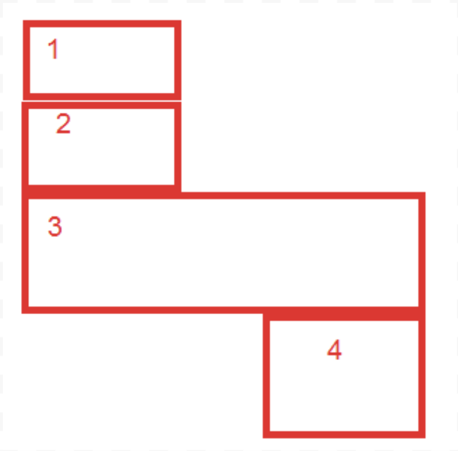

### ДЗ №2. Бойко Василь. ІС-02

Розміщення в офісі. Персонал: Шеф,Шефшефів, Вася, Катя, Гоша, Саша, Петя.  План кімнат на картинці. 

В одній кімнаті можуть знаходитися декілька людей, і не всі кімнати обов'язково заповнювати. У всіх працівників є побажання щодо того, де їх можна розмістити.

1. Шефшефів, і Шеф недолюблюють один одного і не будуть працювати в одній кімнаті.
2. Саша та Петя – гарна команда, і вони повинні працювати в одному приміщенні.
3. Гоша гучно розмовляє. Тільки Шеф буде працювати з ним в одній кімнаті.
4. Шеф постійно відволікає від роботи Сашу, Петю, Катю. Тож не варто їх в одну кімнату.
5. Шеф і Шефшефів лякають Васю і він не може нормально працювати, тож Васю не можна або в ту ж кімнату, або у сусідню, з кімнатою Шефа і Шефшефа.
6. Шефшефів дратує Катю, тому Катя не хоче бути у кімнаті Шефшефа.
7. Шефшефів - головний, тому він хоче працювати в кімнаті 1.

Представити задачу як задачу сsp. Змінні використовувати в алфавітному порядку. а) Описати змінні, області визначення, обмеження (надавати перевагу точним формулюванням). Намалювати граф обмежень. б) зробити перевірку сумісності дуг. в) виконати пошук з поверненням з використанням поширення обмежень а також з використанням евристик. значення змінним присвоювати в щораз більшому порядку.

## Розв'язок

Нехай $ X= x_i, i= 1..7$ це номера кімнат, в яких буде розміщено відповідних співробітників (в алфавітному порядку):

Вася - $x_1$

Гоша - $x_2$

Катя - $x_3$

Петя - $x_4$

Саша - $x_5$

Шеф - $x_6$

Шефшефів - $x_7$

Нехай $D = \{1,2,3,4\}$ область визначення - це номера кімнат, в яких можуть бути розміщені співробітники.

Нехай $С =  c_j, j = 1..7$ це обмеження на розміщення співробітників. Згідно умовам задач вони виглядають таким чином:

$$ c_1 = ((x_6,x_7), x_6  \cancel = x_7) $$

$$ c_2 = ((x_4,x_5), x_4 = x_5) $$

$$ c_3 = ((x_1,x_2,x_3,x_4,x_5,x_7,), x_2 \cancel{=} x_1, x_2 \cancel{=} x_3, x_2 \cancel{=} x_4, x_2 \cancel{=} x_5, x_2 \cancel{=} x_7) $$

$$ c_4 = ((x_3,x_4,x_5,x_6), x_6 \cancel{=} x_3, x_6 \cancel{=} x_4, x_6 \cancel{=} x_5) $$

$$ c_5 = ((x_1,x_6,x_7), x_1 \notin \{x_6, x_6-1, x_6+1\}, x_1 \notin \{x_7, x_7-1, x_7+1\} ) $$

$$ c_6 = ((x_3,x_7), x_3  \cancel = x_7) $$

$$ c_7 = ((x_7), x_7 = 1) $$

Побудуємо граф обмежень

Зауважимо, що обмеження $c_5$, а саме "*Шеф і Шефшефів лякають Васю і він не може нормально працювати, тож Васю не можна або в ту ж кімнату, або у сусідню, з кімнатою Шефа і Шефшефа*", зображено на графі лише у частині "*не можна в ту саму кімнату*".

Виконаємо пошук з поверненням з використанням поширення обмежень а також з використанням евристики мінімальної кількості решти значень.

Початковий стан 

$$\{ \}$$

Запишемо початкові області визначення усіх змінних:

$$ \begin{array}{|c|c|c|c|c|c|c|}  \hline
  x_1     & x_2     & x_3     & x_4     & x_5     & x_6     & x_7 \\ \hline
  1,2,3,4 & 1,2,3,4 & 1,2,3,4 & 1,2,3,4 & 1,2,3,4 & 1,2,3,4 & 1   \\ \hline
\end{array}
$$

Згідно евристиці для призначення ми обираємо змінну $x_7$, тому що для неї існує лише одне допустиме значення. Також згідно умов завдання значення змінним присвоюємо в щораз більшому порядку. Отже після призначення стан та області визначення змінних будуть наступними:

$$ \{ x_7=1 \}$$

$$ \begin{array}{|c|c|c|c|c|c|c|}  \hline
  x_1     & x_2     & x_3     & x_4     & x_5     & x_6     & x_7 \\ \hline
       4 &   2,3,4 &     3,4 & 1,2,3,4 & 1,2,3,4 &   2,3,4 & 1 \\ \hline
\end{array}
$$

Згідно евристиці для призначення ми повинні обрати змінну $x_1$ або змінну $x_3$, але ми повинні присвоювати значення змінним в щораз більшому порядку. Отже для призначення ми обираємо змінну $x_6$ та значення 2.

$$ \{ x_7=1, x_6 = 2 \}$$

$$ \begin{array}{|c|c|c|c|c|c|c|}  \hline
  x_1     & x_2     & x_3     & x_4     & x_5     & x_6     & x_7 \\ \hline
        4 &   2,3,4 &     3,4 & 1,  3,4 & 1,  3,4 &   2     & 1 \\ \hline
\end{array}
$$

Згідно евристиці для призначення ми повинні обрати змінну $x_1$, але ми повинні присвоювати значення змінним в щораз більшому порядку. Отже для призначення ми обираємо змінну $x_2$ та значення 2.

$$ \{ x_7=1, x_6 = 2, x_2 = 2 \}$$

$$ \begin{array}{|c|c|c|c|c|c|c|}  \hline
  x_1     & x_2     & x_3     & x_4     & x_5     & x_6     & x_7 \\ \hline
        4 &   2     &     3,4 & 1,  3,4 & 1,  3,4 &   2     & 1 \\ \hline
\end{array}
$$

Згідно евристиці для призначення ми повинні обрати змінну $x_1$, але ми повинні присвоювати значення змінним в щораз більшому порядку. Отже для призначення ми обираємо змінну $x_3$ та значення 3.

$$ \{ x_7=1, x_6 = 2, x_2 = 2, x_3 = 3 \}$$

$$ \begin{array}{|c|c|c|c|c|c|c|}  \hline
  x_1     & x_2     & x_3     & x_4     & x_5     & x_6     & x_7 \\ \hline
        4 &   2     &     3   & 1,  3,4 & 1,  3,4 &   2     & 1 \\ \hline
\end{array}
$$

Згідно евристиці для призначення ми повинні обрати змінну $x_1$, але ми повинні присвоювати значення змінним в щораз більшому порядку. Отже для призначення ми обираємо змінну $x_4$ та значення 3.

$$ \{ x_7=1, x_6 = 2, x_2 = 2, x_3 = 3, x_4 = 3 \}$$

$$ \begin{array}{|c|c|c|c|c|c|c|}  \hline
  x_1     & x_2     & x_3     & x_4     & x_5     & x_6     & x_7 \\ \hline
        4 &   2     &     3   &     3   &     3   &   2     & 1 \\ \hline
\end{array}
$$

Згідно евристиці для призначення ми повинні обрати змінну $x_1$, але ми повинні присвоювати значення змінним в щораз більшому порядку. Отже для призначення ми обираємо змінну $x_5$ та з огляду на умову $c_2$ значення 3.

$$ \{ x_7=1, x_6 = 2, x_2 = 2, x_3 = 3, x_4 = 3, x_5 = 3 \}$$

$$ \begin{array}{|c|c|c|c|c|c|c|}  \hline
  x_1     & x_2     & x_3     & x_4     & x_5     & x_6     & x_7 \\ \hline
        4 &   2     &     3   &     3   &     3   &   2     & 1 \\ \hline
\end{array}
$$

Згідно евристиці для призначення ми повинні обрати змінну $x_1$, умова присвоєння значень змінним в щораз більшому порядку виконується. Отже для призначення ми обираємо змінну $x_1$ та значення 4.

$$ \{ x_7=1, x_6 = 2, x_2 = 2, x_3 = 3, x_4 = 3, x_5 = 3, x_1 = 4 \}$$

$$ \begin{array}{|c|c|c|c|c|c|c|}  \hline
  x_1     & x_2     & x_3     & x_4     & x_5     & x_6     & x_7 \\ \hline
        4 &   2     &     3   &     3   &     3   &   2     & 1 \\ \hline
\end{array}
$$

Ми отримали повне присвоєння. З огляду на те, що усі умови виконуються, це присвоєння є рішенням. Отже

Вася - кімната 4

Гоша - кімната 2

Катя - кімната 3

Петя - кімната 3

Саша - кімната 3

Шеф - кімната 2

Шефшефів - кімната 1