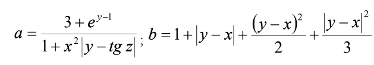

# КОМПЮТЕРНИЙ ПРАКТИКУМ 1. ПРОСТА ОБЧИСЛЮВАЛЬНА ПРОГРАМА

## Група ІС-02. Бойко Василь Олександрович. Варіант 2

### Мета лабораторної роботи:

Навчитись синтаксично правильно будувати програму мовою
програмування C, коректно користуватись можливостями середовища
програмування для її запуску та отримання результату роботи; навчитись
складати та вміти перевірити семантику простої обчислювальної програми, що
реалізує лінійний алгоритм.

### Цілі лабораторної роботи

1. Проаналізувати умову задачі.
2. Розробити алгоритм та створити програму розв’язання задачі згідно з
   номером варіанту.

### Завдання

### Аналіз умов задачі

Обидві формули як для змінної a, так і для змінної b визнвчені при будь яких значеннях x, y та&nbsp;z. Отже немає необхідності у перевірці вхідних значень.
